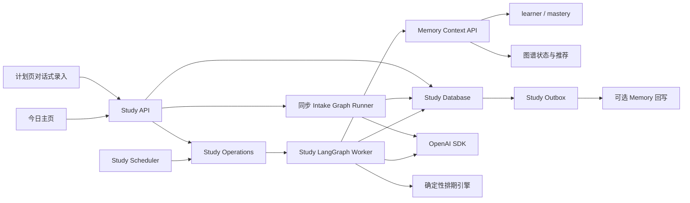
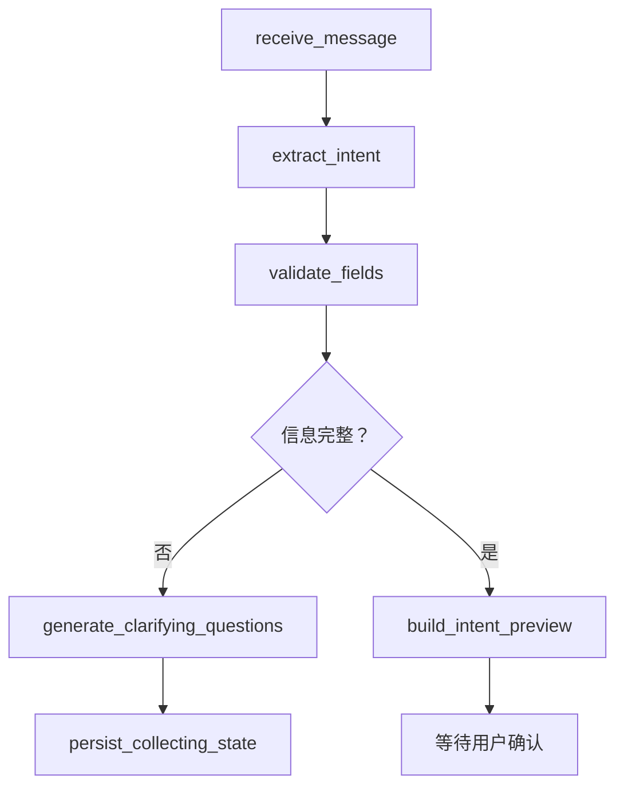
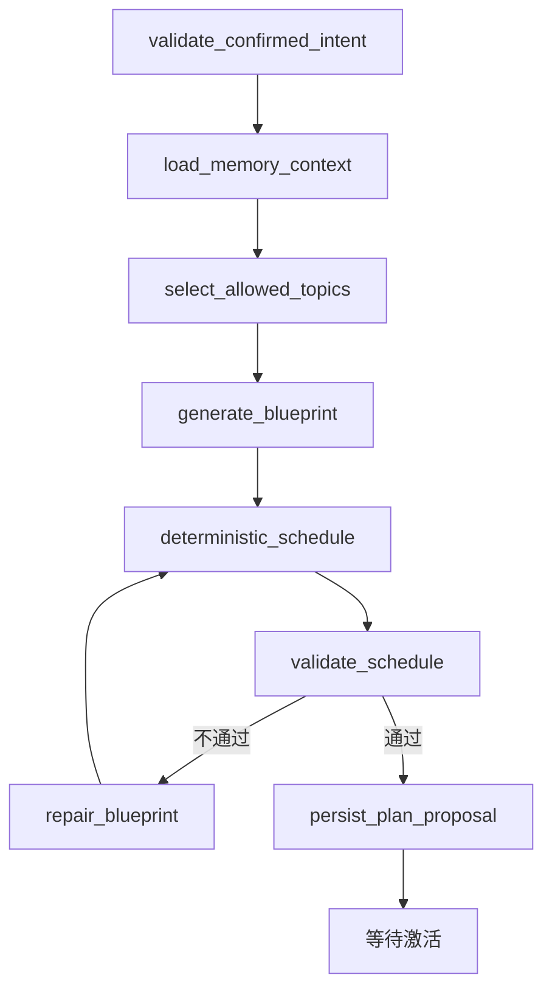

# 学习计划推送后端开发方案

> 版本：v1.2  
> 日期：2026-08-16  
> 状态：产品边界与架构方案已确认 / D1–D29 已冻结 / 待开发  
> 范围：新增学习计划排期、任务状态、今日主动推荐与近 7 天真实学习统计后端。  
> 本文只制定开发方案，不包含业务代码、数据库迁移或配置变更。

---

## 1. 方案摘要

项目新增独立的 **Study Orchestration（学习编排）域**，负责把用户的学习目标和时间约束转化为结构化计划，并在后续学习过程中维护排期、任务状态、计划进度、今日主动推荐和近 7 天真实学习活动。

核心边界如下：

1. `Memory learner.plans` 继续保存长期、低频、语义化的计划摘要，不承担日期排期、任务状态和进度百分比。
2. Study 数据库是完整计划、计划版本、任务状态、今日推荐和学习 Session 的唯一事实源。
3. LangGraph 负责计划录入、计划生成、每日推荐和自动调整的流程编排、checkpoint 与恢复。
4. OpenAI SDK 只负责结构化模型调用，不负责最终日期计算、进度计算和数据库状态迁移。
5. 知识图谱提供合法知识点、前置关系和推荐信号；模型只能从后端允许的候选节点中选择。
6. 首页读取接口不得实时调用模型；每日推荐通过显式 `ensure-today` 请求或异步 Scheduler 预生成，`GET /home` 本身无副作用。
7. 主页“掌握度”本期不接真实 API，也不属于 Study 首页聚合接口。

---

## 2. 已冻结的产品决策

| 编号 | 决策 |
|---|---|
| D1 | 用户输入包括学习目标、截止日期或周期、每周可学习日、每日可用分钟；具体时段可选。 |
| D2 | 计划创建可以采用对话式交互，但最终必须形成结构化 `PlanIntent` 并由用户确认，不能把 AI 回复文本直接当作正式计划。 |
| D3 | 第一版只有用户手动操作能正式完成任务；AI 和练习系统只能提供“建议完成”证据。 |
| D4 | 第一版主动推送只展示在“今日”主页，不发送系统外通知，站内通知保留为后续开关。 |
| D5 | 数据模型支持多个计划，但一个用户同一时间只能有一个 `active` 主计划。 |
| D6 | 第一版推送“任务卡 + 推荐原因 + 预计时长 + AI 学习入口”，不直接展示教材全文或自动生成整套题目。 |
| D7 | “近 7 天”展示真实学习活跃分钟；任务预计时长只用于计划负载和进度计算。 |
| D8 | Phase 1 提供结构化 `PlanIntent` 直录路径，绕过 intake 对话；为保证无模型时仍可端到端验收，直录请求可携带用户确认的结构化任务蓝图。对话式 intake 只是同一 `PlanIntent` 的另一入口。 |
| D9 | Daily Feed 不在 `GET /home` 中隐式创建。前端看到 `generation_status=pending` 后调用 `POST /home/ensure-today`；Study Scheduler 默认每 5 分钟按每个 active 计划的 IANA 时区兜底扫描。生成幂等锚点为 `(user_id, plan_id, local_date)`；旧计划的历史 run 不得阻塞新时区计划。 |
| D10 | Intake 每轮消息同步执行轻量结构化抽取和追问，采用快模型并设置请求超时；`confirm` 后的计划生成仍进入 Study operation 队列。 |
| D11 | 任务状态转移严格使用正文矩阵：`pending` 可开始、完成或跳过，`in_progress` 可完成或跳过，`reopen` 仅允许 `completed/skipped → pending`；`cancelled` 只由 revision/计划生命周期产生。单任务 `reschedule` 仅允许 `pending`，只改自身日期并做碰撞检测，不触发连锁重排。 |
| D12 | 任务预计分钟先由确定性排期引擎限制在 `[session_min_minutes, session_max_minutes]` 并保存估算依据；API 同时返回按任务数和按预计工作量两种进度，首页主进度采用按任务数口径。 |
| D13 | 用户接受推荐后创建的正式任务挂在接受时的 active `revision_id`，`source=recommendation`，并计入当前 revision 的进度分母；任务保留 `source_feed_item_id` 以便审计。 |
| D14 | `personalization_status` 是 revision 级字段，取值为 `personalized/degraded/not_requested`；Memory 不可用时只标记当前 revision 降级，不改变已存在的正式任务。 |
| D15 | 所有模型调用持久化 `(purpose, input_hash, prompt_version, model, schema_version, response)`；同一键重放优先复用已验证响应，不重复调用 OpenAI。缓存记录保留 30 天并随账号 purge 清理。 |
| D16 | 幂等键作用域为 `(user_id, operation_name, idempotency_key)`，默认保留 7 天；同键不同规范化请求体返回 409，同键同 payload 返回第一次的资源或 `operation_id`。 |
| D17 | Study Worker 对同一 `user_id` 的 operation 串行执行；不同用户之间按 `STUDY_WORKER_CONCURRENCY` 并发。用户级串行锁在 Graph 副作用前获取，并由数据库、lease 和 fencing 共同兜底。 |
| D18 | 重大调整量化为：任一未来学习日负载增加 ≥30% 且至少增加 15 分钟；移除未完成任务数占当前未完成任务数 ≥20%；或目标日期变化 ≥7 天。任何目标日期变化、核心章节变化仍必须人工确认。 |
| D19 | 增加 `POST /api/v1/internal/study-accounts/purge`。仅当配置 Study purge service token 且调用方持 system scope 时挂载；按 `account_deletion_id` 幂等，覆盖 Study 全部数据和模型缓存，未配置 token 时 fail-closed。 |
| D20 | `study_daily_feed_runs` 的唯一约束为 `(user_id, plan_id, local_date)`，其中 `plan_id` 必须是当前 active plan 才能被 ensure 或 Scheduler 创建；归档计划的历史 run 保留其原时区语义，但不阻塞新计划。 |
| D21 | 重大调整的 proposed revision 必须通过 `POST /api/v1/study/plans/{plan_id}/revisions/{revision_id}/accept` 或 `/reject` 决策；两个端点都要求 `Idempotency-Key` 和 `expected_version`，并在同一事务内执行 CAS。 |
| D22 | 无 active plan 时，`POST /home/ensure-today` 返回 409 `STUDY_NO_ACTIVE_PLAN`，不创建 feed run、operation 或模型调用；Scheduler 只扫描 active plan，前端不对无计划状态调用 ensure。 |
| D23 | 第一版 Study Session 只能由任务 `start` 或 `launch` 创建/复用；不提供无任务自习 Session，因此从公共契约删除 `POST /api/v1/study/sessions`，保留 Session 查询、heartbeat 和 finish。 |
| D24 | `launch` 先幂等创建/复用 Study Session，再通过 Study Outbox/Conversation Gateway 请求创建 conversation thread；首响应允许 `conversation_status=pending`，thread 创建成功后回填，失败可重试且不能重复创建 thread。 |
| D25 | 用户可以同时拥有多个 `draft/paused/archived` 计划，但最多一个 `active`；`activate` 或 `resume` 撞到其他 active 计划时返回 409 `ACTIVE_STUDY_PLAN_EXISTS`，不自动暂停或归档旧计划。 |
| D26 | `GET /plans/{plan_id}/calendar` 返回按计划时区覆盖完整计划日期范围的周/日/任务结构；包含休息日和空任务日，不包含掌握度数据，接口只读且无副作用。 |
| D27 | 第一版 `completion_source` 只有 `manual`；非 completed 任务为 `null`，AI/练习系统只能写 `completion_suggested` 事件，不能写入正式完成来源。 |
| D28 | heartbeat 因小于最小有效间隔被拒绝时返回统一 `429 RATE_LIMITED` 并附 `Retry-After`；seq 乱序仍返回 `409 STUDY_SESSION_CONFLICT`，两者都不累计活跃时间。 |
| D29 | 首页 `active_plan` 摘要必须返回当前 active revision 的 `personalization_status`，使 `degraded` 状态对用户和运营可见；`study_user_leases` 是 Study 异步基础设施的正式持久化表。 |

上述 D1–D29 是本方案后续数据模型、API、状态机、测试与验收的固定输入。若产品行为需要偏离，必须先修订本文版本，不能在开发阶段自行改变。

---

## 3. 建设范围

### 3.1 本期目标

1. 对话式收集学习目标和时间约束。
2. 将自然语言录入转换成结构化 `PlanIntent`。
3. 生成结构化学习计划草案。
4. 用户确认后激活计划。
5. 保存完整周计划和每日任务排期。
6. 支持任务开始、完成、重开、跳过和改期。
7. 后端计算计划总进度和周进度。
8. 根据长期记忆和知识图谱生成今日自适应推荐。
9. 为首页“今日任务”提供真实 API。
10. 为首页“近 7 天”提供真实 API。
11. 记录真实学习 Session 和活跃分钟。
12. 自动处理未完成任务和未来任务重排。
13. 保存计划生成、计划调整和任务变更的审计记录。
14. 允许结构化 `PlanIntent` 直录和用户确认的任务蓝图，作为不依赖 intake 模型的核心验收路径。

### 3.2 非目标

1. 不为主页“掌握度”接入真实 API。
2. 不允许 AI 自动把任务标记为已完成。
3. 不处理多个 active 计划之间的时间预算竞争。
4. 不实现系统通知、邮件、短信或移动端推送。
5. 不在首页直接展示无来源的教材正文、例题或练习题。
6. 不使用任务预计分钟冒充真实学习时长。
7. 不允许自动调整修改用户目标、截止日期或每日时间上限。
8. 不在浏览器中直接调用 Memory 内部证据接口。
9. 不允许 `GET /api/v1/study/home` 创建 operation、feed run 或其他副作用。
10. 计划创建后的时区和每周可用时间模板不可原地修改；需要改变时区或固定周模板时创建新计划。

---

## 4. 当前系统现状与改造边界

### 4.1 当前计划页

`frontend/src/pages/Plan.tsx` 当前读取真实的 Memory `learner.plans`，但只是把每个字符串临时映射为当天任务。现有结构不包含：

- 计划 ID；
- 周次和日期范围；
- 每日排期；
- 任务预计时长；
- 任务状态；
- 任务版本；
- 进度百分比；
- 改期和自动调整历史。

正式接入 Study 域后，计划页必须读取 Study API。`learner.plans` 只作为历史兼容和长期语义记忆，不再直接渲染成正式任务。

### 4.2 当前首页

`frontend/src/pages/Home.tsx` 当前已有“今日任务”和“近 7 天”视觉结构，但 returning-user 分支仍读取 `frontend/src/data.ts` 中的静态任务和分钟数据。

Study 首页接口只替换：

- 今日计划摘要；
- 今日正式任务；
- 今日自适应推荐；
- 计划进度；
- 近 7 天真实学习分钟。

掌握度雷达及掌握度相关统计继续保留现有行为，本期不接 Study API。

### 4.3 当前 Memory 能力

现有 Memory Context 已可提供：

- learner preferences；
- learner goals；
- learner plans；
- mastery difficulties；
- mastery review advice；
- graph states；
- graph recommendations；
- 推荐原因码和图谱前置节点。

Study Worker 应通过 Memory API/Gateway 读取这些数据，不得跨域直连 Memory 数据库。

---

## 5. 总体架构

### 5.1 领域边界

新增独立 Study 域和独立 Study 数据库。Study Router 仍挂载在现有 FastAPI 唯一入口中，但数据库、迁移链、Worker、Scheduler 和 Outbox 归 Study 域所有。



### 5.2 运行时角色

| 角色 | 职责 |
|---|---|
| FastAPI / Study Router | 用户 API、认证、契约校验、查询聚合、同步执行单轮 Intake Graph、operation 提交 |
| Study Worker | 异步执行 Plan Generation、Daily Feed 和 Replan Graph，调用 Memory/OpenAI，生成草案和每日推荐 |
| Study Scheduler | 按用户时区调度每日 feed、每周复盘和失败恢复 |
| Study Outbox Publisher | 向 Memory 等其他域可靠投递 Study 领域事件 |
| Study Database | 计划、任务、Session、统计、operation、outbox 的唯一事实源 |

### 5.3 推荐目录

```text
backend/study/
├── api/
│   ├── intakes.py
│   ├── plans.py
│   ├── tasks.py
│   ├── recommendations.py
│   ├── sessions.py
│   ├── home.py
│   ├── internal_accounts.py
│   └── operations.py
├── contracts/
│   ├── api.py
│   ├── domain.py
│   ├── graph.py
│   ├── events.py
│   └── errors.py
├── graph/
│   ├── builder.py
│   ├── intake_runner.py
│   ├── state.py
│   ├── nodes/
│   └── prompts/
├── gateways/
│   ├── memory.py
│   └── openai.py
├── persistence/
├── services/
│   ├── scheduling.py
│   ├── progress.py
│   ├── recommendation.py
│   └── home_service.py
├── worker/
└── scheduler/
```

新增独立迁移链和数据库配置：

```text
study_alembic.ini
study_migrations/
STUDY_DATABASE_URL
```

---

## 6. 数据事实源

| 数据 | 唯一事实源 |
|---|---|
| 长期学习目标、偏好和语义计划摘要 | Memory `learner` |
| 完整计划、排期和计划版本 | Study DB |
| 任务状态 | Study DB |
| 今日主动推荐 | Study Daily Feed |
| 计划进度百分比 | Study 后端确定性计算 |
| 真实学习时长 | Study Sessions |
| 近 7 天统计 | Study Daily Stats |
| 知识点和前置关系 | Memory Knowledge Graph |
| 主页掌握度 | 本期不接入 Study API |

计划激活后，可以异步向 Memory 写入稳定摘要，例如：

> 六周内完成线性代数基础，每周学习五天，每天约四十分钟。

Memory 回写失败不能影响计划激活，也不能回滚 Study 数据。

---

## 7. 核心数据模型

### 7.1 `study_plan_intakes`

保存对话式录入过程：

- `intake_id`；
- `user_id`；
- `status`：`collecting/ready/confirmed/exhausted/expired`；
- `normalized_intent`；
- `missing_fields`；
- `message_count`；
- `last_model_call_id`；
- `version`；
- `expires_at`；
- `created_at`；
- `updated_at`。

不保存无界完整 Prompt；只保存必要的结构化结果和最多 8 轮用户输入。单条用户消息最多 2,000 个 Unicode 字符，intake 默认 24 小时过期；第 8 轮处理后仍不完整则进入 `exhausted`，超过长度、轮次或有效期时分别返回明确错误，不再调用模型。

### 7.2 `study_plans`

- `plan_id`；
- `user_id`；
- `goal`；
- `status`：`draft/active/paused/completed/archived`；
- `timezone`；
- `start_date`；
- `target_date`；
- `weekly_minutes`；
- `session_min_minutes`；
- `session_max_minutes`；
- `current_revision`；
- `version`；
- `activated_at`；
- `created_at`；
- `updated_at`。

数据库约束必须保证一个用户最多一个 active 计划。

`timezone` 在计划创建后不可修改。用户需要改变时区时，必须创建新计划并显式归档或替换旧计划，避免同一计划历史任务的 `local_date` 语义漂移。

### 7.3 `study_plan_availability`

- `plan_id`；
- `day_of_week`；
- `available_minutes`；
- `start_local_time`，可选；
- `end_local_time`，可选；
- `is_rest_day`。

约束：

- `day_of_week` 使用 ISO 8601：`1=周一`，`7=周日`；
- `is_rest_day=true` 时 `available_minutes` 必须为 `0`，且不得提供开始/结束时段；
- `is_rest_day=false` 时 `available_minutes` 必须大于 `0`；
- 同一计划每个 `day_of_week` 最多一行；
- Weekly availability 是计划生命周期内固定的周模板，不允许 adjustment 原地修改；改变固定周模板必须创建新计划。

### 7.4 `study_plan_revisions`

- `revision_id`；
- `plan_id`；
- `revision_no`；
- `reason`；
- `status`：`proposed/active/rejected/superseded`；
- `input_snapshot`；
- `memory_context_hash`；
- `personalization_status`：`personalized/degraded/not_requested`；
- `personalization_reason`，可选；
- `proposal_operation_id`，可选，指向等待用户决策的 replan operation；
- `base_revision_id`，可选，记录 proposal 生成时的 active revision，用于 accept/reject CAS；
- `decision_at`，可选；
- `decision_actor_id`，可选；
- `decision_reason`，可选；
- `model_name`；
- `prompt_version`；
- `change_summary`；
- `created_at`；
- `activated_at`。

`reason` 取值：

- `initial`；
- `user_adjustment`；
- `weekly_replan`；
- `missed_task`；
- `memory_change`。

`proposed` 只能由需要人工确认的 replan 生成，并关联 `proposal_operation_id`。用户 accept 时，旧 active revision 在同一事务中变为 `superseded`、proposed revision 变为 `active` 并应用其任务 diff；用户 reject 时 proposed revision 变为 `rejected`，当前 active revision 与任务保持不变。两个决策均写入 `decision_*` 审计字段。

### 7.5 `study_tasks`

- `task_id`；
- `plan_id`；
- `revision_id`；
- `scheduled_date`；
- `order_index`；
- `task_type`：`learn/practice/review/assessment`；
- `title`；
- `description`；
- `estimated_minutes`；
- `model_estimated_minutes`，可选，仅用于审计；
- `estimation_basis`，保存 clamp、拆分或合并依据；
- `topic_key`；
- `graph_node_id`；
- `reason_codes`；
- `source`：`plan/recommendation/manual`；
- `source_feed_item_id`，可选；
- `status`：`pending/in_progress/completed/skipped/cancelled`；
- `user_locked`；
- `completion_source`：第一版仅允许 `manual`；未完成任务为 `null`；
- `started_at`；
- `completed_at`；
- `version`。

任务不物理删除。重排、移除和替换通过 revision、状态和事件保存历史。

### 7.6 `study_task_events`

任务审计事件：

- `created`；
- `started`；
- `completion_suggested`；
- `completed`；
- `reopened`；
- `rescheduled`；
- `skipped`；
- `cancelled`。

第一版只有用户操作可以产生正式 `completed`，完成任务的 `completion_source` 固定为 `manual`；AI 或练习系统只能产生 `completion_suggested`，不得写入其他正式完成来源。

`completion_suggested` 的事件 payload 至少包含 `suggested_by`、`suggested_at`、`evidence_type` 和不含敏感正文的 `evidence_summary`。它不改变 `study_tasks.status`。任务读模型派生 `completion_suggestion_pending`：若最新建议之后尚无用户产生的 `completed/skipped` 或计划产生的 `cancelled` 事件，则前端显示“AI 建议已完成，等待你确认”徽标和“确认完成”按钮。

### 7.7 `study_daily_feed_runs`

Daily Feed 的业务幂等锚点：

- `feed_run_id`；
- `user_id`；
- `plan_id`；
- `revision_id`；
- `local_date`；
- `timezone`；
- `status`：`queued/running/succeeded/failed/stale`；
- `operation_id`，可选；
- `input_hash`；
- `generation`，每次原地重新生成递增；
- `attempt_count`；
- `started_at`；
- `completed_at`；
- `last_error_code`，可选；
- `created_at`；
- `updated_at`。

数据库必须建立 `UNIQUE(user_id, plan_id, local_date)`。Scheduler、`ensure-today` 和 Worker 重放只能为同一用户、同一 active plan、同一用户本地日期创建或复用同一 run；失败 run 通过状态 CAS 和 lease 重试，不能另建第二个 run。`plan_id` 是必填的历史归属维度：用户归档旧时区计划并新建计划后，即使两个计划在同一 UTC 窗口得到相同 `local_date`，旧 run 也不会阻塞新计划。

当天 active plan/revision 或推荐输入发生变化时，把原 run 标记为 `stale`，在同一行递增 `generation` 后重新生成；旧 active items 原子标记为 `expired`，不能为同一 `(user_id, plan_id, local_date)` 插入第二个 run。Scheduler 和 ensure 都只处理 active plan；归档计划的 run 只读保留，不能重新生成。

### 7.8 `study_daily_feed_items`

- `feed_item_id`；
- `feed_run_id`；
- `source_type`；
- `task_id`；
- `topic_key`；
- `graph_node_id`；
- `title`；
- `reason`；
- `reason_codes`；
- `estimated_minutes`；
- `launch_payload`；
- `status`：`active/accepted/dismissed/expired`；
- `expires_at`。

一个 run 可以有多条 item；item 必须通过 `feed_run_id` 归属唯一 run，不再把 `(user_id, local_date)` 当作 item 级幂等键。

### 7.9 `study_sessions`

- `session_id`；
- `user_id`；
- `task_id`；
- `conversation_thread_id`，可选；
- `conversation_status`：`not_requested/pending/ready/failed`；
- `conversation_create_request_id`，可选，用于跨域创建 thread 的幂等；
- `status`：`active/completed/abandoned`；
- `started_at`；
- `last_heartbeat_at`；
- `last_heartbeat_seq`；
- `ended_at`；
- `active_seconds`。

### 7.10 `study_daily_stats`

- `user_id`；
- `local_date`；
- `active_seconds`；
- `completed_task_count`；
- `session_count`；
- `updated_at`。

### 7.11 `study_model_call_records`

持久化经过 Schema 校验的模型响应，用于 Graph 重放防重复计费和结果漂移：

- `model_call_id`；
- `user_id`；
- `operation_id`，可选；
- `purpose`：`intake/plan/feed/replan`；
- `input_hash`；
- `prompt_version`；
- `model`；
- `schema_version`；
- `status`：`running/succeeded/failed`；
- `validated_response`，成功时必填；
- `error_code`，失败时可选；
- `usage`；
- `created_at`；
- `expires_at`。

唯一键为 `(user_id, purpose, input_hash, prompt_version, model, schema_version)`，禁止跨用户复用响应。每次尝试都先创建或复用 call record；只复用成功且已通过当前 Schema 校验的响应。失败、截断或非法响应可以保存错误分类，但不得把原始非法输出作为缓存响应。默认保留 30 天，账号 purge 时必须删除。

### 7.12 异步与幂等基础设施

- `study_operations`；
- `study_outbox`；
- `study_idempotency_requests`；
- LangGraph checkpoint 表；
- scheduler maintenance run 表；
- `study_user_leases`：`user_id`、`operation_id`、`lease_generation`、`locked_by`、`lease_expires_at`、`created_at`、`updated_at`；
- dead-letter、lease 和 fencing 字段。

模式与现有 Memory/Conversation operation、checkpoint、lease、fencing 和 outbox 语义保持一致。

---

## 8. 结构化计划输入

正式的 `PlanIntent` 示例：

```json
{
  "goal": "六周内掌握线性代数基础，并能完成期末复习题",
  "start_date": "2026-08-17",
  "target_date": "2026-09-27",
  "timezone": "Asia/Shanghai",
  "weekly_availability": [
    {
      "day_of_week": 1,
      "available_minutes": 40
    },
    {
      "day_of_week": 3,
      "available_minutes": 40
    },
    {
      "day_of_week": 5,
      "available_minutes": 60
    }
  ],
  "session_min_minutes": 15,
  "session_max_minutes": 60,
  "preferences": []
}
```

约束：

1. `goal` 必填。
2. `target_date` 与 `duration_weeks` 至少提供一个。
3. 时区必须是合法 IANA 时区。
4. 每周总可用时间必须大于零。
5. `session_min_minutes <= session_max_minutes`。
6. 截止日期必须晚于开始日期。
7. 信息不足时返回 `needs_input`，禁止模型自行补造。
8. 浏览器不能提交或覆盖 `user_id`。
9. `day_of_week` 使用 ISO 8601，示例中的 `1/3/5` 表示周一、周三、周五。
10. `is_rest_day=true` 与 `available_minutes>0` 不能同时出现；校验失败返回 422。
11. 计划创建后不能修改 `timezone` 或固定 weekly availability；必须创建新计划。

Phase 1 的结构化直录请求使用同一 `PlanIntent`，并允许追加用户确认的 `task_blueprint`：

```json
{
  "intent": {"...": "上面的 PlanIntent"},
  "generation_mode": "manual",
  "task_blueprint": [
    {
      "title": "矩阵与线性方程组",
      "task_type": "learn",
      "estimated_minutes": 40,
      "topic_key": "linear-algebra:systems"
    }
  ]
}
```

`generation_mode=manual` 要求 `task_blueprint` 非空，由确定性排期引擎直接生成 draft revision；`generation_mode=ai` 只提交 `PlanIntent`，由 Phase 2 的 Plan Generation Graph 生成蓝图。两条路径都必须先生成草案，用户确认后才能激活。这样 Phase 1 可以在不依赖 OpenAI 的情况下验收“排期、任务、状态、进度、首页和近 7 天统计”。

---

## 9. LangGraph 设计

### 9.1 Plan Intake Graph

负责把自然语言录入转换成待确认的结构化 `PlanIntent`。



规则：

- 每轮只询问最关键的少量缺失信息；
- 用户确认前不能创建正式计划；
- 模型返回严格结构化结果；
- 录入 state 必须支持 checkpoint 恢复；
- 重放节点不能重复创建 intake 或 operation；
- `POST /intakes/{id}/messages` 在 API 请求内同步运行本轮 Graph，只允许一次快模型结构化调用，不创建 operation，也不使用 SSE；
- 同步调用默认超时 8 秒；超时或依赖不可用时返回 retryable 503，intake 保持原版本，客户端可用同一幂等键重试；
- 同一模型输入先查询 `study_model_call_records`，命中时直接复用已验证响应；
- 每个 intake 最多接收 8 轮用户消息，单条最多 2,000 字符，默认 24 小时过期。

### 9.2 Plan Generation Graph



#### OpenAI 负责

- 理解学习目标；
- 将目标拆成学习阶段；
- 从后端允许的候选知识点中选择主题；
- 生成任务标题、描述和推荐理由；
- 在确定性校验失败时修复任务蓝图。

#### 确定性代码负责

- 日期和时区；
- 每日时间预算；
- 前置知识排序；
- 休息日；
- 任务拆分；
- 复习间隔；
- 冲突检测；
- 截止日期可行性；
- 进度计算；
- 数据库状态迁移。

模型不得直接决定最终数据库日期，也不得输出候选集合以外的 `graph_node_id`。

### 9.3 Daily Feed Graph

1. 读取当天正式任务。
2. 读取未完成但允许顺延的任务。
3. 读取最新 Memory context。
4. 读取知识图谱推荐及原因码。
5. 去除最近重复推荐。
6. 根据当天剩余时间选择最多两条推荐。
7. 生成任务卡标题、理由和 AI 启动提示。
8. 持久化 daily feed。

生成触发冻结为双机制：

1. **显式惰性触发**：`GET /api/v1/study/home` 只读。当前 active plan 的当天 run 不存在或尚未成功时，返回 `generation_status=pending`。前端随后调用 `POST /api/v1/study/home/ensure-today`；API 先锁定当前 active plan，再在事务内创建或复用 `(user_id, plan_id, local_date)` 的 `study_daily_feed_runs` 和对应 operation，返回 `202 Accepted`。无 active plan 时，GET 只返回无计划状态，前端不得调用 ensure；ensure 必须返回 409 `STUDY_NO_ACTIVE_PLAN`，且不创建任何 run 或 operation。
2. **Scheduler 兜底**：默认每 300 秒只扫描 active plan。候选日期必须由 PostgreSQL 计算：`(now() AT TIME ZONE study_plans.timezone)::date`。Scheduler 对当前 `plan_id` 使用 `NOT EXISTS` 或同一 plan 的最新 run 判断当天是否需要生成；当天 run 为 `stale`、输入哈希与当前 active revision 不匹配、失败已到退避时间时也属于候选。不得按调度进程整点或固定 UTC 偏移推导用户日期，因此支持 DST 和半小时/四十五分钟偏移时区。

两种触发都调用同一个 `ensure_daily_feed(user_id, plan_id, local_date)` 应用服务，并依赖 `(user_id, plan_id, local_date)` run 唯一约束、operation 幂等和 lease/fencing 去重。Scheduler 还可以重试超过 lease 的 `running` run 和到达退避时间的 `failed` run，但不得为同一 plan/date 创建第二个 run。归档计划的历史 run 保留原 timezone 快照且不再参与扫描；因此用户在 Asia/Shanghai 计划生成过 `2026-08-16` 的 run、随后归档并新建 America/New_York 计划时，新计划同样处于 `2026-08-16` 的窗口不会误复用旧 run。`GET /home` 重放、缓存刷新或爬虫请求绝不能创建 operation。

### 9.4 Replan Graph

触发来源：

- 用户修改目标或请求调整未来任务分布；
- 用户主动要求重新安排；
- 连续存在未完成任务；
- 每周固定复盘；
- Memory 出现新的稳定困难点。

改变计划时区或固定 weekly availability 不进入 replan；客户端必须创建新计划。

自动调整只允许修改未来未完成且未锁定的任务。

重大调整必须生成 `proposed` revision 并等待用户确认。量化规则如下：

- 计划范围增加或减少任何用户显式指定的目标项；
- 目标结束日期发生任何变化；其中平移 ≥7 个自然日标记为 `high_impact` 并在确认页突出提示；
- 任一未来学习日相比当前 active revision 增加 ≥15 分钟，且 `(new_minutes - old_minutes) / max(old_minutes, session_min_minutes) >= 30%`；
- 被移除的未完成任务数除以当前未完成任务数 ≥20%；
- 增加、移除或替换用户明确指定的核心章节。

未命中上述条件、未修改已完成/锁定任务且仍满足时间预算的局部调整，才允许自动激活 revision。命中重大调整时，生成 revision 的 operation 进入 `needs_input`，并把该 operation ID 写入 `proposal_operation_id`；前端通过 revision 查询读取差异并调用 accept 或 reject。accept 后原 operation 进入 `succeeded`，reject 后进入 `cancelled`，两者均保留决策审计。所有阈值必须写成纯函数并覆盖边界测试，禁止由模型用“显著”“较多”等自然语言自行判断。

---

## 10. 排期规则

1. 所有日期按用户时区计算。
2. 前置知识点必须排在后继知识点之前。
3. 模型输出的原始预计分钟不能直接落库。排期引擎先按 5 分钟粒度归一化，再把任务限制在 `[session_min_minutes, session_max_minutes]`；低于下限时 clamp 到下限，超过上限时拆分并重新平衡尾段。
4. 每个任务必须保存 `model_estimated_minutes` 和 `estimation_basis`，说明是原值、clamp、拆分还是合并；手工蓝图同样经过该规则。
5. 默认每天最多四个任务。
6. 每周预留约 10% 时间作为缓冲。
7. 复习任务优先采用 1、3、7 天间隔，时间不足时允许压缩。
8. 用户休息日不安排正式任务。
9. 未完成任务顺延时不能突破目标日期的每日上限。
10. 用户锁定任务不得被自动改期。
11. 已完成任务不得被任何 replan 修改。
12. 计划不可行时不能静默超额排期，必须返回以下可选方案：
    - 延长截止日期；
    - 增加每周时间；
    - 缩小学习范围。
13. 任务顺延后若已经无法满足截止日期，必须生成待确认调整，不得无限堆积到某一天。
14. 计划生成时应优先使用明确目标中的知识点，再使用 Memory 困难点和图谱推荐补充个性化内容。

---

## 11. 今日主动推送

首页内容分为两层。

### 11.1 正式任务

来自 active 计划，直接影响计划进度。

### 11.2 自适应推荐

来自长期记忆和知识图谱，但不直接修改正式计划。

推荐原因码包括：

- `CONTINUE_LEARNING`；
- `PREREQUISITE_GAP`；
- `NEXT_GRAPH_NODE`；
- `REVIEW_DUE`；
- `RECENT_DIFFICULTY`；
- `MISSED_TASK_RECOVERY`；
- `STALE_PROFICIENCY`。

用户可以：

- 开始学习；
- 加入今日任务；
- 暂时忽略；
- 不再推荐类似内容。

只有“加入今日任务”后，推荐才创建正式任务并进入进度计算。创建规则冻结如下：

- 必须在同一事务中锁定当前 active plan 和 active revision；
- 新任务的 `revision_id` 固定为接受时的 active revision，`source=recommendation`，并写入 `source_feed_item_id`；
- 新任务计入该 revision 的按任务数进度和按预计工作量进度分母；
- 后续 replan 可以复制并吸收为新 revision 的常规任务，但不能丢失来源审计；
- 如果推荐已过期、active revision 已变化，或加入后超过当天可用分钟，则返回 409，客户端应刷新首页或改走 plan adjustment，不能静默塞入超额任务。

每个推荐必须包含：

- 推荐标题；
- 推荐原因；
- 对应知识点；
- 预计时长；
- AI 学习启动提示；
- 来源原因码。

第一版每日最多展示两条额外自适应推荐，避免主动推荐压过用户正式计划。

---

## 12. API 契约

### 12.1 对话式录入

```http
POST /api/v1/study/intakes
POST /api/v1/study/intakes/{intake_id}/messages
GET  /api/v1/study/intakes/{intake_id}
POST /api/v1/study/intakes/{intake_id}/confirm
```

`confirm` 返回 `202 Accepted` 和 `operation_id`。

`POST /intakes/{intake_id}/messages` 同步返回本轮结果（`200 OK`），响应包含 `status`、当前结构化 intent、`missing_fields`、追问文本和 `version`；它不返回 operation。请求必须带 `Idempotency-Key`，同一轮重放返回首次结果。`confirm` 只能对 `ready` 状态执行，且一旦成功就把 intake 固定为 `confirmed`，后续重复确认返回第一次的 `operation_id`。

Intake 的 API 超时和模型不可用不能改变 intake 状态；只有 `expires_at` 到期才是 `expired`。第 8 轮处理后信息仍不完整时状态变为 `exhausted` 并返回 `STUDY_INTAKE_LIMIT_EXCEEDED`；`expired` 或 `exhausted` 都要求客户端新建 intake。

### 12.2 计划

```http
POST /api/v1/study/plans
GET  /api/v1/study/plans
GET  /api/v1/study/plans/{plan_id}
GET  /api/v1/study/plans/{plan_id}/calendar
GET  /api/v1/study/plans/{plan_id}/revisions
POST /api/v1/study/plans/{plan_id}/revisions/{revision_id}/accept
POST /api/v1/study/plans/{plan_id}/revisions/{revision_id}/reject
POST /api/v1/study/plans/{plan_id}/activate
POST /api/v1/study/plans/{plan_id}/adjustments
POST /api/v1/study/plans/{plan_id}/pause
POST /api/v1/study/plans/{plan_id}/resume
POST /api/v1/study/plans/{plan_id}/archive
```

`POST /api/v1/study/plans` 支持两种请求：

- Phase 1 的 `generation_mode=manual`：提交结构化 `PlanIntent` 和用户确认的 `task_blueprint`，同步完成确定性排期并返回 draft plan/revision；
- Phase 2 的 `generation_mode=ai`：只提交结构化 `PlanIntent`，返回 `202 Accepted` 和 `operation_id`，由 Plan Generation Graph 生成 draft revision。

两种路径都不直接激活计划；激活必须显式调用 `/activate`，并在事务中再次检查 active plan 唯一约束。用户可以保留多个 `draft/paused/archived` 计划；`activate` 或 `resume` 发现已有其他 active plan 时返回 409 `ACTIVE_STUDY_PLAN_EXISTS`，不得自动修改旧计划状态。

`GET /plans/{plan_id}` 必须包含 `current_revision_id`、当前 revision 的 `personalization_status` 和 `proposed_revisions` 摘要；`GET /plans/{plan_id}/revisions` 返回该计划的 revision 列表及可展示的 `change_summary`、任务差异汇总与 `proposal_operation_id`，供确认页读取。

`GET /plans/{plan_id}/calendar` 的返回形状冻结为：

```json
{
  "plan_id": "0198...",
  "timezone": "Asia/Shanghai",
  "start_date": "2026-08-17",
  "target_date": "2026-09-27",
  "current_revision_id": "0199...",
  "weeks": [
    {
      "week_index": 1,
      "from": "2026-08-17",
      "to": "2026-08-23",
      "days": [
        {
          "local_date": "2026-08-17",
          "day_of_week": 1,
          "is_rest_day": false,
          "available_minutes": 40,
          "planned_minutes": 40,
          "completed_minutes": 0,
          "tasks": [
            {
              "task_id": "019a...",
              "title": "理解向量空间定义",
              "task_type": "learn",
              "status": "pending",
              "order_index": 1,
              "estimated_minutes": 40,
              "source": "plan",
              "completion_suggestion_pending": false
            }
          ]
        }
      ]
    }
  ]
}
```

日期全部按 `plan.timezone` 计算，覆盖 `[start_date, target_date]` 完整范围，休息日和没有任务的日期同样返回（`tasks=[]`）；任务按 `order_index` 升序。该 GET 只读、无副作用，不返回 mastery 数据。

重大调整的决策端点请求体均为：

```json
{
  "expected_version": 7,
  "reason": "本周时间不足"
}
```

`reason` 仅在 reject 时可选。accept/reject 必须携带 `Idempotency-Key`，其中 `expected_version` 指 `study_plans.version`。服务在单个 Study DB 事务中锁定 plan 与目标 revision，CAS 校验计划版本、revision 仍为 `proposed`、以及 proposal 所基于的 active revision 未变化；冲突返回 `STUDY_PLAN_VERSION_CONFLICT` 或 `STUDY_INVALID_REVISION_TRANSITION`。accept 将 proposed revision 激活、旧 active revision 标记 `superseded`、应用任务 diff，并将关联的 `needs_input` operation 置为 `succeeded`；reject 将 revision 标记 `rejected`、不改当前 active revision 或任务，并将关联 operation 置为 `cancelled`。两个端点同步返回 `200 OK`、revision 状态和关联 operation 的终态；同一幂等键重放返回第一次结果。

### 12.3 任务

```http
POST /api/v1/study/tasks/{task_id}/start
POST /api/v1/study/tasks/{task_id}/complete
POST /api/v1/study/tasks/{task_id}/reopen
POST /api/v1/study/tasks/{task_id}/skip
POST /api/v1/study/tasks/{task_id}/reschedule
POST /api/v1/study/tasks/{task_id}/launch
```

所有任务写接口必须携带：

- `Idempotency-Key`；
- `expected_version`。

#### 任务状态转移矩阵

| 当前状态 | 允许操作 | 下一状态 | 说明 |
|---|---|---|---|
| `pending` | `start` | `in_progress` | 用户开始任务；创建或关联 Study Session。 |
| `pending` | `complete` | `completed` | 用户可以直接完成未开始任务；只能由用户操作产生。 |
| `pending` | `skip` | `skipped` | 用户主动跳过。 |
| `in_progress` | `complete` | `completed` | 用户确认完成；活跃 Session 先结算。 |
| `in_progress` | `skip` | `skipped` | 用户主动跳过；活跃 Session 结算为 `abandoned`。 |
| `completed` | `reopen` | `pending` | 清除完成时间，保留历史事件。 |
| `skipped` | `reopen` | `pending` | 重新进入待学习状态。 |
| `pending` | `reschedule` | `pending` | 只修改日期，不触发连锁 replan。 |
| `pending/in_progress/skipped` | revision 移除或计划归档 | `cancelled` | 只由确定性 replan/计划生命周期产生；若原状态为 `in_progress`，先结算 Session。 |
| `cancelled` | 任意任务操作 | 拒绝 | 必须由新 revision 创建新 task，不能复活旧 task。 |

重复提交同一幂等键返回第一次结果；使用新幂等键对已完成、已取消等不允许的转移，返回 `STUDY_INVALID_TASK_TRANSITION`。`complete` 成功时将 `completion_source` 写为 `manual`；`completion_suggested` 徽标只辅助用户决定是否调用该端点。

`launch` 是带学习入口的 `start` 便利接口：任务为 `pending` 时先原子转为 `in_progress` 并创建 Session；任务为 `in_progress` 时复用该任务当前 active Session；其余状态拒绝。`start` 只负责状态和 Session，不请求 Conversation；`launch` 额外触发 AI 学习入口创建，具体响应和跨域语义见 §12.5。

`POST /tasks/{task_id}/reschedule` body：

```json
{
  "scheduled_date": "2026-08-20",
  "expected_version": 3
}
```

第一版只允许 `pending` task，只修改该 task 的 `scheduled_date` 并写入 `rescheduled` 事件；允许的目标日期必须按计划时区不早于服务端判定的今天、不晚于 `target_date`、不是休息日。服务会计算目标日已有非取消任务分钟 + 当前任务分钟，超过当天 `available_minutes` 时返回 409 `STUDY_SCHEDULE_CONFLICT`，响应带 `adjustment_required=true`，提示使用 `/adjustments`。reschedule 不会自动移动其他任务，也不会修改 `revision_id`。

### 12.4 推荐

```http
POST /api/v1/study/recommendations/{feed_item_id}/accept
POST /api/v1/study/recommendations/{feed_item_id}/dismiss
```

### 12.5 学习 Session

```http
GET  /api/v1/study/sessions/{session_id}
POST /api/v1/study/sessions/{session_id}/heartbeat
POST /api/v1/study/sessions/{session_id}/finish
```

第一版不提供 `POST /api/v1/study/sessions`：Session 只能由 `POST /tasks/{task_id}/start` 或 `/launch` 创建/复用，避免无任务 Session 混入计划统计。`GET /sessions/{session_id}` 只读返回 Session、`conversation_status` 和可能已回填的 `conversation_thread_id`，供前端轮询恢复。

`POST /tasks/{task_id}/launch` 成功后同步返回以下稳定骨架：

```json
{
  "task_id": "019a...",
  "session_id": "019b...",
  "conversation_thread_id": null,
  "conversation_status": "pending",
  "launch_payload": {
    "task_id": "019a...",
    "topic_key": "linear_algebra.vector_space",
    "graph_node_id": "kg:linear_algebra:vector_space"
  }
}
```

launch 在 Study DB 事务中创建或复用 Session 和 `conversation_create_request_id`，并通过 Study Outbox/Conversation Gateway 投递以 `session_id` 为跨域幂等键的 thread 创建请求。Conversation 成功后回填 `conversation_thread_id` 并把状态改为 `ready`；失败时置为 `failed`，Session 仍有效，重复 launch 或显式重试复用同一 request ID，不能创建第二个 thread。首次响应允许为 `pending`，前端通过 `GET /sessions/{session_id}` 轮询至 `ready` 后再进入既有 Conversation 交互。Study 与 Conversation 不使用跨数据库事务。

`heartbeat` body 必须包含单调递增的 `seq`：

```json
{
  "seq": 7
}
```

服务器使用 Session 行中的 `last_heartbeat_seq` 判定顺序：相同 `seq` 的重放返回上一次结果；小于已确认值的请求返回 409 `STUDY_SESSION_CONFLICT`；大于已确认值但距离上次有效 heartbeat 少于 30 秒的请求返回 429 `RATE_LIMITED`、携带 `Retry-After`，且不累计活跃时间。服务器使用收到请求的时间，不信任客户端时间戳。heartbeat 周期默认 60 秒，连续 120 秒没有有效 heartbeat 即停止累计；具体阈值通过配置控制。

### 12.6 首页

```http
GET /api/v1/study/home?date=2026-08-16
POST /api/v1/study/home/ensure-today
```

`GET /home` 的 `date` 缺省值由服务端按当前 active plan 的 IANA 时区计算；调用方提交的日期不得晚于服务端计算的今天，未来日期返回 422 `INVALID_PAYLOAD`。查询历史日期允许只读，不触发 feed 生成。服务端不能信任浏览器自行计算的“今天”。

`POST /home/ensure-today` 只允许确保服务端按当前 active plan IANA 时区判定的今天，必须携带 `Idempotency-Key`。无 active plan 时返回 409 `STUDY_NO_ACTIVE_PLAN`，不创建 feed run、operation 或模型调用。存在 active plan 时，它在同一用户、同一 active plan、同一用户本地日期上创建或复用 `study_daily_feed_runs`，即业务键为 `(user_id, plan_id, local_date)`，并返回 `202 Accepted`、`feed_run_id` 和 `operation_id`；只有已有成功 run 的 `input_hash` 仍与当前 active plan/revision 一致时才直接复用，否则将同一 run 标记为 `stale`、递增 `generation` 并创建新的生成 operation。

响应包含：

- active plan 摘要；
- 今日正式任务；
- 今日自适应推荐；
- 计划总进度；
- 今日完成数量；
- 近 7 天真实活跃分钟；
- 可选的继续学习入口。

响应不包含 mastery 数据。

示例：

```json
{
  "local_date": "2026-08-16",
  "timezone": "Asia/Shanghai",
  "active_plan": {
    "plan_id": "0198...",
    "goal": "六周内掌握线性代数基础",
    "week_label": "第 2 周",
    "personalization_status": "personalized",
    "progress_percent": 33,
    "task_progress_percent": 33,
    "workload_progress_percent": 36
  },
  "today": {
    "generation_status": "ready",
    "completed_count": 1,
    "total_count": 3,
    "planned_minutes": 55,
    "tasks": [],
    "recommendations": []
  },
  "recent_7_days": {
    "from": "2026-08-10",
    "to": "2026-08-16",
    "total_active_minutes": 183,
    "days": []
  }
}
```

### 12.7 Operation

```http
GET /api/v1/study/operations/{operation_id}
```

状态：

- `queued`；
- `running`；
- `needs_input`：重大调整已生成 proposed revision，等待 accept/reject，属于可恢复的非终态；
- `succeeded`；
- `failed`；
- `cancelled`：包括用户 reject proposed revision 或 operation 被明确取消。

### 12.8 内部账号清理

```http
POST /api/v1/internal/study-accounts/purge
```

请求体包含 `account_deletion_id`、目标 `user_id` 和 `requested_at`。目标 `user_id` 只允许由统一账号删除编排器在 system 请求中提交，普通浏览器路由仍禁止注入 `user_id`。仅在 `STUDY_ACCOUNT_PURGE_SERVICE_TOKEN` 已配置，且调用方通过 `system` actor 与 `study:account_purge` scope 校验后挂载路由；未配置时 fail-closed。

`account_deletion_id` 是幂等锚点。接口返回 Study operation 结果；同一删除 ID 重放返回原 operation，不创建第二次清理。purge 必须覆盖计划、revision、availability、任务、事件、feed run/item、Session、统计、operation、outbox、checkpoint、幂等记录和模型响应缓存，并保留最小必要删除账本以证明清理完成。

---

## 13. 进度与近 7 天定义

### 13.1 计划进度

```text
按任务数进度 =
当前 active revision 中 completed 任务数
÷
当前 active revision 中所有非 cancelled 任务数

按预计工作量进度 =
当前 active revision 中 completed 任务的 normalized estimated_minutes 之和
÷
当前 active revision 中所有非 cancelled 任务的 normalized estimated_minutes 之和
```

规则：

- API 同时返回 `task_progress_percent` 与 `workload_progress_percent`；
- 首页主字段 `progress_percent` 等于 `task_progress_percent`，并明确标注“按任务完成”；计划详情可以同时展示预计工作量进度；
- 进度算法和入库后的输入均由后端确定性处理，不允许模型直接输出百分比；预计分钟仍属于估算，因此只能用于工作量辅助口径；
- `cancelled` 不计入分母；
- `skipped` 默认仍属于未完成；
- 用户接受推荐创建的任务挂当前 active revision，并同时计入两个分母；
- 新 revision 正式移除的任务只会从新 active revision 的分母退出，历史 revision 结果保持可审计；
- 分母为零时返回 `0`，否则按 `ROUND_HALF_UP` 四舍五入为整数并限制在 0–100；
- 周进度和计划总进度分别计算。

### 13.2 真实学习分钟

真实分钟来自 Study Session：

1. 任务 `start` 或 `launch` 时创建或复用 session。
2. 前端按约 60 秒周期发送带单调 `seq` 的 heartbeat。
3. 只统计有效 heartbeat 区间。
4. 相同 `seq` 幂等重放；乱序或过快 heartbeat 不累计。
5. 超过 120 秒空闲阈值停止累计。
6. session 异常退出时以最后 heartbeat 结算。
7. 手动完成任务不自动补写预计分钟。

第一版 heartbeat 周期默认 60 秒、最小有效间隔 30 秒、空闲阈值 120 秒；具体值通过配置控制。

### 13.3 近 7 天

按用户时区返回包含查询日期在内的七个自然日。

查询 `2026-08-16` 时固定返回：

```text
2026-08-10 至 2026-08-16
```

没有活动的日期也必须返回零值，保证前端柱状图稳定。

---

## 14. Memory 与知识图谱集成

Study Worker 通过 Memory Gateway 调用现有 Memory Context API，读取：

- learner preferences；
- learner goals；
- learner plans；
- mastery difficulties；
- mastery review advice；
- graph states；
- graph recommendations。

集成规则：

1. Memory 内容只能作为模型数据，不能作为 system 指令。
2. 图谱节点必须来自后端候选集合。
3. 模型输出未知 `graph_node_id` 时直接拒绝。
4. 生成计划时保存 Memory 输入快照哈希和必要版本信息。
5. Memory 暂时不可用时允许生成降级计划。
6. Memory 恢复后可以重新生成个性化推荐，但不能静默覆盖正式计划。
7. Study 不得直接访问 Memory 数据库。
8. Memory 写回通过 Study Outbox 和内部服务身份完成。

计划激活后，通过 Study Outbox 异步向 Memory 回写稳定计划摘要。该链路由独立 Feature Flag 控制，回写失败不影响计划激活。

任务活动写回建议映射为：

- `practice` → `exercise_attempt`；
- `review` → `review_result`；
- 普通学习 Session → `check_in` 或新的受控 Study activity 类型。

如果新增 Study activity 类型，必须同步更新 Memory evidence 契约、Source Reader、删除语义、测试和 OpenAPI snapshot，不能只扩充 Literal。

---

## 15. 一致性、幂等与并发

### 15.1 幂等

以下操作必须幂等：

- 确认 intake；
- 创建计划生成 operation；
- 激活计划；
- 完成任务；
- 推荐加入今日；
- session 结束；
- scheduler 每日生成；
- 每周 replan；
- Study Outbox 投递。

所有公共写接口都使用 `study_idempotency_requests`，heartbeat 除外；heartbeat 以 `(session_id, seq)` 自身作为幂等锚。冻结语义：

- `Idempotency-Key` 必须是 1–200 个 ASCII 可见字符；
- 唯一作用域为 `(user_id, operation_name, idempotency_key)`，`operation_name` 使用稳定业务动作名，不直接依赖可变 URL 字符串；
- payload hash 由规范化请求体、资源 path 参数和会影响结果的请求版本字段共同计算；
- 相同作用域、相同 key、相同 payload 返回第一次已提交的资源、响应状态或 `operation_id`；原 operation 尚在运行时返回同一 operation 当前状态；
- 相同作用域、相同 key、不同 payload 返回 409 `STUDY_IDEMPOTENCY_CONFLICT`；
- 默认保留 7 天，由 `STUDY_IDEMPOTENCY_RETENTION_DAYS` 控制；到期清理由 Scheduler 批量执行；
- feed 生成、weekly replan 和 purge 还必须有业务唯一键，不能只依赖客户端 header。

### 15.2 模型调用重放

OpenAI 调用属于有成本且非确定性的外部副作用。每个模型节点在调用前必须：

1. 用规范化结构化输入计算 `input_hash`；输入应包含 Memory snapshot hash、允许知识点集合 hash、当前 revision/日期和会影响输出的业务约束；
2. 使用 `(user_id, purpose, input_hash, prompt_version, model, schema_version)` 查询 `study_model_call_records`；
3. 命中成功且仍在保留期的记录时复用 `validated_response`；
4. 未命中时调用 OpenAI，完成 Schema 与业务候选集校验后再持久化；
5. 缓存写入和节点 checkpoint 必须处于可恢复的顺序中，崩溃重放最多复用同一响应，不能生成漂移结果。

普通日志仍不得记录完整响应。缓存表默认保留 30 天，由 `STUDY_MODEL_RESPONSE_CACHE_RETENTION_DAYS` 控制并纳入账号 purge。

### 15.3 并发

- 计划和任务写入使用 `expected_version`；
- 版本冲突返回 409；
- Worker 使用 lease、generation 和 fencing token；
- LangGraph 恢复执行时，所有副作用节点必须可安全重放；
- 同一用户的 active plan 激活必须由数据库唯一约束兜底；
- Scheduler 并发触发同一用户同一天 daily feed 时只能生成一份有效结果。

Worker 并发策略冻结为“同用户串行、跨用户并发”：

- claim operation 时必须同时获取该 `user_id` 的 durable user lease；已有未过期 user lease 时跳过该用户，继续 claim 其他用户；
- user lease 记录 `operation_id`、`lease_generation`、`locked_by`、`lease_expires_at`，与 operation lease 同步续租；
- Graph 进入任何数据库副作用节点前再次校验 user lease 与 fencing token；旧 Worker 的迟到写回必须被 CAS 拒绝；
- operation 终态或 lease 回收后释放 user lease；
- `STUDY_WORKER_CONCURRENCY` 只控制跨用户并发，不允许同一用户的 feed、replan、激活和任务变更 operation 同时执行。

### 15.4 事务边界

单个 Study DB 事务内可以原子提交：

- 计划或任务变更；
- 审计事件；
- Study Outbox 事件；
- operation 结果。

Memory、Conversation 和 Study 之间不做跨数据库事务，统一通过 Outbox、幂等和补偿处理最终一致性。

---

## 16. 降级与失败处理

| 故障 | 行为 |
|---|---|
| Memory 不可用 | 根据目标和时间生成通用计划，在本次 revision 标记 `personalization_status=degraded` 和原因 |
| OpenAI 不可用 | operation 重试，旧计划继续有效 |
| 每日推荐失败 | 正常展示正式任务，不展示虚构推荐 |
| 新 revision 生成失败 | 不修改当前 active revision |
| Session heartbeat 中断 | 统计到最后有效 heartbeat |
| 图谱节点非法 | 执行一次模型修复，仍失败则使用确定性模板或终止 operation |
| Scheduler 重复执行 | 通过业务幂等键和唯一约束复用既有结果 |
| Worker 重放模型节点 | 优先复用 `study_model_call_records` 中已验证响应，不重复计费 |
| Memory 回写失败 | Study 计划保持有效，Outbox 重试并产生告警 |

不得将半生成计划写成 active，也不得因推荐生成失败清空已存在的正式任务。

---

## 17. 错误契约

新增 Study 域错误码：

- `STUDY_PLAN_NOT_FOUND`；
- `STUDY_INTAKE_EXPIRED`；
- `STUDY_INTAKE_LIMIT_EXCEEDED`；
- `ACTIVE_STUDY_PLAN_EXISTS`；
- `STUDY_PLAN_VERSION_CONFLICT`；
- `STUDY_TASK_VERSION_CONFLICT`；
- `STUDY_PLAN_INPUT_INCOMPLETE`；
- `STUDY_PLAN_INFEASIBLE`；
- `STUDY_PLAN_GENERATION_FAILED`；
- `STUDY_TASK_NOT_FOUND`；
- `STUDY_INVALID_TASK_TRANSITION`；
- `STUDY_SCHEDULE_CONFLICT`；
- `STUDY_IDEMPOTENCY_CONFLICT`；
- `STUDY_FEED_ITEM_NOT_FOUND`；
- `STUDY_RECOMMENDATION_EXPIRED`；
- `STUDY_NO_ACTIVE_PLAN`；
- `STUDY_REVISION_NOT_FOUND`；
- `STUDY_INVALID_REVISION_TRANSITION`；
- `STUDY_SESSION_CONFLICT`；
- `STUDY_OPERATION_NOT_FOUND`；
- `STUDY_INVALID_PLAN_TRANSITION`（实现期补充，v1.2：计划生命周期 activate/pause/resume/archive 的状态转移错误；与 D21 的 revision 转移错误分离）。

继续使用统一 PublicError：

```json
{
  "code": "STUDY_PLAN_INFEASIBLE",
  "message": "当前时间预算无法在截止日期前完成目标",
  "retryable": false,
  "trace_id": "..."
}
```

HTTP 语义：

- 400：请求语义无法处理；
- 404：资源不存在或不属于当前用户；
- 409：版本冲突、状态冲突或 active plan 冲突；
- 422：字段非法、缺失或包含额外字段；
- 429：速率限制（包括过快 heartbeat，错误码为 `RATE_LIMITED` 并携带 `Retry-After`）；
- 500/503：内部异常或依赖不可用。

沿用现有 `REQUEST_EXTRA_FIELD` 与 `INVALID_PAYLOAD` 区分规则。

---

## 18. 安全与隐私

1. `user_id` 只能来自 `AuthContext`。
2. 用户不能查询或修改他人的计划、任务、推荐和 Session。
3. Study 内部服务身份使用最小权限 scope。
4. Memory 内容以数据形式注入，不允许覆盖系统指令。
5. 不记录完整长期记忆、完整 Prompt 和完整模型输出到普通日志。
6. 日志只记录 operation ID、模型名、prompt version、token 使用、输入哈希和错误分类。
7. 模型输出必须通过严格 Pydantic/JSON Schema 校验。
8. `launch_payload` 只包含启动学习所需的最小上下文，不包含无关长期记忆全文。
9. 账号删除流程必须覆盖 Study 计划、revision、任务、Session、Daily Feed、统计、operation、outbox、checkpoint、幂等请求和模型缓存。
10. 内部 purge 只接受独立 system principal 和 `study:account_purge` scope；未配置 service token 时不挂载路由，禁止降级为普通用户认证。

---

## 19. Feature Flags

遵循“实现不等于批准启用”：

```text
STUDY_DOMAIN_ENABLED=false
STUDY_MEMORY_READ_ENABLED=false
STUDY_DAILY_FEED_ENABLED=false
STUDY_AUTO_REPLAN_ENABLED=false
STUDY_MEMORY_WRITEBACK_ENABLED=false
STUDY_NOTIFICATION_ENABLED=false
```

即使代码和迁移完成，也不得未经确认自行开启。

其他建议配置：

```text
STUDY_DATABASE_URL
STUDY_WORKER_CONCURRENCY
STUDY_OPERATION_LEASE_SECONDS
STUDY_OPERATION_SOFT_TIMEOUT_SECONDS
STUDY_OPERATION_HARD_TIMEOUT_SECONDS
STUDY_SCHEDULER_TIMEZONE
STUDY_DAILY_FEED_SCAN_INTERVAL_SECONDS=300
STUDY_DAILY_FEED_SCAN_BATCH_SIZE
STUDY_IDEMPOTENCY_RETENTION_DAYS=7
STUDY_MODEL_RESPONSE_CACHE_RETENTION_DAYS=30
STUDY_INTAKE_REQUEST_TIMEOUT_SECONDS=8
STUDY_INTAKE_MAX_MESSAGES=8
STUDY_INTAKE_MESSAGE_MAX_CHARS=2000
STUDY_INTAKE_TTL_HOURS=24
STUDY_SESSION_HEARTBEAT_SECONDS=60
STUDY_SESSION_HEARTBEAT_MIN_INTERVAL_SECONDS=30
STUDY_SESSION_IDLE_TIMEOUT_SECONDS=120
STUDY_ACCOUNT_PURGE_SERVICE_TOKEN
OPENAI_STUDY_INTAKE_MODEL
OPENAI_STUDY_PLAN_MODEL
OPENAI_STUDY_FEED_MODEL
```

用户日期仍以计划自身的 IANA 时区为准，`STUDY_SCHEDULER_TIMEZONE` 只用于调度进程自身的维护任务。

---

## 20. 测试方案

### 20.1 单元测试

- Plan、Revision、Task 状态机；
- active plan 唯一约束对应的服务逻辑；
- 按任务数、按预计工作量的计划进度和周进度；
- estimated minutes 的 5 分钟归一化、clamp、拆分和估算依据；
- 七个自然日补零；
- 时区、DST、半小时和四十五分钟偏移边界；
- ISO 8601 `day_of_week`、休息日冲突、时区和 weekly availability 不可修改；
- 前置知识拓扑排序；
- 每日时间预算；
- 任务拆分；
- 休息日；
- 未完成任务顺延；
- 推荐去重；
- 推荐接受后 revision/source 归属和进度分母；
- `completion_suggested` 不改变任务状态及首页派生展示；
- reschedule 只改自身、日期边界和负载碰撞；
- Session heartbeat 计时、seq 重放、乱序与过快拒绝；
- 重大调整 30%/15 分钟、20% 和 7 天阈值边界；
- 幂等 key 作用域、payload hash 和保留期。

### 20.2 Graph 测试

使用 Fake Study LLM Client，不依赖真实 OpenAI：

- intake 信息完整与缺失分支；
- intake 同步响应、8 轮/2,000 字符/24 小时限制；
- Memory 可用与不可用分支；
- 合法和非法图谱节点；
- 排期校验失败后的修复；
- checkpoint 恢复；
- 副作用节点重放；
- 模型响应缓存命中时 OpenAI 调用次数为零；
- 相同输入恢复后复用完全相同的 validated response；
- 最大模型调用次数；
- daily feed 幂等；
- replan 人工确认分支。

### 20.3 集成测试

新增独立 `study_test` 数据库，覆盖：

- API 认证和用户隔离；
- migration；
- operation lease；
- fencing；
- outbox；
- active plan 唯一约束；
- draft/paused 多计划与 activate/resume 撞 active 时的 `ACTIVE_STUDY_PLAN_EXISTS`；
- `generation_mode=manual` 的结构化直录端到端路径；
- task version 冲突；
- task 状态矩阵和 reschedule 碰撞；
- proposed revision 列表、accept/reject 的 expected_version CAS、幂等重放和 operation 终态；
- session 并发、heartbeat seq、`RATE_LIMITED` 和速率限制响应头；
- start/launch 创建或复用 Session、launch pending→ready 回填和 Conversation thread 跨域幂等；
- 无 active plan 的 ensure 409 且不产生 run/operation；
- `GET /home` 无副作用；
- `ensure-today` 与 Scheduler 并发只创建一个 feed run/operation；
- 用户归档旧时区计划并新建计划后，同一 `local_date` 允许存在不同 `plan_id` 的历史 run，且新 active plan 不复用旧 run；
- Scheduler 对 `America/New_York`、`Asia/Kolkata`、`Australia/Eucla` 等时区正确计算 local date；
- 同用户 operation 串行、不同用户按并发度并行；
- 幂等同键同 payload 重放、同键不同 payload 409、7 天清理；
- Memory Gateway 降级；
- 模型缓存保留和清理；
- purge 路由未配置 token 时不挂载、scope 拒绝、重复 purge 幂等和完整数据清理。

### 20.4 契约测试

路由和 Schema 冻结后更新 OpenAPI snapshot，并重点确认：

- 所有请求模型 `extra="forbid"`；
- 409、422 和 503 错误信封；
- operation response；
- 首页聚合 response；
- calendar 完整周/日/任务 response、`proposed_revisions` 和 accept/reject 契约；
- `ensure-today`、reschedule、heartbeat 和内部 purge 契约；
- cursor 和日期范围；
- 未来 `date` 被拒绝；
- 不包含 mastery 字段。

### 20.5 前端测试

- 新用户无计划状态；
- intake 继续追问；
- intake 同步超时后的可重试状态；
- 草案确认；
- 今日任务完成；
- “AI 建议已完成，等待你确认”徽标不会自动完成任务；
- 推荐接受和忽略；
- 首页 pending 时只调用一次 `ensure-today`，重复 GET 不产生写请求；
- 无 active plan 时展示无计划状态且不调用 ensure；
- proposed revision 确认页可读取差异并 accept/reject；
- 近七天零值补齐；
- Study API 降级；
- 掌握度区域保持现状。

### 20.6 质量评估

建立计划生成 eval 集：

- 目标与时间是否一致；
- 是否超出日预算；
- 是否违反前置关系；
- 是否存在无法执行的模糊任务；
- 推荐是否与长期困难点相关；
- 是否重复推荐；
- 是否编造图谱节点；
- 不可行计划是否正确提出调整方案。

---

## 21. 监控与运维

建议指标：

- `study_operations_total{type,status}`；
- `study_operation_duration_seconds`；
- `study_plan_generation_degraded_total`；
- `study_schedule_validation_failures_total`；
- `study_daily_feed_generation_total{status}`；
- `study_daily_feed_pending_age_seconds`；
- `study_daily_feed_scheduler_candidates_total`；
- `study_recommendation_accept_total`；
- `study_task_transition_total{action}`；
- `study_session_active_seconds_total`；
- `study_outbox_lag_seconds`；
- `study_memory_gateway_failures_total`；
- `study_openai_calls_total{purpose,status}`；
- `study_openai_tokens_total{purpose}`；
- `study_model_response_cache_total{purpose,result}`；
- `study_idempotency_conflicts_total{operation}`；
- `study_user_lease_contention_total`；
- `study_account_purge_total{status}`。

Readiness 检查：

- Study migration head；
- Study DB 连接；
- Worker/Scheduler 不作为 API readiness 的硬依赖；
- Feature Flag 关闭时不要求 Study DB 可用；
- Study 域开启但 DB 未配置时启动失败或不挂载路由，具体语义在实施前按现有 Community 模式冻结。

---

## 22. 开发阶段

### Phase 0：契约与迁移设计

- 冻结表结构；
- 冻结 API Schema；
- 冻结状态机；
- 冻结任务进度双口径、reschedule 与重大调整阈值；
- 冻结 feed run、模型响应缓存、幂等请求和 user lease 表；
- 冻结 feed run 的 `(user_id, plan_id, local_date)` 业务唯一键和无 active plan 语义；
- 冻结 proposed revision 查询、accept/reject、CAS 和 operation needs_input 语义；
- 冻结 Session 创建触发点、launch 响应骨架与 Conversation thread 回填协议；
- 冻结 calendar response、completion_source、heartbeat 错误码和 active plan 冲突；
- 冻结 `ensure-today`、heartbeat seq 和内部 purge 契约；
- 确认 Study 数据库和服务账号；
- 增加 Settings 和 Feature Flags；
- 建立 migration、readiness 和测试库框架。

### Phase 1：结构化计划和任务

- Study DB；
- Plan/Revision/Task Repository；
- Plan/Task API（包括 calendar 和 proposed revision 查询/确认）；
- `generation_mode=manual` 的结构化 `PlanIntent + task_blueprint` 直录路径；
- 确定性排期引擎的无模型路径；
- 任务状态机；
- 双口径进度计算；
- Session 与 heartbeat seq；
- task start/launch Session 创建和 launch response skeleton；
- 首页聚合；
- 近 7 天真实统计。

### Phase 2：AI 计划生成

- Plan Intake Graph；
- Intake 每轮同步执行；
- Plan Generation Graph；
- Memory Gateway；
- OpenAI Gateway；
- 复用 Phase 1 确定性排期引擎处理 AI 任务蓝图；
- 模型响应缓存接线；
- 草案确认。

### Phase 3：今日主动推送

- Daily Feed Graph；
- `study_daily_feed_runs`；
- `POST /home/ensure-today`；
- 每 5 分钟按用户 IANA 时区兜底扫描的 Scheduler；
- Memory/图谱推荐融合；
- 推荐接受和忽略；
- AI 学习启动入口；
- 首页接线。

### Phase 4：自动调整

- 未完成任务顺延；
- 每周 replan；
- proposed revision 查询、accept/reject 及任务 diff 应用；
- 重大调整人工确认；
- Memory 计划摘要回写。

### Phase 5：后续能力

- 站内通知；
- 有来源的 RAG 学习内容；
- 多 active 计划调度；
- 主页掌握度真实 API。

---

## 23. 验收标准

1. 用户能通过对话完整提供目标和时间。
2. Intake 每轮同步返回，信息不完整时系统继续追问，不猜测关键约束。
3. 用户确认前计划不会激活。
4. 用户也能通过结构化 `PlanIntent + task_blueprint` 在无 OpenAI 条件下创建可验收草案。
5. 计划不会超过用户每日时间预算，任务预计分钟经过确定性归一化并可解释。
6. 图谱前置关系不会被违反。
7. 一个用户不能同时存在两个 active 计划。
8. 用户完成任务后，计划页和首页状态一致；AI 建议完成不会自动改变任务状态。
9. API 同时返回按任务数和按预计工作量进度，首页主进度采用按任务数口径。
10. 首页最多展示两条额外自适应推荐。
11. 推荐不会未经用户同意进入正式计划；接受后挂当前 revision 并纳入进度。
12. `GET /home` 无副作用；缺 feed 时只有 `ensure-today` 或 Scheduler 能创建唯一 feed run。
13. Scheduler 能按每个用户的 IANA 时区处理 DST、半小时和四十五分钟偏移日期。
14. 近七天始终返回连续七个自然日，未来日期查询被拒绝。
15. 手动完成任务不会伪造真实学习分钟；heartbeat 乱序、重放和过快请求不会虚增时长。
16. Memory 或 OpenAI 故障不会破坏已有计划，降级状态记录在 revision。
17. 自动重排不会修改已完成或用户锁定的任务，重大调整阈值可确定性测试。
18. 主页掌握度保持现状，不接入新 API。
19. 所有写接口具备完整幂等语义和并发版本保护。
20. 同一用户 operation 串行，不同用户可以并发。
21. LangGraph checkpoint 恢复不会产生重复任务、重复事件或重复模型费用。
22. 所有跨域写入通过 Outbox 完成，不存在跨数据库事务。
23. 内部 purge fail-closed、幂等并覆盖所有 Study 用户数据。
24. Study Feature Flags 默认关闭。
25. 所有单元、集成、契约和前端测试通过后，才允许申请启用。
26. `study_daily_feed_runs` 以 `(user_id, plan_id, local_date)` 为唯一幂等键，切换时区新建计划不会误冲突；无 active plan 的 ensure 返回 409 且无副作用。
27. 重大调整可以在计划详情/ revisions 查询中看到 proposed revision，并通过带 `Idempotency-Key` 和 `expected_version` 的 accept/reject 完成 CAS 决策；operation 正确进入 succeeded/cancelled。
28. Session 只由 task start/launch 创建或复用；launch 能返回 pending 的稳定响应骨架，并通过跨域幂等最终回填 conversation thread。
29. calendar 返回完整计划日期范围、ISO 周几、休息日和空任务日；首页 active_plan 暴露 personalization_status，completion_source 第一版只允许 manual，heartbeat 过快返回 `429 RATE_LIMITED`。

---

## 24. 最终结论

本方案将“长期学习记忆”和“可执行学习计划”明确分离：

- Memory 负责理解用户长期目标、偏好、困难点和知识状态；
- Study 负责把这些信号转化为可执行、可追踪、可调整的日程和任务；
- LangGraph 负责编排和恢复；
- OpenAI SDK 负责结构化理解与内容表达；
- 确定性代码负责日期、预算、状态、进度和约束；
- 首页 GET 只读取已持久化结果；显式 `ensure-today` 和 Scheduler 负责创建 Daily Feed operation，不把模型调用放进 GET 请求链路。

D1–D29 已全部确认，本文可作为后续实现、评审、测试和验收的施工基线。
