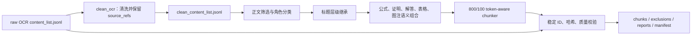

# 教材 Embedding Chunk 构建设计

## 目标

从 `/Users/kebofeier/Desktop/xueshen/clean_text/<book_id>/clean_content_list.jsonl` 读取清洗后的教材内容，以 `/Users/kebofeier/Desktop/xueshen/ocr_text/<book_id>/content_list.jsonl` 校验精确 OCR 溯源，生成可直接进入 embedding 与向量库导入流程的确定性 chunk 数据集。

固定切块参数：

- `chunk_size = 800 tokens`
- `chunk_overlap = 100 tokens`
- `chunk_size` 约束最终 `embedding_text`，包含书名、章节路径、内容角色前缀。
- overlap 只发生在同一语义单元内部的可拆正文，不跨章节、角色或语义单元边界。

## 输入事实层

### 内容事实

`clean_content_list.jsonl` 是 embedding 文本的唯一内容来源。清洗结果负责去除页眉页脚、水印、重复扫描页并修复段落和断裂公式。

### 溯源事实

`content_list.jsonl` 是 OCR 定位事实来源。清洗流水线必须把参与一条 clean 记录的全部 raw block 写入 `source_refs`，每个引用包括：

- `source_page`
- `mineru_page_index`
- `block_index`
- `source_chunk_id`
- `source_pdf`
- `element_type`
- `bbox`
- `raw_hash`

跨块段落和跨块公式合并时合并引用列表；禁止构建器仅凭页码或文本模糊匹配回填溯源。

## 处理流程



## 内容筛选

保留：

- 正文、定义、定理、引理、推论、证明
- 例题及其解答
- 练习、习题、复习题
- 习题答案，标记为 `answer_key` 且 `retrieval_weight = 0.65`
- 有知识内容的附录
- 线性化后的表格
- 有图注的图片或图表，仅保留图注文本

排除：

- front matter：封面、版权、前言、目录和出版信息
- 参考文献、索引、中英文名词索引
- 无图注图片或图表
- 图片路径、公式图片路径和其他文件路径
- 空记录、无法安全拆分且超过 token 限制的原子公式或表格

排除项写入 `excluded_records.jsonl`，包含原因和原始定位。

## 标题继承

维护 1–4 级标题栈。新标题覆盖同级并清除更深层级；每个内容单元继承当前非空标题路径。标题本身不单独生成 chunk，但会进入 `embedding_text` 前缀。

## 内容角色

标准角色：

- `body`
- `definition`
- `theorem`
- `proof`
- `example`
- `solution`
- `exercise`
- `answer_key`
- `formula`
- `table`
- `figure_caption`
- `appendix`

角色由 section、章节路径、元素类型和文本前缀共同确定。答案章节优先级最高；参考文献和索引在分类前排除。

## 语义单元

- 定义或定理与紧随其后的公式、说明和证明形成同一语义单元。
- 例题与紧随其后的“解”形成同一语义单元。
- 练习/习题及其同一段内说明形成同一语义单元。
- 独立公式绑定相邻正文，不生成缺少上下文的孤立 embedding；确无上下文时保留为 `formula` 并记录质量提示。
- 表格使用 HTML 行列结构线性化；caption 在首行写入，不保留 HTML 标签。
- 图片和图表只保留 caption，并绑定相邻语义单元；无 caption 排除。
- 标题变化、section 变化和强角色锚点触发单元边界。

## Tokenizer 与切块

定义 tokenizer protocol，生产实现使用 `tiktoken` encoding，默认 `cl100k_base`，并把 `tokenizer_id` 写入输出和 manifest。测试使用确定性的 whitespace tokenizer。

每个语义单元由带溯源的 segment 组成：

- 普通正文可按 token 拆分。
- 公式和表格是不可拆原子 segment。
- 若不可拆 segment 加前缀后超过 800 tokens，则排除并报告，不静默截断。
- overlap 只复制上一 chunk 末尾最多 100 个可拆正文 tokens；不复制公式或表格，不跨语义单元。

`embedding_text` 格式：

```text
书名：<book_name>
章节：<level1> > <level2> > ...
内容类型：<content_role>

<content_text>
```

## 稳定标识与哈希

- `content_hash`：规范化 `content_text` 的 SHA-256。
- `source_hash`：按出现顺序序列化 source refs 后的 SHA-256。
- `chunk_id`：固定 namespace 下 UUIDv5，name 包含 schema version、book id、chapter path、role、content hash、source hash。
- 生成时间不参与 ID，输入和参数不变时 ID 必须稳定。

## 输出

```text
embedding_artifacts/v1/
├── chunks.jsonl
├── excluded_records.jsonl
├── reports/
│   └── <book_id>.json
├── quality_report.json
└── manifest.json
```

每条 chunk 至少包含：

- schema/version/book metadata
- `chunk_id`、`chunk_index`
- `content_text`、`embedding_text`
- `chapter_path`、`content_role`、`retrieval_weight`
- `source_page_start`、`source_page_end`、`source_refs`
- `token_count`、`tokenizer_id`
- `content_hash`、`source_hash`

## 质量门禁

正式输出必须满足：

- chunk ID 全局唯一且可重现
- `embedding_text` 非空且 `token_count <= 800`
- `source_refs` 非空并能在 raw OCR 索引中精确命中
- 内容中不存在图片路径或 HTML 标签
- page range 与 source refs 一致
- 所有排除均有原因
- 报告数量与输出行数一致

任何门禁失败都使 CLI 非零退出，不发布部分正式产物。
