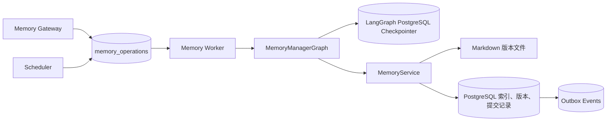
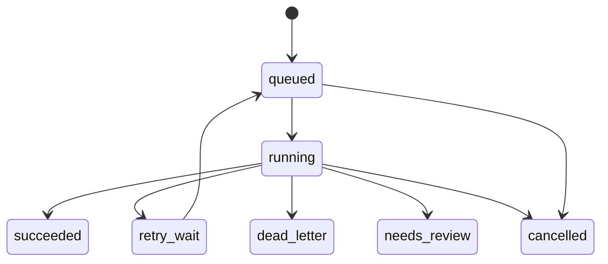
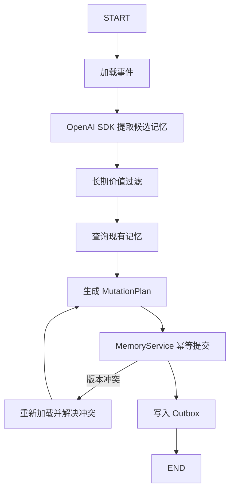

当前设计应采用 **“任务级恢复 + LangGraph 节点级恢复 + MemoryService 幂等提交”三层机制**。

不要追求理论上的 exactly-once，而是实现：

> **任务至少执行一次（at-least-once）+ 最终写入幂等（idempotent commit）**

即使 Worker 重启、任务重复投递、Graph 重跑，也不会重复修改用户记忆。



---

# 一、失败恢复分为三层

## 第一层：任务级恢复

负责处理：

- Worker 进程被杀死
- 服务器重启
- 容器被重新调度
- 数据库暂时不可用
- 任务执行时间过长
- 整个 Graph 执行失败

使用 PostgreSQL `memory_operations` 表作为可靠任务队列。

建议字段：

```text
memory_operations
├── operation_id
├── user_id
├── operation_type
├── source_type
├── payload
├── idempotency_key
├── priority
├── status
├── attempt_count
├── max_attempts
├── next_run_at
├── locked_by
├── lease_expires_at
├── graph_thread_id
├── result
├── error_code
├── error_message
├── created_at
├── started_at
├── completed_at
└── updated_at
```

### 任务状态机



状态含义：

| 状态 | 含义 |
|---|---|
| `queued` | 等待 Worker |
| `running` | Worker 正在执行 |
| `retry_wait` | 暂时失败，等待下一次重试 |
| `succeeded` | 核心记忆修改已经提交 |
| `dead_letter` | 超过最大重试次数 |
| `needs_review` | 需要用户或管理员处理冲突 |
| `cancelled` | 被用户或系统取消 |

---

## 第二层：LangGraph 节点级恢复

每个记忆操作使用独立的 Graph Thread：

```text
thread_id = memory-op:{operation_id}
```

例如：

```text
operation_id = memop_01923
thread_id    = memory-op:memop_01923
```

`MemoryManagerGraph` 使用 PostgreSQL Checkpointer：

```text
AsyncPostgresSaver
```

LangGraph 会在 Graph 的 super-step 边界保存状态，也会保存已经成功完成的节点写入；因此后续节点失败时，可以从已有 checkpoint 恢复，而不必把所有成功节点重新执行。生产环境应使用数据库支持的持久化 Checkpointer。([docs.langchain.com](https://docs.langchain.com/oss/python/langgraph/persistence?utm_source=openai))

例如：

```text
extract_candidate       成功
filter_candidate        成功
search_existing_memory  成功
plan_mutation           成功
commit_memory           失败
```

恢复时应尽量从：

```text
commit_memory
```

继续，而不是重新调用 OpenAI 提取候选记忆。

同一个 `thread_id` 是 LangGraph 查找和恢复 checkpoint 的游标；更换 `thread_id` 会被视为全新的运行。([docs.langchain.com](https://docs.langchain.com/oss/python/langgraph/persistence?utm_source=openai))

### 推荐 Graph 流程



Graph State 至少保留：

```text
operation_id
user_id
source_event
candidate_memories
existing_memory_versions
mutation_plan
commit_result
retry_count
error
```

这样模型已经生成的 `candidate_memories` 和 `mutation_plan` 可以从 checkpoint 恢复。

---

## 第三层：MemoryService 幂等提交

这是最关键的一层。

可能出现下面的情况：

```text
MemoryService 已经写入 Markdown
    ↓
Worker 在更新 operation 状态前宕机
    ↓
任务被重新执行
```

如果没有幂等保护，同一条总结可能写入两次。

因此每次提交必须带：

```text
operation_id
mutation_id
expected_version
```

数据库增加唯一约束：

```text
UNIQUE(user_id, operation_id, mutation_id)
```

MemoryService 提交前检查：

```text
这个 mutation_id 是否已经提交？
├── 是 → 直接返回上一次 CommitResult
└── 否 → 正常提交
```

这样任务重复执行不会重复修改 Markdown。

---

# 二、Markdown 文件如何避免写到一半？

不建议直接覆盖：

```text
memory/mastery/uniform-convergence.md
```

生产环境建议使用“逻辑路径 + 不可变版本文件”。

例如逻辑上仍然是：

```text
memory/mastery/uniform-convergence.md
```

物理存储可以是：

```text
memory/.versions/mastery/uniform-convergence/
├── v000001.md
├── v000002.md
└── v000003.md
```

PostgreSQL只保存当前活动版本：

```text
memory_documents
├── user_id
├── logical_path
├── active_version
├── storage_key
├── checksum
├── updated_by_operation_id
└── updated_at
```

## 提交流程

```text
1. 获取用户级写锁
2. 检查 expected_version
3. 写入新的不可变 Markdown 版本
4. 校验文件 checksum
5. PostgreSQL 事务更新 active_version
6. 写入 memory_commits
7. 把 memory.changed 写入 Outbox
8. 提交数据库事务
```

如果第 3 步成功，但第 5 步失败：

- 新文件没有成为 `active_version`
- 用户仍然读到旧版本
- 新文件只是孤立版本
- 后台清理任务以后删除它

如果第 5 步成功，但更新 `index.md` 时宕机：

- 核心记忆已经安全提交
- Outbox 事件还在
- 后台重新生成 `index.md`

因此建议：

> `index.md` 是可重建的派生目录，不要让它成为唯一索引真相。

逻辑上的记忆内容仍然存储在 Markdown 中，PostgreSQL只管理：

- 活动版本指针
- 文件校验值
- 幂等记录
- 检索索引
- 操作历史

---

# 三、Worker 如何领取任务？

多个 Worker 可以通过 PostgreSQL 并发领取：

```sql
SELECT operation_id
FROM memory_operations
WHERE status IN ('queued', 'retry_wait')
  AND next_run_at <= NOW()
ORDER BY priority DESC, created_at ASC
FOR UPDATE SKIP LOCKED
LIMIT 10;
```

领取之后设置：

```text
status            = running
locked_by         = worker-03
lease_expires_at  = 当前时间 + 5分钟
attempt_count     = attempt_count + 1
```

## 为什么需要 Lease？

假设：

```text
worker-03 领取任务
    ↓
执行到一半服务器宕机
```

数据库里的任务仍然是 `running`。

Watchdog 定期查找：

```text
status = running
AND lease_expires_at < now()
```

然后：

```text
attempt_count < max_attempts
    → retry_wait

attempt_count >= max_attempts
    → dead_letter
```

长任务执行期间，Worker 每隔一段时间延长 Lease：

```text
lease_expires_at = now() + 5分钟
```

---

# 四、重试应分成两级

## 1. 节点级短重试

适合：

- OpenAI 请求超时
- OpenAI 限流
- 临时网络异常
- 数据库连接闪断
- 对象存储临时错误

在 LangGraph Node 上配置 RetryPolicy：

```text
最多重试：3次
等待策略：指数退避
等待时间：1s → 2s → 4s
增加随机 jitter
```

LangGraph 支持为节点配置重试策略；节点重试耗尽后，再由外层任务恢复机制决定是否重新调度整个任务。([docs.langchain.com](https://docs.langchain.com/oss/python/langgraph/fault-tolerance?utm_source=openai))

## 2. 任务级长重试

节点级重试仍然失败后，Worker 将任务设置成：

```text
retry_wait
```

推荐：

```text
第1次：30秒后
第2次：2分钟后
第3次：10分钟后
第4次：30分钟后
第5次：进入 dead_letter
```

具体时间可以通过：

```text
next_run_at
```

调度，不需要 Worker 原地睡眠。

---

# 五、哪些错误不能重试？

必须区分临时错误与永久错误。

| 错误 | 是否重试 | 处理方式 |
|---|---:|---|
| OpenAI 超时 | 是 | 节点级重试 |
| OpenAI 429/5xx | 是 | 指数退避 |
| PostgreSQL 临时断开 | 是 | 任务级重试 |
| Markdown 存储暂时不可用 | 是 | 任务级重试 |
| 文件版本冲突 | 有条件 | 重新读取并合并 |
| 输入格式错误 | 否 | `dead_letter` |
| 用户无权限 | 否 | `failed_permanent` |
| 图谱 `node_id` 不存在 | 否 | 返回业务错误 |
| 用户要求删除不存在的记忆 | 否或幂等成功 | 一般按成功处理 |
| 模型持续输出不符合 Schema | 限制次数 | `needs_review` |
| 多次合并冲突 | 否 | `needs_review` |

特别是删除操作：

```text
删除一个已经不存在的记忆
```

建议视为幂等成功，而不是错误。

---

# 六、版本冲突如何恢复？

例如两个任务同时修改：

```text
memory/mastery/uniform-convergence.md
```

任务 A 和 B 都读取到：

```text
version = 8
```

A 先提交：

```text
version 8 → version 9
```

B 提交时携带：

```text
expected_version = 8
```

MemoryService 检测当前已经是 `9`，返回：

```text
VERSION_CONFLICT
```

Graph 不应立即把任务标记失败，而是走：

```text
reload_latest_memory
→ reconcile_mutation
→ 生成新 MutationPlan
→ 再次提交
```

最多重新合并一到两次。仍冲突则进入：

```text
needs_review
```

不过，更推荐对同一用户执行写入串行化：

```text
PostgreSQL advisory lock(user_id)
```

这样不同用户可以并行，同一用户的长期记忆修改按顺序执行。

---

# 七、任务调度怎么划分优先级？

建议分四档。

| 优先级 | 来源 | 调度方式 |
|---:|---|---|
| P0 | 用户删除、纠正记忆 | 立即执行 |
| P1 | 用户点击图谱熟悉/不熟悉 | 同步快速路径 |
| P2 | 对话结束后的总结 | 异步，尽快执行 |
| P3 | 浏览、打开、论坛等行为证据 | 聚合后执行 |
| P4 | 索引重建、清理、压缩 | 后台低优先级 |

## 用户明确命令

例如：

- 删除记忆
- 纠正掌握状态
- 标记知识点熟悉/不熟悉

建议采用：

```text
先持久化 operation
→ API 尝试立即执行
→ 成功返回 200
→ 临时失败返回 202 + operation_id
→ Worker 后台继续处理
```

这样既能快速响应，又不会因为 API 进程宕机而丢失命令。

## 对话证据

不要每条消息都提交长期记忆。

建议在：

- 会话明确结束
- 用户切换主题
- 累积到一定消息量
- 检测到重要学习状态变化

时创建总结任务。

## 行为证据

浏览和打开页面应先聚合。例如：

```text
用户在10分钟内打开同一知识点5次
```

合并成一条：

```text
topic_exposure_count = 5
```

然后再交给 MemoryManagerGraph，避免大量低价值任务调用 OpenAI。

---

# 八、周期性任务怎么调度？

Scheduler 只负责向 `memory_operations` 插入任务，不直接修改记忆。

建议的周期任务：

| 任务 | 推荐周期 |
|---|---|
| 回收过期 Lease | 每30秒—1分钟 |
| 重试到期任务 | 持续轮询 |
| 重建失败的 `index.md` | 每5分钟或事件驱动 |
| 清理孤立 Markdown 版本 | 每天 |
| 清理已成功 Graph Checkpoint | 每天 |
| 检查死信任务 | 每5—15分钟 |
| 压缩重复行为证据 | 每小时 |
| 校验 Markdown 与数据库 checksum | 每天 |
| 重新生成检索索引 | 事件驱动，失败时补偿 |

多台 Scheduler 同时运行时，要使用：

```text
scheduler_lock
```

或者 PostgreSQL advisory lock，确保同一周期任务只生成一次。

---

# 九、对当前设计最重要的约束

## `succeeded` 的准确含义

只有满足下面条件才能标记成功：

```text
Markdown 新版本已经写入
+ active_version 已经更新
+ memory_commit 已经记录
+ Outbox 事件已经入库
```

不要求派生的 `index.md` 已经生成完成，因为它可以通过 Outbox 重建。

## Checkpoint 不是最终记忆

必须继续保持：

```text
LangGraph Checkpointer
    = Graph 执行恢复

Markdown
    = 长期总结记忆

PostgreSQL memory_operations
    = 任务恢复和调度

PostgreSQL memory_commits
    = 幂等和版本控制
```

它们不能互相替代。

## 不复用对话 Thread

```text
chat:{conversation_id}
```

只用于对话短期记忆。

```text
memory-op:{operation_id}
```

只用于一次 MemoryManagerGraph 执行恢复。

两者完全隔离。

---

## 最终推荐方案

当前不使用 Agent Server 时，部署以下进程：

```text
1. Website API
   └── 接收前端请求和 Agent 请求

2. Memory Worker
   └── 执行 MemoryManagerGraph

3. Memory Scheduler
   └── 生成周期任务、回收超时任务

4. PostgreSQL
   ├── memory_operations
   ├── memory_commits
   ├── memory_documents
   ├── memory_outbox
   └── LangGraph checkpoints

5. Markdown Storage
   └── 不可变版本文件
```

第一版可以让 `Memory Worker` 和 `Memory Scheduler` 运行在同一个服务进程中，但代码模块必须分离。以后扩容时，可以直接拆成多个 Worker，而不改变 API 和 `MemoryManagerGraph`。