# 数学知识科技树关系图

> 节点来源：`教材目录.md` 中全部四级标题（`####`）。本图包含 127 个有章节细目的核心节点，以及 6 个无细目专题节点。
>
> 关系判定依据：教材目录中的章节细目、数学概念与方法的直接先修关系，以及中学到大学的自然知识延伸。本版未直接查阅原始 PDF。

## 阅读规则

- **实线箭头 `A --> B`**：A 是学习 B 的直接前置或强支撑知识。
- **虚线箭头 `A -.-> B`**：B 是无细目专题节点，仅表示它固定紧跟教材中的前一章；不额外解释为严格先修关系。
- 只保留直接或强先修边，能够由多条边推导出的传递关系通常不重复绘制。
- 教材中相邻的两个章节如果没有明显知识依赖，不会仅因目录顺序而连接。
- 子图用于帮助阅读，不代表不同分支绝对隔离；跨子图箭头表示知识路线的汇合。

## 科技树总图

```mermaid
flowchart LR
    subgraph g1["基础代数与初等函数"]
        direction TB
        n001["第一章 有理数"]
        n002["第二章 有理数的运算"]
        n003["第三章 代数式"]
        n004["第四章 整式的加减"]
        n005["第五章 一元一次方程"]
        n008["第八章 实数"]
        n009["第九章 平面直角坐标系"]
        n010["第十章 二元一次方程组"]
        n011["第十一章 不等式与不等式组"]
        n018["第十六章 整式的乘法"]
        n019["第十七章 因式分解"]
        n020["第十八章 分式"]
        n021["第十九章 二次根式"]
        n024["第二十二章 函数"]
        n025["第二十三章 一次函数"]
        n027["第二十一章 一元二次方程"]
        n028["第二十二章 二次函数"]
        n032["第二十六章 反比例函数"]
        n036["第一章 集合与常用逻辑用语"]
        n037["第二章 一元二次函数、方程和不等式"]
        n038["第三章 函数的概念与性质"]
        n039["第四章 指数函数与对数函数"]
        n040["数学建模 建立函数模型解决实际问题"]
        n041["第五章 三角函数"]
        n056["第四章 数列"]
        n057["第五章 一元函数的导数及其应用"]
    end

    subgraph g2["初等几何与解析几何"]
        direction TB
        n006["第六章 几何图形初步"]
        n007["第七章 相交线与平行线"]
        n013["第十三章 三角形"]
        n014["综合与实践 确定匀质薄板的重心位置"]
        n015["第十四章 全等三角形"]
        n016["第十五章 轴对称"]
        n017["综合与实践 最短路径问题"]
        n022["第二十章 勾股定理"]
        n023["第二十一章 四边形"]
        n029["第二十三章 旋转"]
        n030["第二十四章 圆"]
        n033["第二十七章 相似"]
        n034["第二十八章 锐角三角函数"]
        n035["第二十九章 投影与视图"]
        n042["第六章 平面向量及其应用"]
        n043["数学探究 用向量法研究三角形的性质"]
        n045["第八章 立体几何初步"]
        n048["第一章 空间向量与立体几何"]
        n049["第二章 直线和圆的方程"]
        n050["第三章 圆锥曲线的方程"]
        n104["第一章 几何空间的线性结构和度量结构"]
        n105["第二章 空间的平面和直线"]
        n106["第三章 常见曲面"]
        n107["第四章 坐标变换"]
        n108["第五章 二次曲线方程的化简及其类型和性质"]
        n109["第六章 正交变换和仿射变换"]
        n110["第七章 射影平面和它的射影变换"]
        n129["第八章 向量代数与空间解析几何"]
    end

    subgraph g3["数据、概率与统计"]
        direction TB
        n012["第十二章 数据的收集、整理与描述"]
        n026["第二十四章 数据的分析"]
        n031["第二十五章 概率初步"]
        n046["第九章 统计"]
        n047["第十章 概率"]
        n051["第六章 计数原理"]
        n052["数学探究 杨辉三角的性质与应用"]
        n053["第七章 随机变量及其分布"]
        n054["第八章 成对数据的统计分析"]
        n055["数学建模 建立统计模型进行预测"]
        n083["第一章 概率论的基本概念"]
        n084["第二章 随机变量及其分布"]
        n085["第三章 多维随机变量及其分布"]
        n086["第四章 随机变量的数字特征"]
        n087["第五章 大数定律及中心极限定理"]
        n088["第六章 样本及抽样分布"]
        n089["第七章 参数估计"]
        n090["第八章 假设检验"]
        n091["第九章 方差分析及回归分析"]
        n092["第十章 bootstrap 方法（自助法）"]
        n093["第十一章 在数理统计中应用 R 软件"]
        n094["第十二章 随机过程"]
        n095["第十三章 马尔可夫链"]
        n096["第十四章 平稳随机过程"]
        n097["第十五章 时间序列分析"]
    end

    subgraph g4["数学分析与微积分"]
        direction TB
        n058["第一章 集合与映射"]
        n059["第二章 数列极限"]
        n060["第三章 函数极限与连续函数"]
        n061["第四章 微分"]
        n062["第五章 微分中值定理及其应用"]
        n063["第六章 不定积分"]
        n064["第七章 定积分"]
        n065["第八章 反常积分"]
        n066["第九章 数项级数"]
        n067["第十章 函数项级数"]
        n068["第十一章 Euclid空间上的极限和连续"]
        n069["第十二章 多元函数的微分学"]
        n070["第十三章 重积分"]
        n071["第十四章 曲线积分、曲面积分与场论"]
        n072["第十五章 含参变量积分"]
        n073["第十六章 Fourier 级数"]
        n122["第一章 函数与极限"]
        n123["第二章 导数与微分"]
        n124["第三章 微分中值定理与导数的应用"]
        n125["第四章 不定积分"]
        n126["第五章 定积分"]
        n127["第六章 定积分的应用"]
        n128["第七章 微分方程"]
        n130["第九章 多元函数微分法及其应用"]
        n131["第十章 重积分"]
        n132["第十一章 曲线积分与曲面积分"]
        n133["第十二章 无穷级数"]
    end

    subgraph g5["线性代数与高等代数"]
        direction TB
        n098["第1章 行列式"]
        n099["第2章 矩阵及其运算"]
        n100["第3章 矩阵的初等变换与线性方程组"]
        n101["第4章 向量组的线性相关性"]
        n102["第5章 相似矩阵及二次型"]
        n103["第6章 线性空间与线性变换"]
        n111["第1章 线性方程组"]
        n112["第2章 行列式"]
        n113["第3章 n维向量空间K^n"]
        n114["第4章 矩阵的运算"]
        n115["第5章 矩阵的相抵与相似"]
        n116["第6章 二次型·矩阵的合同"]
        n117["第7章 一元和n元多项式环"]
        n118["第8章 线性空间"]
        n119["第9章 线性映射"]
        n120["第10章 具有度量的线性空间"]
        n121["*第11章 多重线性代数"]
    end

    subgraph g6["复数与复变函数"]
        direction TB
        n044["第七章 复数"]
        n074["第一章 复数与复变函数"]
        n075["第二章 解析函数"]
        n076["第三章 复变函数的积分"]
        n077["第四章 解析函数的幂级数表示法"]
        n078["第五章 解析函数的洛朗（Laurent）展式与孤立奇点"]
        n079["第六章 留数理论及其应用"]
        n080["第七章 共形映射"]
        n081["第八章 解析延拓"]
        n082["第九章 调和函数"]
    end

    %% 初中数与代数基础
    n001 --> n002
    n001 --> n008
    n001 --> n003
    n002 --> n003
    n002 --> n012
    n003 --> n004
    n003 --> n024
    n004 --> n005
    n004 --> n018
    n005 --> n010
    n005 --> n011
    n008 --> n021
    n009 --> n010
    n009 --> n025
    n010 --> n025
    n011 --> n025
    n018 --> n019
    n018 --> n051
    n018 --> n020
    n019 --> n020
    n019 --> n027
    n020 --> n032
    n021 --> n027
    n024 --> n025
    n024 --> n032
    n024 --> n038
    n027 --> n028
    n027 --> n037
    n028 --> n037
    n032 --> n038

    %% 初等几何、三角与坐标几何
    n006 --> n007
    n006 --> n009
    n006 --> n035
    n006 --> n013
    n007 --> n013
    n007 --> n023
    n007 --> n033
    n013 --> n015
    n013 --> n030
    n013 --> n016
    n013 --> n022
    n013 --> n023
    n013 --> n033
    n015 --> n016
    n015 --> n023
    n016 --> n029
    n022 --> n034
    n030 --> n041
    n033 --> n034
    n034 --> n041
    n035 --> n045
    n009 --> n049
    n025 --> n049
    n030 --> n049
    n042 --> n048
    n042 --> n049
    n042 --> n104
    n042 --> n129
    n045 --> n048
    n045 --> n104
    n045 --> n105
    n045 --> n129
    n048 --> n105
    n048 --> n129
    n049 --> n050
    n049 --> n105
    n050 --> n108
    n104 --> n105
    n104 --> n107
    n105 --> n106
    n107 --> n108
    n108 --> n109
    n109 --> n110
    n129 --> n130

    %% 高中函数、数列与导数
    n036 --> n037
    n036 --> n038
    n038 --> n039
    n038 --> n041
    n038 --> n056
    n038 --> n057
    n039 --> n057
    n041 --> n042
    n041 --> n044
    n041 --> n057
    n056 --> n059
    n056 --> n066
    n057 --> n061
    n057 --> n123

    %% 数据、概率与统计
    n012 --> n026
    n012 --> n031
    n026 --> n046
    n031 --> n047
    n036 --> n047
    n046 --> n054
    n046 --> n088
    n047 --> n053
    n047 --> n054
    n047 --> n083
    n051 --> n053
    n053 --> n084
    n054 --> n091
    n083 --> n084
    n084 --> n085
    n084 --> n086
    n084 --> n094
    n085 --> n086
    n086 --> n087
    n087 --> n088
    n088 --> n089
    n088 --> n090
    n088 --> n092
    n089 --> n090
    n089 --> n092
    n090 --> n091
    n090 --> n093
    n091 --> n092
    n091 --> n093
    n091 --> n097
    n092 --> n093
    n094 --> n095
    n094 --> n096
    n096 --> n097

    %% 数学分析
    n036 --> n058
    n008 --> n059
    n058 --> n059
    n058 --> n060
    n059 --> n060
    n038 --> n060
    n060 --> n061
    n061 --> n062
    n061 --> n063
    n061 --> n069
    n063 --> n064
    n064 --> n065
    n064 --> n070
    n064 --> n072
    n059 --> n066
    n066 --> n067
    n060 --> n068
    n068 --> n069
    n069 --> n070
    n069 --> n071
    n070 --> n071
    n067 --> n072
    n067 --> n073
    n041 --> n073

    %% 高等数学
    n038 --> n122
    n056 --> n122
    n122 --> n123
    n123 --> n124
    n123 --> n125
    n123 --> n130
    n125 --> n126
    n126 --> n127
    n124 --> n128
    n126 --> n128
    n126 --> n131
    n130 --> n131
    n131 --> n132
    n056 --> n133
    n122 --> n133
    n041 --> n133

    %% 复数与复变函数
    n008 --> n044
    n027 --> n044
    n044 --> n074
    n060 --> n075
    n074 --> n075
    n075 --> n076
    n075 --> n082
    n076 --> n077
    n076 --> n082
    n077 --> n078
    n078 --> n079
    n079 --> n080
    n080 --> n081

    %% 线性代数、高等代数与几何变换
    n010 --> n099
    n010 --> n100
    n010 --> n111
    n042 --> n101
    n042 --> n113
    n099 --> n098
    n099 --> n100
    n098 --> n100
    n100 --> n101
    n101 --> n103
    n103 --> n102
    n100 --> n111
    n098 --> n112
    n101 --> n113
    n099 --> n114
    n111 --> n113
    n111 --> n117
    n113 --> n114
    n113 --> n118
    n114 --> n115
    n115 --> n116
    n102 --> n116
    n103 --> n118
    n117 --> n119
    n118 --> n119
    n118 --> n121
    n119 --> n120
    n119 --> n121
    n099 --> n107
    n114 --> n107
    n103 --> n109
    n116 --> n108
    n119 --> n109
    n120 --> n109

    %% 六个无细目专题节点：只固定在前一章之后
    n013 -. 教材顺序 .-> n014
    n016 -. 教材顺序 .-> n017
    n039 -. 教材顺序 .-> n040
    n042 -. 教材顺序 .-> n043
    n051 -. 教材顺序 .-> n052
    n054 -. 教材顺序 .-> n055

    classDef junior fill:#E8F4FD,stroke:#3B82B6,color:#102A43,stroke-width:1px;
    classDef high fill:#FFF3CD,stroke:#B8860B,color:#4A3500,stroke-width:1px;
    classDef university fill:#E9F7EF,stroke:#2E8B57,color:#123524,stroke-width:1px;
    classDef special fill:#FCE8F3,stroke:#B83280,color:#4A1534,stroke-width:2px,stroke-dasharray: 5 3;
    class n001,n002,n003,n004,n005,n006,n007,n008,n009,n010,n011,n012,n013,n014,n015,n016,n017,n018,n019,n020,n021,n022,n023,n024,n025,n026,n027,n028,n029,n030,n031,n032,n033,n034,n035 junior;
    class n036,n037,n038,n039,n040,n041,n042,n043,n044,n045,n046,n047,n048,n049,n050,n051,n052,n053,n054,n055,n056,n057 high;
    class n058,n059,n060,n061,n062,n063,n064,n065,n066,n067,n068,n069,n070,n071,n072,n073,n074,n075,n076,n077,n078,n079,n080,n081,n082,n083,n084,n085,n086,n087,n088,n089,n090,n091,n092,n093,n094,n095,n096,n097,n098,n099,n100,n101,n102,n103,n104,n105,n106,n107,n108,n109,n110,n111,n112,n113,n114,n115,n116,n117,n118,n119,n120,n121,n122,n123,n124,n125,n126,n127,n128,n129,n130,n131,n132,n133 university;
    class n014,n017,n040,n043,n052,n055 special;
```

## 主要路线说明

| 路线 | 主要发展方向 | 代表性连接 |
|---|---|---|
| 数与代数 | 数系、式、方程、不等式、函数 | 有理数 → 代数式 → 整式 → 方程；函数 → 一次/反比例函数 → 高中函数 |
| 几何 | 基本图形、三角形、变换、坐标与空间 | 几何图形初步 → 平行线 → 三角形 → 相似/三角函数；坐标系 → 直线和圆 → 圆锥曲线 |
| 分析与微积分 | 极限、微分、积分、级数、多元分析 | 数列 → 数列极限 → 函数极限 → 微分/积分；一元微积分 → 多元微积分 |
| 概率统计 | 数据、事件、随机变量、统计推断、随机过程 | 数据整理 → 数据分析 → 统计；概率初步 → 高中概率 → 大学概率论 |
| 线性代数 | 矩阵、方程组、向量空间、线性映射 | 矩阵 → 方程组 → 向量组 → 线性空间/线性变换 |
| 复变函数 | 复数、解析函数、积分、级数、留数与映射 | 高中复数 → 复数与复变函数 → 解析函数 → 复积分 → 留数/共形映射 |

## 六个专题节点的固定位置

| 前一章 | 紧随其后的专题节点 |
|---|---|
| 第十三章 三角形 | 综合与实践 确定匀质薄板的重心位置 |
| 第十五章 轴对称 | 综合与实践 最短路径问题 |
| 第四章 指数函数与对数函数 | 数学建模 建立函数模型解决实际问题 |
| 第六章 平面向量及其应用 | 数学探究 用向量法研究三角形的性质 |
| 第六章 计数原理 | 数学探究 杨辉三角的性质与应用 |
| 第八章 成对数据的统计分析 | 数学建模 建立统计模型进行预测 |

## 节点索引

| ID | 四级标题节点 | 来源 | 类型 |
|---|---|---|---|
| `n001` | 第一章 有理数 | 七年级数学 / 上册 | 有细目核心节点 |
| `n002` | 第二章 有理数的运算 | 七年级数学 / 上册 | 有细目核心节点 |
| `n003` | 第三章 代数式 | 七年级数学 / 上册 | 有细目核心节点 |
| `n004` | 第四章 整式的加减 | 七年级数学 / 上册 | 有细目核心节点 |
| `n005` | 第五章 一元一次方程 | 七年级数学 / 上册 | 有细目核心节点 |
| `n006` | 第六章 几何图形初步 | 七年级数学 / 上册 | 有细目核心节点 |
| `n007` | 第七章 相交线与平行线 | 七年级数学 / 下册 | 有细目核心节点 |
| `n008` | 第八章 实数 | 七年级数学 / 下册 | 有细目核心节点 |
| `n009` | 第九章 平面直角坐标系 | 七年级数学 / 下册 | 有细目核心节点 |
| `n010` | 第十章 二元一次方程组 | 七年级数学 / 下册 | 有细目核心节点 |
| `n011` | 第十一章 不等式与不等式组 | 七年级数学 / 下册 | 有细目核心节点 |
| `n012` | 第十二章 数据的收集、整理与描述 | 七年级数学 / 下册 | 有细目核心节点 |
| `n013` | 第十三章 三角形 | 八年级数学 / 上册 | 有细目核心节点 |
| `n014` | 综合与实践 确定匀质薄板的重心位置 | 八年级数学 / 上册 | 无细目专题节点 |
| `n015` | 第十四章 全等三角形 | 八年级数学 / 上册 | 有细目核心节点 |
| `n016` | 第十五章 轴对称 | 八年级数学 / 上册 | 有细目核心节点 |
| `n017` | 综合与实践 最短路径问题 | 八年级数学 / 上册 | 无细目专题节点 |
| `n018` | 第十六章 整式的乘法 | 八年级数学 / 上册 | 有细目核心节点 |
| `n019` | 第十七章 因式分解 | 八年级数学 / 上册 | 有细目核心节点 |
| `n020` | 第十八章 分式 | 八年级数学 / 上册 | 有细目核心节点 |
| `n021` | 第十九章 二次根式 | 八年级数学 / 下册 | 有细目核心节点 |
| `n022` | 第二十章 勾股定理 | 八年级数学 / 下册 | 有细目核心节点 |
| `n023` | 第二十一章 四边形 | 八年级数学 / 下册 | 有细目核心节点 |
| `n024` | 第二十二章 函数 | 八年级数学 / 下册 | 有细目核心节点 |
| `n025` | 第二十三章 一次函数 | 八年级数学 / 下册 | 有细目核心节点 |
| `n026` | 第二十四章 数据的分析 | 八年级数学 / 下册 | 有细目核心节点 |
| `n027` | 第二十一章 一元二次方程 | 九年级数学 / 上册 | 有细目核心节点 |
| `n028` | 第二十二章 二次函数 | 九年级数学 / 上册 | 有细目核心节点 |
| `n029` | 第二十三章 旋转 | 九年级数学 / 上册 | 有细目核心节点 |
| `n030` | 第二十四章 圆 | 九年级数学 / 上册 | 有细目核心节点 |
| `n031` | 第二十五章 概率初步 | 九年级数学 / 上册 | 有细目核心节点 |
| `n032` | 第二十六章 反比例函数 | 九年级数学 / 下册 | 有细目核心节点 |
| `n033` | 第二十七章 相似 | 九年级数学 / 下册 | 有细目核心节点 |
| `n034` | 第二十八章 锐角三角函数 | 九年级数学 / 下册 | 有细目核心节点 |
| `n035` | 第二十九章 投影与视图 | 九年级数学 / 下册 | 有细目核心节点 |
| `n036` | 第一章 集合与常用逻辑用语 | 高中数学（A版） / 必修 第一册 | 有细目核心节点 |
| `n037` | 第二章 一元二次函数、方程和不等式 | 高中数学（A版） / 必修 第一册 | 有细目核心节点 |
| `n038` | 第三章 函数的概念与性质 | 高中数学（A版） / 必修 第一册 | 有细目核心节点 |
| `n039` | 第四章 指数函数与对数函数 | 高中数学（A版） / 必修 第一册 | 有细目核心节点 |
| `n040` | 数学建模 建立函数模型解决实际问题 | 高中数学（A版） / 必修 第一册 | 无细目专题节点 |
| `n041` | 第五章 三角函数 | 高中数学（A版） / 必修 第一册 | 有细目核心节点 |
| `n042` | 第六章 平面向量及其应用 | 高中数学（A版） / 必修 第二册 | 有细目核心节点 |
| `n043` | 数学探究 用向量法研究三角形的性质 | 高中数学（A版） / 必修 第二册 | 无细目专题节点 |
| `n044` | 第七章 复数 | 高中数学（A版） / 必修 第二册 | 有细目核心节点 |
| `n045` | 第八章 立体几何初步 | 高中数学（A版） / 必修 第二册 | 有细目核心节点 |
| `n046` | 第九章 统计 | 高中数学（A版） / 必修 第二册 | 有细目核心节点 |
| `n047` | 第十章 概率 | 高中数学（A版） / 必修 第二册 | 有细目核心节点 |
| `n048` | 第一章 空间向量与立体几何 | 高中数学（A版） / 选择性必修 第一册 | 有细目核心节点 |
| `n049` | 第二章 直线和圆的方程 | 高中数学（A版） / 选择性必修 第一册 | 有细目核心节点 |
| `n050` | 第三章 圆锥曲线的方程 | 高中数学（A版） / 选择性必修 第一册 | 有细目核心节点 |
| `n051` | 第六章 计数原理 | 高中数学（A版） / 选择性必修 第三册 | 有细目核心节点 |
| `n052` | 数学探究 杨辉三角的性质与应用 | 高中数学（A版） / 选择性必修 第三册 | 无细目专题节点 |
| `n053` | 第七章 随机变量及其分布 | 高中数学（A版） / 选择性必修 第三册 | 有细目核心节点 |
| `n054` | 第八章 成对数据的统计分析 | 高中数学（A版） / 选择性必修 第三册 | 有细目核心节点 |
| `n055` | 数学建模 建立统计模型进行预测 | 高中数学（A版） / 选择性必修 第三册 | 无细目专题节点 |
| `n056` | 第四章 数列 | 高中数学（A版） / 选择性必修 第二册 | 有细目核心节点 |
| `n057` | 第五章 一元函数的导数及其应用 | 高中数学（A版） / 选择性必修 第二册 | 有细目核心节点 |
| `n058` | 第一章 集合与映射 | 大学数学 / 数学分析（第三版）·上册 | 有细目核心节点 |
| `n059` | 第二章 数列极限 | 大学数学 / 数学分析（第三版）·上册 | 有细目核心节点 |
| `n060` | 第三章 函数极限与连续函数 | 大学数学 / 数学分析（第三版）·上册 | 有细目核心节点 |
| `n061` | 第四章 微分 | 大学数学 / 数学分析（第三版）·上册 | 有细目核心节点 |
| `n062` | 第五章 微分中值定理及其应用 | 大学数学 / 数学分析（第三版）·上册 | 有细目核心节点 |
| `n063` | 第六章 不定积分 | 大学数学 / 数学分析（第三版）·上册 | 有细目核心节点 |
| `n064` | 第七章 定积分 | 大学数学 / 数学分析（第三版）·上册 | 有细目核心节点 |
| `n065` | 第八章 反常积分 | 大学数学 / 数学分析（第三版）·上册 | 有细目核心节点 |
| `n066` | 第九章 数项级数 | 大学数学 / 数学分析（第三版）·下册 | 有细目核心节点 |
| `n067` | 第十章 函数项级数 | 大学数学 / 数学分析（第三版）·下册 | 有细目核心节点 |
| `n068` | 第十一章 Euclid空间上的极限和连续 | 大学数学 / 数学分析（第三版）·下册 | 有细目核心节点 |
| `n069` | 第十二章 多元函数的微分学 | 大学数学 / 数学分析（第三版）·下册 | 有细目核心节点 |
| `n070` | 第十三章 重积分 | 大学数学 / 数学分析（第三版）·下册 | 有细目核心节点 |
| `n071` | 第十四章 曲线积分、曲面积分与场论 | 大学数学 / 数学分析（第三版）·下册 | 有细目核心节点 |
| `n072` | 第十五章 含参变量积分 | 大学数学 / 数学分析（第三版）·下册 | 有细目核心节点 |
| `n073` | 第十六章 Fourier 级数 | 大学数学 / 数学分析（第三版）·下册 | 有细目核心节点 |
| `n074` | 第一章 复数与复变函数 | 大学数学 / 复变函数论（第五版） | 有细目核心节点 |
| `n075` | 第二章 解析函数 | 大学数学 / 复变函数论（第五版） | 有细目核心节点 |
| `n076` | 第三章 复变函数的积分 | 大学数学 / 复变函数论（第五版） | 有细目核心节点 |
| `n077` | 第四章 解析函数的幂级数表示法 | 大学数学 / 复变函数论（第五版） | 有细目核心节点 |
| `n078` | 第五章 解析函数的洛朗（Laurent）展式与孤立奇点 | 大学数学 / 复变函数论（第五版） | 有细目核心节点 |
| `n079` | 第六章 留数理论及其应用 | 大学数学 / 复变函数论（第五版） | 有细目核心节点 |
| `n080` | 第七章 共形映射 | 大学数学 / 复变函数论（第五版） | 有细目核心节点 |
| `n081` | 第八章 解析延拓 | 大学数学 / 复变函数论（第五版） | 有细目核心节点 |
| `n082` | 第九章 调和函数 | 大学数学 / 复变函数论（第五版） | 有细目核心节点 |
| `n083` | 第一章 概率论的基本概念 | 大学数学 / 概率论与数理统计（第五版） | 有细目核心节点 |
| `n084` | 第二章 随机变量及其分布 | 大学数学 / 概率论与数理统计（第五版） | 有细目核心节点 |
| `n085` | 第三章 多维随机变量及其分布 | 大学数学 / 概率论与数理统计（第五版） | 有细目核心节点 |
| `n086` | 第四章 随机变量的数字特征 | 大学数学 / 概率论与数理统计（第五版） | 有细目核心节点 |
| `n087` | 第五章 大数定律及中心极限定理 | 大学数学 / 概率论与数理统计（第五版） | 有细目核心节点 |
| `n088` | 第六章 样本及抽样分布 | 大学数学 / 概率论与数理统计（第五版） | 有细目核心节点 |
| `n089` | 第七章 参数估计 | 大学数学 / 概率论与数理统计（第五版） | 有细目核心节点 |
| `n090` | 第八章 假设检验 | 大学数学 / 概率论与数理统计（第五版） | 有细目核心节点 |
| `n091` | 第九章 方差分析及回归分析 | 大学数学 / 概率论与数理统计（第五版） | 有细目核心节点 |
| `n092` | 第十章 bootstrap 方法（自助法） | 大学数学 / 概率论与数理统计（第五版） | 有细目核心节点 |
| `n093` | 第十一章 在数理统计中应用 R 软件 | 大学数学 / 概率论与数理统计（第五版） | 有细目核心节点 |
| `n094` | 第十二章 随机过程 | 大学数学 / 概率论与数理统计（第五版） | 有细目核心节点 |
| `n095` | 第十三章 马尔可夫链 | 大学数学 / 概率论与数理统计（第五版） | 有细目核心节点 |
| `n096` | 第十四章 平稳随机过程 | 大学数学 / 概率论与数理统计（第五版） | 有细目核心节点 |
| `n097` | 第十五章 时间序列分析 | 大学数学 / 概率论与数理统计（第五版） | 有细目核心节点 |
| `n098` | 第1章 行列式 | 大学数学 / 线性代数（第七版） | 有细目核心节点 |
| `n099` | 第2章 矩阵及其运算 | 大学数学 / 线性代数（第七版） | 有细目核心节点 |
| `n100` | 第3章 矩阵的初等变换与线性方程组 | 大学数学 / 线性代数（第七版） | 有细目核心节点 |
| `n101` | 第4章 向量组的线性相关性 | 大学数学 / 线性代数（第七版） | 有细目核心节点 |
| `n102` | 第5章 相似矩阵及二次型 | 大学数学 / 线性代数（第七版） | 有细目核心节点 |
| `n103` | 第6章 线性空间与线性变换 | 大学数学 / 线性代数（第七版） | 有细目核心节点 |
| `n104` | 第一章 几何空间的线性结构和度量结构 | 大学数学 / 解析几何（第三版） | 有细目核心节点 |
| `n105` | 第二章 空间的平面和直线 | 大学数学 / 解析几何（第三版） | 有细目核心节点 |
| `n106` | 第三章 常见曲面 | 大学数学 / 解析几何（第三版） | 有细目核心节点 |
| `n107` | 第四章 坐标变换 | 大学数学 / 解析几何（第三版） | 有细目核心节点 |
| `n108` | 第五章 二次曲线方程的化简及其类型和性质 | 大学数学 / 解析几何（第三版） | 有细目核心节点 |
| `n109` | 第六章 正交变换和仿射变换 | 大学数学 / 解析几何（第三版） | 有细目核心节点 |
| `n110` | 第七章 射影平面和它的射影变换 | 大学数学 / 解析几何（第三版） | 有细目核心节点 |
| `n111` | 第1章 线性方程组 | 大学数学 / 高等代数（第二版）·上册 | 有细目核心节点 |
| `n112` | 第2章 行列式 | 大学数学 / 高等代数（第二版）·上册 | 有细目核心节点 |
| `n113` | 第3章 n维向量空间K^n | 大学数学 / 高等代数（第二版）·上册 | 有细目核心节点 |
| `n114` | 第4章 矩阵的运算 | 大学数学 / 高等代数（第二版）·上册 | 有细目核心节点 |
| `n115` | 第5章 矩阵的相抵与相似 | 大学数学 / 高等代数（第二版）·上册 | 有细目核心节点 |
| `n116` | 第6章 二次型·矩阵的合同 | 大学数学 / 高等代数（第二版）·上册 | 有细目核心节点 |
| `n117` | 第7章 一元和n元多项式环 | 大学数学 / 高等代数（第二版）·下册 | 有细目核心节点 |
| `n118` | 第8章 线性空间 | 大学数学 / 高等代数（第二版）·下册 | 有细目核心节点 |
| `n119` | 第9章 线性映射 | 大学数学 / 高等代数（第二版）·下册 | 有细目核心节点 |
| `n120` | 第10章 具有度量的线性空间 | 大学数学 / 高等代数（第二版）·下册 | 有细目核心节点 |
| `n121` | *第11章 多重线性代数 | 大学数学 / 高等代数（第二版）·下册 | 有细目核心节点 |
| `n122` | 第一章 函数与极限 | 大学数学 / 高等数学（第八版）·上册 | 有细目核心节点 |
| `n123` | 第二章 导数与微分 | 大学数学 / 高等数学（第八版）·上册 | 有细目核心节点 |
| `n124` | 第三章 微分中值定理与导数的应用 | 大学数学 / 高等数学（第八版）·上册 | 有细目核心节点 |
| `n125` | 第四章 不定积分 | 大学数学 / 高等数学（第八版）·上册 | 有细目核心节点 |
| `n126` | 第五章 定积分 | 大学数学 / 高等数学（第八版）·上册 | 有细目核心节点 |
| `n127` | 第六章 定积分的应用 | 大学数学 / 高等数学（第八版）·上册 | 有细目核心节点 |
| `n128` | 第七章 微分方程 | 大学数学 / 高等数学（第八版）·上册 | 有细目核心节点 |
| `n129` | 第八章 向量代数与空间解析几何 | 大学数学 / 高等数学（第八版）·下册 | 有细目核心节点 |
| `n130` | 第九章 多元函数微分法及其应用 | 大学数学 / 高等数学（第八版）·下册 | 有细目核心节点 |
| `n131` | 第十章 重积分 | 大学数学 / 高等数学（第八版）·下册 | 有细目核心节点 |
| `n132` | 第十一章 曲线积分与曲面积分 | 大学数学 / 高等数学（第八版）·下册 | 有细目核心节点 |
| `n133` | 第十二章 无穷级数 | 大学数学 / 高等数学（第八版）·下册 | 有细目核心节点 |

## 图谱统计

- 四级标题节点：**133**
- 有细目核心节点：**127**
- 无细目专题节点：**6**
- 实线先修关系：**209**
- 虚线固定顺序关系：**6**
- 实线关系图：**有向无环图（DAG）**
