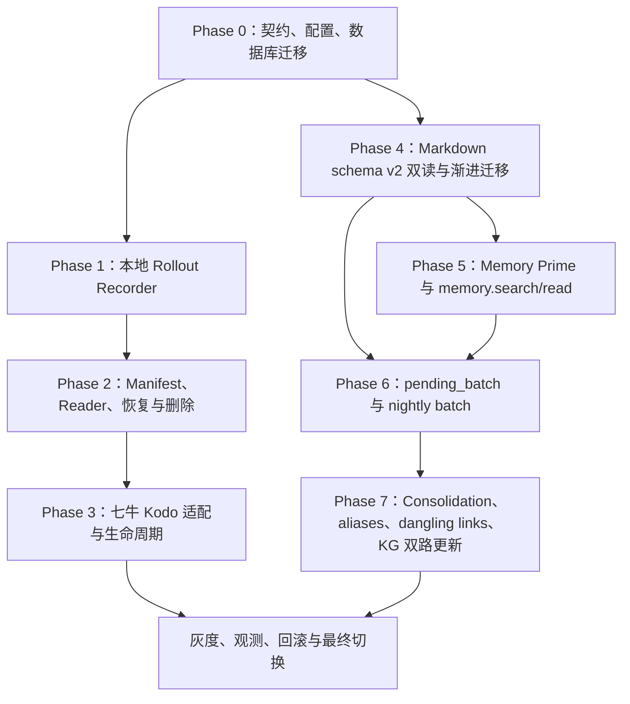

# Memory 框架重构设计（memory-rebuild）

> 本文档是记忆框架重构的系列设计文档，每章覆盖一个记忆域的改造。
> 参考项目：`codex-rs/`（只读参考，禁止修改）。设计讨论定稿后再实施，遵守
> "实现不等批准，启用必须等批准"：所有新链路默认 feature flag 关闭。
>
> 部署前提：**最终部署在云服务器，非本地单机；支持对象存储**。这一前提直接
> 影响第一章的文件写入设计（见 §1.7）。
>
> 引用约定：凡借鉴 codex-rs / OPUS-5 的设计点，正文均注明**原因 + 模仿的代码位置**
> （文件 + 行号）；§1.2 / §2.1 / §3.1 三张表是集中索引，正文散点引用在表外补充
> 具体位置。

---

## 第一章 Conversation 短期记忆 Rollout 化（conversation-rollout-design）

### 1.0 设计思路（一句话）

把短期记忆从"只有 LangGraph checkpoint 一种不透明载体"改造为 codex-rs 的三层模型：
**内存（图执行工作态）→ JSONL rollout 文件（唯一事实源、人类可读、可独立重放）→
PostgreSQL（索引 + 分布式协调）**。

### 1.1 现状盘点（代码核实，非猜测）

短期记忆在规格中的定义（[memorymangergraph.md](memorymangergraph.md) §3.1）：
会话线程状态，由对话 Agent 的 LangGraph Checkpointer 保存，不进入 Markdown。

当前实现的真实状态：

| 载体 | 内容 | 代码位置 |
|---|---|---|
| LangGraph checkpoint（PostgreSQL saver） | 整个 `ConversationGraphState`：`snapshot`（**内联最近 20 条消息全文**）、`rewrite_plan`、`evidence_set`、`answer_buffer` 等 | [backend/conversation/worker/main.py](backend/conversation/worker/main.py)（`AsyncPostgresSaver`，独立 schema `conversation_checkpoints`）；graph thread = `conv-turn:{turn_id}`（**每轮一个 thread**），见 [backend/conversation/graph/runner.py](backend/conversation/graph/runner.py) |
| `conversation_messages` 表 | **消息全文 canonical**：content / content_hash / `eligible_for_context` / `eligible_for_memory` / 软删除 | [backend/conversation/persistence/messages.py](backend/conversation/persistence/messages.py) |
| `conversation_turn_events` 表 | 每轮事件流水：`turn.started` / `answer.delta`（文本增量）/ `answer.completed`（**完整回答 + citations**）等，sequence 由锁 Turn 行原子 +1 分配 | [backend/conversation/persistence/events.py](backend/conversation/persistence/events.py)、[backend/conversation/contracts/api.py](backend/conversation/contracts/api.py)（179–218 行 payload 定义） |
| `conversation_turns` 表 | 状态机 / lease / fencing / `last_event_sequence` 序号分配器 | [backend/conversation/persistence/turns.py](backend/conversation/persistence/turns.py) |
| SSE 断线重放 | `Last-Event-ID` → 按 `(turn_id, sequence)` 从 turn_events 补发；早于最早保留事件 → 410 `EVENT_REPLAY_EXPIRED` | [backend/conversation/api/events.py](backend/conversation/api/events.py) |
| 跨轮上下文 | 每轮由 `ContextService` 从 messages 表重建 `TurnContextSnapshot`（最近 20 条 / 6000 tokens）再塞入 checkpoint | [backend/conversation/services/context_service.py](backend/conversation/services/context_service.py) |
| Retention | 30 天 turn event 清理 + 终态 checkpoint 清理（maintenance loop，advisory lock 防多副本并发） | [backend/conversation/worker/graph_worker.py](backend/conversation/worker/graph_worker.py) `run_maintenance_loop` |

**现状已有的冗余（有意分层，非失误）**：

1. 助手回答全文两份：`conversation_messages`（长期 canonical）+ `turn_events.answer.completed`（30 天短命，服务 SSE 重放）。
2. checkpoint 的 `snapshot.recent_messages` 内联消息全文——LangGraph 恢复要求 checkpoint
   自包含（方案 §9.3：恢复时禁止重读 DB），代价是短命副本。

**真正的差距**：短期记忆没有任何"按会话组织、人类可读、可独立重放"的载体。
checkpoint 是不透明 blob、按 turn 切片、终态即被 retention 清除；排障、导出、
崩溃后审计都无从下手。这正是 codex-rs rollout 机制解决的问题。

### 1.2 codex-rs 参考机制与抄代码位置

| 机制 | codex-rs 代码位置 | 要点 | 我们抄什么 |
|---|---|---|---|
| 双写：先内存后落盘 | `codex-rs/core/src/session/mod.rs` `record_prepared_conversation_items`（3091–3120 行） | item 先写 `state.history`（ContextManager），再 `persist_rollout_items` 异步落盘 | 图节点产出时先更新 Graph State，再调 rollout recorder |
| RolloutRecorder | `codex-rs/rollout/src/recorder.rs` | 后台 tokio writer task + 有界 mpsc(256) 通道；**延迟建文件**（首个 persist 才物化）；`persist/flush` 带 oneshot ack；写失败重开文件重试 | Python 版：`asyncio.Queue(maxsize=256)` + 后台 task 持有文件句柄 |
| **时间戳 ① 文件名/会话创建时间** | `codex-rs/rollout/src/rollout_file_name.rs` | `rollout-<YYYY-MM-DDTHH-MM-SS>-<thread_id>[_<rollout_id>].jsonl`，秒级、可排序、可解析；revert 时追加 `_<rollout_id>` 保持 thread_id 稳定 | 文件名取 **thread 创建时间**；预留回滚命名规则 |
| **时间戳 ② 每行落盘时间** | `codex-rs/rollout/src/recorder.rs` `JsonlWriter::write_rollout_item`（1948–1966 行） | 每行 `{timestamp, ordinal, item}`；`timestamp = OffsetDateTime::now_utc()` 毫秒级 `...SS.sssZ`；`ordinal` 单调递增；**每行 write+flush** | 每行 `recorded_at`（UTC 毫秒）+ 文件级 `ordinal`；逐行 flush |
| 目录分片 | `codex-rs/rollout/src/recorder.rs`（1613–1624 行附近） | `sessions/YYYY/MM/DD/rollout-...jsonl` | `{rollout_root}/threads/YYYY/MM/DD/` |
| 首行 SessionMeta | `codex-rs/rollout/src/recorder.rs`（859–887 行） | 首行元数据：session_id / timestamp（毫秒，与文件名同源）/ cwd / source / cli_version 等 | 首行 `thread_meta`：thread_id / user_id / created_at / graph 版本 / schema_version |
| 持久化白名单 | `codex-rs/rollout/src/policy.rs` `is_persisted_rollout_item` | 消息/工具调用/Compaction/TurnContext 落盘；delta、审批请求等瞬态事件不落 | `backend/conversation/rollout/policy.py`：模型输入语义相关的落，瞬态传输态不落 |
| 重放重建 | `codex-rs/core/src/session/rollout_reconstruction.rs` | 反向扫描找最近 replacement-history 基线（compaction 快照），正向重放尾部重建内存 history | checkpoint 失效时从 jsonl 重建 `TurnContextSnapshot`（见 §1.6） |
| 索引分层 | `codex-rs/rollout/src/recorder.rs` `list_threads_with_db_fallback` | jsonl 是 source of truth；SQLite state_db 只做列表/搜索索引，read-repair 对齐 | PostgreSQL 扮演其 SQLite 角色（索引），**不抄 state_db 本身** |
| 归档 | `codex-rs/rollout/src/lib.rs` `ARCHIVED_SESSIONS_SUBDIR` | `archived_sessions/` 归档目录 | `archived_threads/`（见 §1.8） |

**明确不抄的部分**：SQLite state_db 本体（我们已有 PG 索引表）、Legacy/Paginated 双历史
模式、压缩 worker（`compression.rs`，量级不到）、multi-agent / world-state 条目。

### 1.3 目标架构

```text
ConversationGraph 执行中
  ├─ 内存态：ConversationGraphState（LangGraph 运行时，不变）
  ├─ 恢复缓存：AsyncPostgresSaver → conversation_checkpoints
  │    （保留但瘦身：终态即清，只是"加速恢复的缓存"，不再是唯一载体）
  └─ 事实源：TurnRolloutRecorder（graph 节点关键产出时调用）
        └─ asyncio.Queue(256) → 后台 writer task（逐行 write+flush）
              └─ {rollout_root}/threads/YYYY/MM/DD/
                   rollout-<thread_created_at>-<thread_id>.jsonl
                          ↓（turn 终态后封存，见 §1.7）
                   对象存储（云部署的持久层）
```

**职责划分**：jsonl 是短期记忆内容的**唯一事实源**；PG 只存索引与协调；
checkpoint 退化为可再生的恢复缓存。排障用 `jq` 直接读 jsonl；导出/审计不依赖 DB。

### 1.4 PostgreSQL 表分工（"PG 只存索引"的落地）

| 表 | 改造后定位 |
|---|---|
| `conversation_messages` | **索引化**：message_id / thread_id / sequence / content_hash / 资格标记 / 软删除位 + `(rollout_file, byte_offset)` 指针。**正文移出，只在 jsonl** |
| `conversation_turns` | **保留，定性为"协调"而非索引**：lease / claim / fencing / expected_thread_version 是分布式协调原语，jsonl 给不了（codex 没有它是因为本地单进程不需要） |
| `conversation_turn_events` | **过渡组件，第二阶段可废弃**（见 §1.6 SSE 分析） |
| `conversation_checkpoints` | 恢复缓存；终态清理逻辑不变 |
| outbox / jobs / knowledge_summaries | 不动——领域业务表，不属于短期记忆 |

### 1.5 JSONL 文件设计

**粒度：按 conversation thread**（不按 turn）。规格 §3.1 定义短期记忆属于会话线程；
graph thread 的 `conv-turn:{turn_id}` 切片是实现细节。同一 thread 的所有 turn 追加进
同一**逻辑文件**（物理载体 = 每 turn 一个不可变 segment，完整 thread 文件是 manifest
拼装出的逻辑视图，无任何进程持有跨 turn 的文件句柄——见 §1.7"多副本写入模型"），
`turn_started` / `turn_completed` 行作为段边界（对应 codex 的
TurnStarted/TurnComplete 段机制：`codex-rs/core/src/session/rollout_reconstruction.rs`
中 `ActiveReplaySegment` 以 TurnStarted/TurnComplete 事件划分重放段——193 行
TurnComplete、252 行 TurnStarted 触发段结算；抄它的原因：段边界是断点重放时
划分 turn、定位恢复基线的唯一可靠依据，我们把同样语义落到 jsonl 行级）。

**命名与分片**（照抄 `rollout_file_name.rs` 语义）：

```text
threads/YYYY/MM/DD/rollout-<thread创建时间,秒级>-<thread_id>.jsonl
# 预留：回滚到第 N 轮时 rollout-<ts>-<thread_id>_<rollback_id>.jsonl，thread_id 保持稳定
```

**行格式**：

```json
{"recorded_at": "2026-08-28T05:41:07.123Z", "ordinal": 42, "type": "user_message", "turn_id": "...", "payload": {...}}
```

- **时间戳 ①**：thread 创建时间 → 文件名（秒级，可排序）+ 首行 `thread_meta.created_at`（毫秒）
- **时间戳 ②**：每行 `recorded_at` = writer 实际落盘时间，UTC 毫秒（对应 codex `OffsetDateTime::now_utc()`）
- `ordinal`：文件级单调递增（与 turn 内 event sequence 并存，两者作用域不同）
- `turn_id`：每行冗余携带，单文件可按轮过滤

**记录内容白名单**（对应 codex `policy.rs`，落到 `backend/conversation/rollout/policy.py`）：

| 落盘（全文） | 落盘（仅引用） | 不落盘 |
|---|---|---|
| `thread_meta`（首行） | `evidence_set`：引用 ID + 排序（chunk 正文在 rag 库，体积大且不属于短期记忆） | SSE delta / answer_buffer 流式中间态 |
| `turn_started` / `turn_completed`（含 status、degraded_flags） | `embedded_queries`：只记模型标识 + 维度 | 取消令牌、lease 等瞬态控制 |
| `user_message` / `assistant_message`（正文全文） | | gateway 原始 HTTP 细节 |
| `turn_context_snapshot`（摘要级：snapshot_hash + 消息 ID 序列 + token 数 + memory_status） | | |
| `rewrite_plan`（每 revision） | | |

原则：**小文本放全文、大对象放引用**。消息文本 KB 级，全文廉价；evidence chunk /
向量是 MB 级潜在体积，只存引用。

**写入与故障语义**（照抄 recorder.rs）：

- 注入点：`ConversationRuntimeContext` 增加 `rollout_recorder`（可空）；
  `snapshot` / `rewrite` / `evidence` / `answer` / `finalize` 节点各追加一条；
  `finalize` 后 `flush()` 等 ack
- **逐行 write + flush**（对齐 codex 1972 行 `file.flush()`）：最小化崩溃窗口
- 延迟建文件：首个 flush 才物化，空跑 turn 不产生空文件
- 写 IO 失败 → 缓冲保留、重开文件重试一次；仍失败记 `rollout_write_failed` 指标并
  **降级不拖垮 turn**（此阶段 checkpoint 仍是恢复权威）
- 并发：同一 thread 的 turn 已被 DB lease 串行化；writer 按 thread_id 分桶持有句柄
- feature flag `conversation_rollout_enabled` 默认关闭

### 1.6 恢复路径与 SSE 断线重放

**图恢复**（沿用附录 A.3 决策树 + 新增第 ④ 分支，[backend/conversation/graph/runner.py](backend/conversation/graph/runner.py)）：

1. 有 checkpoint → resume（不变）
2. 无 checkpoint → 从 START 新跑（不变）
3. checkpoint 反序列化失败 → 记 `checkpoint_recovery_failed` 指标重跑（不变）
4. **新增**：终态 checkpoint 已被 retention 清除、需查看/导出/重建该会话短期记忆
   → 从 jsonl 重放（对应 `rollout_reconstruction.rs`）：反向找最近
   `turn_context_snapshot` 行，按消息 ID 序列回查 messages 索引，正向重放尾部。
   注意语义差异：codex 重放重建**模型输入**；我们的快照正文在 jsonl/索引，重建很轻。

**SSE 断线重放：两阶段决策**。

现状依赖（[api/events.py](backend/conversation/api/events.py)、[turns.py](backend/conversation/persistence/turns.py)）：
① sequence 由锁 Turn 行原子 +1 分配，**四个写入方**（API / Graph Worker / Publisher /
MEMORYACK）跨进程追加同一 turn；② 事件随事务 commit 落盘，无丢失窗口；
③ 410 过期判定查表一行。

jsonl 直接替代要补四个洞：

| 洞 | DB 免费给的 | jsonl 方案要做的 |
|---|---|---|
| 崩溃窗口 | 事件随事务 commit | 逐行 flush + 接受"最终一致 + 读时修复"；worker 在 finalize 提交与 jsonl flush 之间死掉会丢尾 |
| 跨进程排序 | 行锁原子 +1 | flock + ordinal 单点分配；`turn.accepted` 由 API 进程写的现状要改为 worker claim 后补写 |
| 410 判定 | 查表 | PG 索引表维护"每 turn 最早保留 ordinal" |
| 部署假设 | DB 天然共享 | 多副本 append 同一文件不成立，须由对象存储分段方案兜底（§1.7） |

**决策**：

- **第一阶段**：保留 `conversation_turn_events` 作为瘦身 SSE journal（只存 SSE 需要的
  事件类型，30 天清理）。jsonl 先在短期记忆这条**用户不可见**的路径上验证可靠性
- **第二阶段**：以崩溃注入测试验收（kill -9 worker 后 jsonl 与 turn 终态一致率），
  达标后 SSE 重放源切到 jsonl，events 表降级为"最早保留序号"一行索引，最终废弃

不一步到位的原因：SSE 重放是用户可见的实时正确性（重连少一条 answer.completed
= 回答消失）；codex 敢全押 jsonl 是因为本地 CLI 崩溃最大代价是自己会话丢尾，
我们丢的是用户看到的回答。

### 1.7 云部署与对象存储

前提：生产在云服务器，jsonl 持久层走对象存储。对象存储**不支持 append**，
因此写入路径与持久路径分离：

```text
写入路径（热）：节点本地盘（或共享块存储）追加，逐行 flush —— 低延迟、可 fsync
封存路径（冷）：turn 终态 / 段大小达阈值 / 节点退出前
  → 把该 turn 的段（segment）整体上传为对象：
    s3://.../threads/<thread_id>/segments/<ordinal_start>-<ordinal_end>.jsonl
  → PG 索引表记录 segment 清单（manifest）：thread_id / ordinal 范围 / object key / 行数 / crc
```

- **分段而非整文件**：单个 turn 一个段（天然边界），避免整文件重写；manifest 存 PG
  索引表——这正是"PG 只存索引"在存储层的体现
- **多副本**：任意时刻同一 thread 只有一个持 lease 的 worker 在写（现状已保证），
  段封存后不可变，天然免疫多机 append 冲突；节点宕机未封存的尾段由新 claim 者
  按 jsonl 本地文件 + manifest 做 reconcile（对应 codex read-repair：
  `codex-rs/rollout/src/recorder.rs` `list_threads_with_db_fallback`，460 行起、
  721 行 warn 后回落文件系统——机制说明见 §1.2"索引分层"行；抄它的原因：
  文件/对象是真相、索引可能落后，读路径必须能以真相源为准自愈）
- **读取**：SSE 重放 / 上下文重建只读最近段（本地热数据）；跨段历史经 manifest
  定位对象拉回
- **本地盘为缓存**：节点本地 jsonl 可按 LRU 清理，对象存储为准

**多副本写入模型（已确认，2026-08-28）**：生产环境**不依赖**"多个副本 append 同一个
完整 thread 文件"，每个 turn 的执行流程固定为五步：

1. Worker claim 当前 turn（`conversation_turns` lease/fencing 保证同一 thread 单写者，
   现状已具备）
2. 以 thread_id + manifest 定位本地热段：缓存命中直接续写；未命中且存在未封存段
   → 从对象存储拉回续写；无未封存段 → 新建段
3. 追加并逐行 flush
4. turn 终态后封存当前 turn 的 segment（此后不可变）
5. **先上传对象成功，再在同一事务写 PG manifest 行**（顺序铁律：反向会产生指向
   不存在对象的悬空 manifest；崩溃在两步之间产生孤儿对象，由新 claim 者 reconcile
   时重新登记或清理——机制见上方 read-repair 条目）

跨副本安全三支柱：turn 级 claim 单写者 + segment 封存后不可变 + manifest
`(thread_id, ordinal_start)` 唯一约束。

- 本地开发环境：对象存储层用本地目录模拟（与 `LocalMarkdownStore` 同模式，
  [backend/memory/storage](backend/memory/storage/)）

### 1.8 Retention 与归档

- 新增配置：`conversation_rollout_root`、`conversation_rollout_retention_days`、
  `conversation_rollout_segment_max_bytes`
- maintenance loop（[graph_worker.py](backend/conversation/worker/graph_worker.py)
  `run_maintenance_loop`，advisory lock 单实例）增加：
  - thread 删除（[thread_deletion.py](backend/conversation/services/thread_deletion.py)
    链路挂接）→ 段对象移入 `archived_threads/` 前缀（对应 codex `archived_sessions/`）
  - 超过 retention → 物理删除段对象 + manifest 行 + messages 索引行
- 用户删除合规：删除 = 删段对象 + 索引行，比现状（软删除标记散落多表）更简单可审计

### 1.9 记忆提交链路（Evidence Submission）的配套改造

**现状已经就是"引用提交"，与新方案同构**——agent 从不提交全文：

1. finalize 节点（同一事务）：写助手消息 → `build_source_manifest(thread_id, turn_id,
   message_rows)` 生成 `source_checkpoint_id`（对 `{thread_id, turn_id, 按 sequence 排序的
   message_id/role/sequence/content_hash}` 做 canonical JSON + 完整 SHA-256，§7.2/D9，
   [backend/conversation/contracts/domain.py](backend/conversation/contracts/domain.py)
   172–197 行）→ 写 `conversation_outbox` 行
   （[backend/conversation/graph/nodes/finalize.py](backend/conversation/graph/nodes/finalize.py)）
2. MEMORYACK 节点快速 claim outbox，短超时投递
   `submit_conversation_evidence(thread_id, message_ids, checkpoint_id, ...)`；
   失败由独立 Publisher 重投
   （[backend/conversation/graph/nodes/memory_ack.py](backend/conversation/graph/nodes/memory_ack.py)）
3. memory-api 收 `ConversationEvidence{thread_id, checkpoint_id, message_ids, trigger,
   topic_hints, graph_node_hints}`（[backend/memory/contracts/evidence.py](backend/memory/contracts/evidence.py)
   12–27 行）→ operation 队列
4. MemoryManagerGraph `load_source_refs` 经 Reader 边界回查正文：
   `ConversationReader.read(thread_id, checkpoint_id, message_ids)` →
   `HttpConversationReader` 打 conversation 内部 API 读 messages 表，外层
   `DeletionAwareConversationReader` 抑制已删除来源 → `SourceBundle`（≤80KB）→
   提炼写 Markdown（[backend/memory/graph/summary.py](backend/memory/graph/summary.py) 76–99 行）

**rollout 化后：提交载荷不变，引用解析目标变**：

| 元素 | 现状 | rollout 化后 |
|---|---|---|
| `thread_id` / `message_ids` | 指向 messages 表行 | 不变——UUID 是稳定键，与存储无关 |
| 正文解析路径 | Reader → conversation 内部 API → messages 表 | Reader → PG 索引（message_id → `(segment_object_key, byte_offset)`）→ 读 jsonl 段（热数据读本地，冷数据拉对象存储）；HTTP 内部 API 降级为备选 |
| `source_checkpoint_id` | manifest 输入来自 DB 行 | 算法不变（manifest 只含 id/role/sequence/content_hash，不含正文），content_hash 权威来源换成 jsonl 行；manifest 追加该 turn 的 ordinal 范围做冗余定位 |
| 删除合规 | `SourceDeletedEvent(source_ref=message_id)` + 软删除标记 | source_ref 不变；底层删除 = 删段对象 + 删索引行；DeletionAware Reader 语义不变 |
| outbox / MEMORYACK / Publisher | DB 协调 | 不动（协调层，不属于"PG 只存索引"要砍的内容） |

### 1.10 测试与验收

| 层级 | 内容 | 对标 |
|---|---|---|
| 单元 | policy 白名单、文件命名/解析、双时间戳格式、ordinal 单调 | `rollout_file_name_tests.rs`、`recorder_tests.rs` |
| 集成 | 写入 → kill -9 → 重放一致性；延迟建文件；flush ack 语义 | `rollout_reconstruction_tests.rs` |
| 崩溃注入 | kill -9 worker 后 jsonl 与 turn 终态一致率（第二阶段切 SSE 的验收门槛） | codex flush-per-line 语义 |
| 契约 | rollout 行 schema 进 `contracts/rollout.py`，快照测试 | 现有 tests/contract 机制 |
| 门禁 | `scripts/ci-local.sh` 全 stage | AGENTS.md |

### 1.11 开放问题（已决议，见文末决议总表）

1. checkpoint 瘦身（`snapshot.recent_messages` 从全文内联改为 message_id 引用）违背
   方案 §9.3"恢复时禁止重读 DB"，需单独评估，第一阶段不动。
   **→ 决议（C 组）：维持现状不动**。checkpoint 自包含是 LangGraph 恢复语义，
   本改造不碰；零工作量，确认即关闭。
2. `turn_context_snapshot` 行是否存全文：当前决策为摘要级 + 引用；若要求 jsonl 脱离
   DB 也能完整重放，需改为全文并接受体积膨胀。
   **→ 决议（C 组）：维持摘要级 + 引用**，不改全文。
3. 段封存触发条件的默认值（每 turn 一段 vs 大小阈值优先）待压测确定。
   **→ 决议（B 组）：每 turn 一段**（简单优先），大小阈值仅作防爆兜底
   （`conversation_rollout_segment_max_bytes`），压测校准后置。
4. 多副本部署下"同一 thread 追加同一文件"的写入模型：Worker 只保证同一 thread
   同时一个活动 turn，不代表同一进程长期持有文件句柄——是否接受"每 turn 定位
   热段 → append+flush → 终态封存 → 写 manifest"、不依赖共享 append 的方向。
   **→ 决议（B 组）：接受**。物理载体 = 每 turn 一个不可变 segment，完整 thread
   文件是 manifest 拼装的逻辑视图；五步流程与顺序铁律见 §1.7"多副本写入模型"。

---

## 第二章 长期记忆（总结记忆）格式与读路径改造

### 2.0 设计思路（一句话）

**内容全保留，动的是"索引密度"与"注入层级"**：保留现有 learner / mastery / index
三文档内容模型与版本化存储，新增 `memory_summary.md` 预注入层、把 `index.md` 升级为
带检索锚的可搜索注册表；读路径从"每轮 query 驱动注入"改为 codex 式的
**"首轮 prime 注入固定提示词 + 之后 agent 持记忆工具自助检索"**。

### 2.1 codex-rs 参考机制与抄代码位置

| 机制 | codex-rs 代码位置 | 要点 | 我们抄什么 |
|---|---|---|---|
| `memory_summary.md` 预注入 | `codex-rs/ext/memories/src/prompts.rs`、`templates/memories/read_path.md`（125–127 行） | 整文件渲染进 developer instructions，超 token 上限截断 | 新增每用户 `memory_summary.md`，首轮注入 |
| summary schema 版本与重置 | `codex-rs/memories/write/src/workspace.rs` `validate_consolidation_artifacts`（71–79 行） | 首行必须恰好是 `v1`，否则整体重生成 | 同款首行标记 + schema reset 校验 |
| summary 内容格式 | `codex-rs/memories/write/templates/memories/consolidation.md`（454 行起 "`memory_summary.md` FORMAT (STRICT)"） | User Profile ≤350 词 / User preferences / General Tips；高信号密度、激进去重 | 按我们的学习场景改写分区（见 §2.3） |
| `MEMORY.md` 注册表 | 同上模板（201–344 行 "`MEMORY.md` FORMAT (STRICT)"） | Task Group 块 + `### keywords` 判别性检索词 + `### rollout_summary_files` 路由锚；"easy to grep" | index.md 条目增加 keywords + 一句话 scope |
| 三层读取与预算 | `codex-rs/ext/memories/templates/memories/read_path.md`（19–46 行） | summary 已在提示词 → grep 注册表 → 命中才开下层文件；≤4–6 步搜索预算 | 记忆工具 + 调用上限 + prompt 引导词 |
| 记忆引用义务 | 同上（75–115 行 `<oai-mem-citation>`） | 用过记忆就在回答末尾附引用块 | 对齐到我们 citations 体系（可选，第二阶段） |
| ad_hoc 更新笔记 | 同上（117–123 行） | 用户显式要求"记住"时只写小笔记文件，不直接改记忆 | 与 `explicit_remember` 触发器语义契合（可选，第二阶段） |

**不抄清单**：`rollout_summaries/`（我们的 mastery/learner 文档本身就是摘要层，
evidence_refs 已是结构化路由，rollout 化后直达 jsonl 段，中间层纯冗余）、
`raw_memories.md`（阶段中间产物，我们的 SourceBundle 在图状态里不落盘）、
`skills/` 目录、`extensions/`（除 ad_hoc 外）、git baseline diff（我们有 versions 表，
可从版本历史生成等价 diff）。

### 2.2 现状盘点（保留部分）

| 已有资产 | 代码位置 | 处置 |
|---|---|---|
| 三文档 schema：learner-profile / mastery-profile / memory-index，front matter + 确定性渲染 + round-trip 解析 | [backend/memory/storage/markdown_schema.py](backend/memory/storage/markdown_schema.py) | **保留**（codex 的 MEMORY.md 是自由格式无校验，我们不做这个倒退） |
| 版本化存储：不可变版本 + current 物化 + quarantine + 原子写 + checksum | [backend/memory/storage/local_markdown.py](backend/memory/storage/local_markdown.py) | **保留**（codex 没有，是我们的强项） |
| `evidence_refs` → message_id 路由 | markdown_schema.py（证据引用节） | 保留；第一章 rollout 化后解析为 jsonl 段坐标 |
| PG 索引检索 `index_repo.search_candidates`（title/topic_key 相似度） | [backend/memory/services/context_service.py](backend/memory/services/context_service.py) | 保留并升级（加 keywords 列），变为 `memory_search` 工具的服务实现 |
| `LearningContextService.build`：每轮 query 检索 + 4 级 token 裁剪 | context_service.py 204–333 行 | **拆解**（见 §2.4）：组装/注入逻辑大部分退役 |
| conversation 域 `recall_memory` 节点：每轮一次 query seed 检索 | [backend/conversation/graph/nodes/memory.py](backend/conversation/graph/nodes/memory.py) | **改造**为首轮 prime / 非首轮短路 |

### 2.3 目标文件框架（每用户）

```text
users/<user_id>/
  memory_summary.md        ← 新增：预注入层
  current/learner.md       ← 保留（内容不变）
  current/mastery/<topic_key>.md
  current/index.md         ← 保留但升级为注册表（schema_version 2，待确认）
  versions/...             ← 保留（版本历史不变）
```

**`memory_summary.md` schema（v1）**：

```text
v1
（首行必须恰好是 v1，无 front matter；校验不符 → 从 MEMORY 层整体重生成，
  抄 codex validate_consolidation_artifacts 语义）

## 用户画像
（从 learner 文档投影，≤350 词：稳定的学习偏好、目标、沟通习惯；
 保守推断，一次性印象不落地——对齐 codex 的画像保守性规则，出处：
 `codex-rs/memories/write/templates/memories/consolidation.md` 508 行
 "This entire section is free-form, <= 350 words" 及同节保守推断约束）

## 稳定偏好
（跨主题、会改变未来行为的可执行偏好，短 bullet，激进去重）

## 主题路由
（每行一条：<topic_key> | <一句话掌握状态> | 熟练度 → mastery:<topic_key>；
 只作路由，不含正文细节）
```

**`index.md` 升级为注册表**（schema_version 2，待确认）：条目从单行
`memory_id | title | v{n} | updated_at` 扩展为带 **`keywords`**（判别性检索词：
概念名、术语、常见错误模式——抄"未来 grep 会用的词"原则）与**一句话 scope** 的块结构；
仍保持 front matter + 确定性渲染 + round-trip 解析 + 版本化。
PG 索引表同步加 keywords 列，检索召回升级。

### 2.4 读路径改造（本章核心，含已拍板决策）

**D1 首轮 prime 注入，之后不再每轮注入**

- 首轮判定：thread 无历史消息（查 messages 索引表即可，不新增标记位；
  我们的 graph thread 是 `conv-turn:{turn_id}` per-turn，注入状态不能放 Graph State）
- 首轮注入内容：`memory_summary.md` 全文（截断到独立小预算）+ **记忆索引目录**
  （注册表条目：memory_id / title / scope / keywords，**不含正文**）
- `recall_memory` 节点改造：首轮 → prime 注入；非首轮 → 直接短路。
  消掉 §9.3 #6"补检索循环禁止再读 Memory"的约束（该约束由新工具语义取代）
- 新增轻量 `build_memory_prime()`：读 summary 文件 + 索引表，无检索打分

**D2 固定提示词防跨轮遗忘（用户拍板）**

- 首轮注入的内容视为**提示词的一部分并固化（pin）**：作为不可变快照随该 thread 的
  持久载体保存（第一章 rollout 化后落 `memory_prime` 行 + checkpoint 快照）
- **每次上下文压缩后，将同一份固定提示词原样重注入**——压缩丢失的是对话历史，
  不是记忆提示词
- **记忆更新不回溯旧提示词**：旧 thread 保持旧快照继续用；新 thread 的 prime
  自然用最新 summary。旧提示词的"过期"是可接受语义（对应 codex session 内
  summary 不热更新，出处：`codex-rs/ext/memories/src/prompts.rs`
  `build_memory_tool_developer_instructions` 在会话启动时一次性读取
  memory_summary 并渲染进 developer instructions——`ext/memories/src/extension.rs`
  19 行注册调用，运行期间不重读文件；抄它的原因：避免同一 session 内提示词
  漂移导致的上下文不一致，代价（旧快照过期）由新 thread 自然吸收）

**D3 记忆工具集 v1：answer 路径 tool-call 循环自助取记忆（用户拍板定稿）**

参考 codex-rs 记忆工具（[ext/memories/src/tools](codex-rs/ext/memories/src/tools/mod.rs)，
namespace `memory` 下 list/read/search/add_ad_hoc_note 四个，文件系统视角），
我们收敛为**两个工具**，不要 list：

- 首轮 prime 已直注 index 注册表目录（D1）；`memory.search` 查的是**实时 index 表**
  而非注入的旧快照——注入的目录只是提示，search 才是事实源，pin 住的旧目录过期
  不影响正确性。list 的两个用途（浏览目录/发现新文件）被首轮注入和 search 全覆盖

**① `memory.search`：纯关键词，可预测（用户拍板，不引入向量）**

- 入参：`queries: string[]`、`match_mode: any|all`（对齐 codex SearchArgs 子集）、
  `max_results`（clamp 上限）
- 匹配域：index 表的 `name / description / aliases / keywords` 四列（ILIKE 子串），
  **不碰向量、不碰正文**——正文由 agent 先 search 定位、再 read 下沉
- 出参：注册表条目（memory_id / name / description / keywords / version /
  updated_at），**不含正文**，强制"search 定位 → read 下沉"两段式
- 排序固定规则（不用模型打分）：updated_at 近者优先 + 命中列权重
  （name/aliases > keywords > description）

**② `memory.read`：分段 + 预算 + 溯源**

- 入参：`memory_id`、`line_offset?`、`max_lines?`（对齐 codex 的 1-indexed 分段读，
  [read.rs](codex-rs/ext/memories/src/tools/read.rs)）
- 出参：正文片段 + `version`（供引用）+ `truncated` 标记；走版本化读取 +
  删除抑制（DeletionAware 语义）；单文档计入现有 `memory_context_token_budget`
  （预算沿用旧体系，不新设预算族）

**③ tool-call 循环 + 流式交错（现在就改链路，用户拍板不做绕开）**

- answer 节点与新增 `memory_tool` 节点构成循环边：模型流式生成中可以发起
  工具调用 → 图执行工具 → 结果回灌 → 继续流式生成
- **SSE 协议同步扩展（现在改）**：新增工具调用事件类型（`memory.tool_call` /
  `memory.tool_result` 或统一 `turn.tool_activity` 状态事件），前端可展示
  "agent 正在查记忆"；事件仍走 TurnEventWriter 同一事务追加（§7.4 机制不变）
- 防死循环：记忆工具调用次数上限（对应 codex ≤4–6 步预算，出处：
  `codex-rs/ext/memories/templates/memories/read_path.md` 43–46 行
  "Quick-pass budget: ideally <= 4-6 search steps before main work"），超限记
  `degraded_flags` 继续回答；工具失败沿用 §16.2 降级语义
- 工具调用与结果按第一章 policy 落 rollout jsonl（白名单新增 `memory_tool_call` 类型）
- answer prompt 增加 quick memory pass 引导词（对齐 codex read_path.md：
  "问题涉及用户学习历史/偏好/先前掌握 → 先 search 再答；不确定就先查一次；
  重复报错/疑似有先前上下文时重查"）

**④ 旧格局退役清单**

- `recall_memory` 节点：非首轮短路（D1 已定）；`memory_read` flag 语义改为
  "记忆工具是否可用"
- `MemoryGateway.build_learning_context` / `LearningContextService.build` 的
  query 检索 + 4 级裁剪 + 组装注入：退役；只保留单文档预算裁剪给 `memory.read`；
  新增轻量 `build_memory_prime()`（读 summary + index 目录，无检索）供首轮 prime
- 规格 §16 相关章节随实施同步改写

### 2.5 教学场景适配说明

我们是数学教材学习场景，学生提问主题跳跃大："每轮按 query 猜该注入什么"本质是
猜测，新模式是**按需精确读取**（讲到椭圆才读 `mastery:椭圆`），token 效率与准确率
都更好。首轮注入的目录本身即提示；回答的 citations 体系可扩展"记忆引用"
（对齐 codex citation 义务，第二阶段）。

### 2.6 总结时机：证据池 + 每日批量调度（用户已拍板）

**设计思路**：学习 codex-rs"提交与处理解耦 + 有界批量认领 + 两段式（逐条提取 →
统一合并）"的机制内核，但把它的触发点（会话启动时批量，[start.rs](codex-rs/memories/write/src/start.rs)
+ [phase1.rs](codex-rs/memories/write/src/phase1.rs) 149–182 行的有界 claim）替换为
服务端定时调度——**每条证据至少沉淀 N 小时才进入总结，总结整理固定在每日 0 点批量执行**，
避免单条提交即时处理过于分散。

**已拍板决策**：

- **D4 参数化配置**（不写死）：新增 settings
  - `memory_evidence_min_age_hours`（默认 6）：证据最短沉淀时长
  - `memory_summary_daily_time`（默认 `00:00`，走 Scheduler 既有
    `memory_scheduler_timezone`，默认 Asia/Shanghai）
  - `memory_summary_batch_max_evidence` / `memory_summary_max_users_per_run` /
    `memory_summary_llm_concurrency`：有界认领三件套（对齐 codex 的
    `max_rollouts_per_startup`（`codex-rs/memories/write/src/phase1.rs` 170 行
    的 claim 参数，配置定义在 `codex-rs/config/src/types.rs` 310 行）/
    `CONCURRENCY_LIMIT` / `JOB_LEASE_SECONDS`（`codex-rs/memories/write/src/lib.rs`
    81–82 行 stage_one 常量：并发 8、租约 3600 秒；抄它的原因：批量任务必须
    有界，防止一次启动把全部待办打满 LLM 并发与 worker 租约）
- **D5 explicit_remember 豁免**：用户显式"记住这个"不受最短沉淀时长约束，
  下一个 0 点批即处理（MEMORYACK 的快速 ACK 语义不变，用户立即得到"已收到"）
- **D6 批量粒度：每用户一批**（不按主题拆分）

**证据池建模（已决议：方案 A 修订版——复用 memory_operations，不建新表、不加 eligible_at 列）**：

- 候选方案：A 复用 `memory_operations` 加资格门控与批次归属 / B 新增独立
  `memory_evidence` inbox 表。**定稿 A 修订版**，依据（代码核实）：
  - `memory_operations.next_run_at` 列**现成**（[0001_memory_core.py](alembic/versions/0001_memory_core.py)
    78 行），且共享认领查询 `claim_operation` 已过滤 `next_run_at <= now()`
    （[persistence/operations.py](backend/memory/persistence/operations.py)
    107、117 行）——最短沉淀门控 = 提交时设置 `next_run_at`，**零新列**
  - 但只靠 `next_run_at` 有洞：到期后普通 Worker / Gateway P0 快速路径会把证据
    单独领走立即执行，批量失效。解法：**新增状态值 `pending_batch`**——
    claim 只认 `('queued','retry_wait')`，`pending_batch` 对 Worker/Gateway
    天然不可见，共享 claim 查询不用改
  - 不选 B 的原因：B 需复制整套 operation 信封机制（幂等键、lease/fencing、
    retry/dead_letter、metrics、[account_purge.py](backend/memory/services/account_purge.py)
    级联），并引入两套状态机对账；"提交与处理解耦"用 `pending_batch` 即可
    等价获得。codex 对应物也是单表 jobs 扫描认领（`memories/write/src/phase1.rs`），
    无独立 inbox 层
- **新增列**：`batch_operation_id uuid NULL REFERENCES memory_operations(operation_id)`
  （证据 → 批次归属，单 FK 足够：一个证据只进一个批，消费后即终态）
- **状态机**：
  1. 提交：evidence operation 落库为 `pending_batch`，
     `next_run_at = submitted_at + memory_evidence_min_age_hours`
     （`explicit_remember` 豁免：`next_run_at` = 下一个 0 点）
  2. 0 点入批：Scheduler 扫 `status='pending_batch' AND next_run_at <= now()`，
     按 user_id 分组生成批量 op，成员行写 `batch_operation_id`（状态不动）
  3. 批量 op `succeeded` → 同一事务把成员 evidence 置 `succeeded`
  4. 批量 op 失败走现有 `retry_wait`/lease 机制，期间成员保持 `pending_batch`；
     批量 op `dead_letter` → 成员一并置 `dead_letter`（带批次归属）进人工审
- **实施影响面**：`contracts/common.py` `OperationStatus` Literal + DB CHECK
  约束迁移 + OpenAPI 快照更新；`account_purge` 活跃状态列表加 `pending_batch`；
  metrics 增加 pending_batch 在途 gauge

**提交侧（改动小）**：

- conversation → memory-api 链路不动（outbox / MEMORYACK / Publisher 保留）
- memory-api 收到 `conversation_evidence` 后不再立即生成可执行 operation：
  按上述状态机落 `pending_batch` 行

**处理侧（0 点批量）**：Scheduler（[backend/memory/worker/scheduler.py](backend/memory/worker/scheduler.py)，
已有 daily_at / advisory lock / maintenance_runs 幂等 / batch cursor + continuation 续跑）
新增日任务 `summarize_pending_evidence`，`daily_at=00:00`：

1. 选取：扫 `status='pending_batch' AND next_run_at <= now()` 的证据行，
   按 user_id 分组
2. 每用户生成一个批量 operation（新类型 `summarize_user_memory_batch`，payload 携带
   该用户本批全部证据引用），幂等键 `summarize:{user_id}:{date}` 走现有
   maintenance_runs 机制
3. 有界执行：单批证据上限 + 单 run 用户数上限 + LLM 并发上限；跑不完用
   continuation cursor 续跑（机制现成）
4. MemoryManagerGraph 内两段式：先逐证据提取，再统一合并写 learner/mastery——
   **同时回答了 §2.7 遗留问题 2：`memory_summary.md` 由批量总结的合并段整体重写
   （consolidation 式），不做增量投影**

**已识别的代价与对策**：

- 记忆新鲜度：最长延迟约 30 小时（23:30 提交 → 后天 0 点）。对策即 D5 豁免通道；
  常规证据接受隔日可见
- 0 点峰值：有界认领 + continuation 续跑把 LLM 负载摊到 0 点后；0 点与既有
  02:30–05:00 维护任务天然错开

### 2.7 开放问题（已决议，见文末决议总表）

1. `index.md` schema_version 2：条目改块结构后，现有 `_INDEX_ITEM_PATTERN` 单行正则
   需改块解析——是否接受 index 格式升版。
   **→ 决议（A 组）：接受升版**。index 块解析 + 文档 frontmatter v2
   （name/description/aliases）+ `[[link]]` 解析合并为一次 schema_version 2 升版
   （与 §3.7-⑤ 同一件事）。
2. ~~`memory_summary.md` 生成方~~ **已由 §2.6 解决**：批量总结的合并段整体重写
   （consolidation 式），不做增量投影。
3. 记忆工具调用上限与现有 `_max_retrieval_iterations` 补检索预算是否共享。
   **→ 决议（B 组）：独立预算，不共享**（检索是质量兜底，记忆是按需读取，
   共享会互相挤占），默认 6 次/轮。
4. ad_hoc 更新笔记（explicit_remember 语义对齐）与记忆 citation 块，是否进第二阶段。
   **→ 决议（F 组）：明确后置第二阶段**，不进本轮实施范围。
5. schema_version 2 的迁移策略：渐进（解析器双读 v1/v2 + 后台逐用户升级）vs
   一次性迁移命令。
   **→ 决议（A 组）：渐进迁移**。一次性迁移在现有存储语义下不可行：`versions/` 是
   不可变版本、文件名内嵌 checksum12（[storage/base.py](backend/memory/storage/base.py)
   29–43 行），重写历史版本会让 checksum 级联失效、`verify_checksums` 全线告警。
   具体策略：**历史版本永不迁移**（读历史按各自 frontmatter 的 schema_version 分派
   解析器，双读是长期能力）；"迁移"= 后台维护任务把 current/ 按 v2 重新渲染并走正常
   `write_immutable_version` 追加新版本（version+1），版本历史与回滚语义不受损；
   载体 = Scheduler daily 任务表 + maintenance_runs 幂等 + batch cursor
   （[scheduler.py](backend/memory/worker/scheduler.py) 84–91 行），新增
   `migrate_markdown_schema_v2` 逐用户升版。codex 同思路佐证：schema 不符整体重生成
   而非原地改写（§2.1 表"summary schema 版本与重置"行）。

---

## 第三章 文档层关联性改造与 KG 关系重定位（OPUS-5 式）

### 3.0 设计思路（一句话）

对文档层（learner/mastery）做 OPUS-5 式改造（frontmatter 规范 + `[[link]]` 互链 +
aliases 归并）；注册表层（index）仍是"改造后文档的索引目录"；**KG registry + overlay
是另一套独立记忆体系，与长期记忆的关联只在"更新"上同源联动，注入时分别注入，
冲突协调放在 context build 阶段**。

### 3.1 OPUS-5 参考机制与位置

| 机制 | OPUS-5.md 位置 | 要点 | 我们抄什么 |
|---|---|---|---|
| 文件结构 | 238–249 行 | frontmatter（name/description/sources/aliases）+ 事实行 | mastery/learner frontmatter 扩展（schema_version 2） |
| `[[links]]` 互链 | 253、261–265 行 | name（path stem）全局唯一 = 链接解析键；事实涉及另一主体时 `[[name]]` 互链；**悬空链接合法**，标记"值得日后建档" | 文档正文引入 `[[link]]`，解析键 = memory_id/aliases；悬空链接喂 nightly 批 |
| taxonomy 铁律 | 329–336 行 | 一个事实只进其主体的文件，关联全部用链接表达，文档间不复制内容 | 照搬为 mastery 写作纪律 |
| aliases 实体归并 | 316–327 行 | 同一主体的不同叫法收敛到一个文件，防重复建档 | mastery frontmatter 新增 aliases |
| `<memory_listing>` 目录 | 186–196、1676–1679 行 | 每轮注入：path + 一行 description + aliases + sources；"给提示不给内容" | 已由第二章 D1 对齐（首轮注入注册表目录），本章补 description/aliases 投影规则 |
| 事实溯源纪律 | 267–310 行 | 只落用户直接陈述的事实（`[stated]`）；agent 推断/建议/展望不进文件 | 语义沿用（我们不照搬标签）：正文事实必须挂 evidence_refs，agent 推断不进正文 |

### 3.2 文档层 schema v2

**frontmatter（与现有字段合并，版本化/quarantine/原子写全部保留）**：

```yaml
---
kind: mastery-profile            # 保留
schema_version: 2                # 升版（v1 → v2：新增 name/description/aliases）
memory_id: "mastery:椭圆"         # 保留，全局唯一 = [[link]] 解析键
name: "椭圆"                      # 新增：链接显示名
description: "..."               # 新增：一行描述，注册表目录展示，"要不要打开它"的判据
aliases: ["ellipse", "椭圆形"]    # 新增：实体归并
topic_key / topic_title          # 保留但语义改为长期记忆自有命名空间（见 §3.3）
version / updated_at / confidence / evidence_count   # 保留
---
```

**正文 `[[link]]` 规则**：

- 语法 `[[name]]` 或 `[[memory_id]]`；解析顺序：memory_id 精确 → name → aliases
- 关联铁律：一个事实只进其主体的 mastery 文档；跨主题关系只用链接表达
  （例：`mastery:椭圆` 的"仍有困难"写"与 [[抛物线]] 的焦点性质混淆"，
  不复制抛物线内容）；learner 同样可链（"当前计划"里 `[[mastery:导数]]`）
- **悬空链接合法**：指向不存在的主题；每日 0 点批量总结（§2.6）收集全部悬空链接，
  作为"候选新 mastery 主题"输入 consolidation——OPUS "dangling link flags something
  worth filing later" 的服务端落地
- round-trip 解析器（markdown_schema.py）扩展：渲染/解析识别 `[[...]]`，
  链接不存在的告警进一致性维护（不阻断写入）

### 3.3 mastery 主题命名空间独立（用户拍板）

- mastery 主题**是长期记忆自己的命名空间**，与图谱本体脱钩：
  拆除 [local_markdown.py](backend/memory/storage/local_markdown.py) 33–40 行
  `validate_existing_topic_key` 对 KG registry 的强校验
- 主题治理改用 OPUS 模式：**自由建档 + aliases 归并 + nightly 批清理**
  （出处：OPUS-5.md 329–379 行 "Where it goes" 节——按主题一文件、359 行
  "create food.md, don't append to hobbies"、379 行起同名归并进 `aliases:`；
  抄它的原因：主题集合是开放世界，注册表强校验会拒绝新知识，自由建档 +
  事后归并才能跟上学习者的真实提问分布。consolidation 时发现近义主题文件，
  按 aliases 合并并在 index 中留归并记录）
- learner 维持单文件（等价 OPUS 的 /profile.md + /preferences.md 合并，不拆分）

### 3.4 注册表（index）投影规则

- 索引项对齐改造后文档：`memory_id | name | description | aliases | keywords |
  version | updated_at`；description / aliases 从文档 frontmatter **投影**而来
- **文档是唯一事实源，index 是可再生派生物**（rebuild_index 维护链路现有，
  [scheduler.py](backend/memory/worker/scheduler.py) `schedule_index_rebuilds`）
- 首轮注入目录（第二章 D1）注入此列表，对齐 OPUS "listing 给提示不给内容"

### 3.5 KG 关系重定位（用户拍板）

**KG registry + overlay 是另一套独立记忆体系，不进本文档的格式改造范围。
两套体系的关系只有两处接触面：**

**① 写路径：同一证据、双路更新（唯一的关联点）**

- 例：对话表明"用户对微积分很熟悉" → 长期记忆写入/更新 `mastery:微积分`，
  图谱侧同步更新对应节点状态
- 现有契约雏形：`GraphProjectionEvidence`（direction: learning / positive /
  strong_positive / conflict，[backend/memory/contracts/evidence.py](backend/memory/contracts/evidence.py)
  157–163 行）——挂在 §2.6 nightly 批量总结里做双路分发：consolidation 产出
  长期记忆变更的同时产出图谱投影证据
- 两路更新**不追求事务一致**（两套独立体系），各自幂等；冲突留给读路径协调

**② 读路径：分别注入 + context build 冲突协调**

- 长期记忆走长期记忆的注入（第二章：首轮 prime + 记忆工具）；图谱走图谱自己的
  注入通道——两边分别进 context，互不代理
- **冲突协调是 context build 阶段的工作**：组装注入前做两套记忆的一致性检查
  （例：长期记忆"熟悉微积分" vs 图谱节点状态"薄弱" → 裁决策略：更新鲜者优先 /
  证据强度优先 / 并列呈现并标注冲突——具体策略待讨论）
- 落点：`LearningContextService` 的 graph_states 注入段
  （[backend/memory/services/context_service.py](backend/memory/services/context_service.py)
  279–314 行）从"弱连接展示"改造为"双源协调点"

### 3.6 记忆总结 Agent 提示词配套改造

格式契约必须配提示词，否则 agent 不知道怎么写。现有两段式提示词管线
（[backend/memory/graph/prompt_loader.py](backend/memory/graph/prompt_loader.py) 版本管理，
每次 LLM 调用记录 prompt_version）配套升版：

**① `build_mutation_plan` v1 → v2**（主战场，[现版](backend/memory/graph/prompts/build_mutation_plan_v1.md)）：

新增教学规则，来源为 OPUS-5.md 238–336 行的本地化改写：

- frontmatter v2 维护：`create` 时必须生成 `name` / `description`（一行、供注册表
  目录展示，回答"这个文件里有什么"）/ `aliases`；`merge` 时按需更新
- `[[link]]` 语法 + 关联铁律：**一个事实只进其主体的文档**；候选涉及其他主题时
  用 `[[主题名]]` 互链，禁止把别的主题内容复制进本文档
- 悬空链接允许（不存在的主题照常链接，由 nightly 批收集）
- 事实溯源纪律强化（对齐 OPUS `[stated]`）：只落用户直接表现证实的事实；
  现有"不得把助手讲解当作用户掌握事实写入"保留并扩展到 learner
- 配套代码变更：MutationPlan schema 扩展 `frontmatter_patch` 动作
  （description/aliases 可补丁），planner 提示词与新动作一起上线

**② `extract_candidates` v2 → v3**（小改，[现版](backend/memory/graph/prompts/extract_candidates_v2.md)）：

- 候选增加**主体归属**字段（该事实属于哪个主题/learner），作为 taxonomy 铁律的
  路由依据
- 增加 `related_topic_hints`（候选涉及的相邻主题），供 planner 生成 `[[link]]`

**③ 新增 `summary_consolidate_v1`**（第二章 `memory_summary.md` 的生成提示词）：

- 教 consolidation 段从 learner + mastery 投影生成 §2.3 的 v1 格式：首行 `v1`、
  用户画像 ≤350 词（保守推断）、稳定偏好（可执行 bullet、激进去重）、
  主题路由（一行一条只作路由）
- 素材输入 = 当前全部长期记忆文档 + 本批变更 diff（对齐 codex phase2 的
  workspace diff 输入形态：`codex-rs/memories/write/src/workspace.rs`
  `write_workspace_diff`（34 行）生成 `phase2_workspace_diff.md` 供
  consolidation agent 读取，上限 `MAX_BYTES = 4MB`（lib.rs 113 行）；
  抄"diff 作为变更输入"的形态——让 agent 聚焦本批变化而非全量重读；
  但我们从 versions 表生成等价 diff，不抄 git baseline）

**④ 版本绑定与兜底**：

- prompt 版本与文档 schema 绑定：schema v2 文档必须配 v2 planner prompt，
  混用视为配置错误（启动校验）
- prompt 教写、validator 兜底：round-trip 解析器（markdown_schema.py）检查
  frontmatter 必填、`[[link]]` 可解析、description 单行；失败进一致性维护告警，
  不阻断写入（沿用现有 checksum/告警链路）

### 3.7 开放问题（已决议，见文末决议总表）

1. context build 冲突裁决策略（新鲜度优先 / 证据强度优先 / 并列标注）未定。
   **→ 决议（D 组）：更新鲜者优先 + 并列标注**——按两边时间戳取新的一方为准，
   同时在注入内容中标注"与另一来源存在冲突"，模型知情，不作静默覆盖。
2. aliases 归并的执行者：consolidation agent 自动合并 vs 人工确认。
   **→ 决议（E 组）：自动合并**。归并记录写 index + 版本历史可回滚，
   保留人工纠错通道；人工确认会破坏 nightly 批的全自动性。
3. 悬空链接提升为新主题的阈值（出现 1 次即建 vs 累计 N 次）。
   **→ 决议（E 组）：两级制**——出现 1 次即列为"候选主题"（只进 index，
   不建 mastery 文档）；累计 ≥2 批出现才正式建档（防一次性噪声成档）。
4. KG 侧更新失败的重试与对账（双路分发无事务，需要 reconciler 还是接受最终一致）。
   **→ 决议（D 组）：接受最终一致 + 告警**，不建 reconciler——双路各自幂等重试，
   差异由每日 verify 类任务发现并告警。
5. index.md schema_version 2（§2.7 遗留 1）与本章文档 frontmatter v2 合并升版。
   **→ 决议（A 组）：合并为一次 schema_version 2 升版**（同 §2.7-①）。

---

## 第四章 nightly 批量模式的图执行结构（方案 A，已拍板）

### 4.0 设计思路（一句话）

**现有节点一个不换，图内加两样**：① 证据循环段（对批量 operation 内该用户的 N 条
证据逐条走现有 extract → plan → commit）；② 循环结束后的 consolidation 末段。
checkpoint 机制原样保留，不改。

### 4.1 为什么不改 checkpoint

memory 域 checkpoint 现状：每 operation 一个 graph thread
（`thread_id_for_operation`），AsyncPostgresSaver 存 memory 库，崩溃从最近
superstep 恢复，终态由每日 03:30 `cleanup_checkpoints` 清理
（[scheduler.py](backend/memory/worker/scheduler.py) 345–381 行）。

MemoryManagerGraph 是内部处理引擎，其工作态没有"人类可读、可重放"需求
（那是 conversation 短期记忆的问题，第一章已解决）；在三层模型下它本来就已经是
"恢复缓存"角色。**结论：原样保留**。且图内循环的每次迭代都是 superstep，
批量中途崩溃从循环中间恢复，已处理的证据不丢——checkpoint 天然支持批量恢复。

### 4.2 图结构调整

现状粒度：一条证据 = 一个 operation = 跑一次图
（load_source → extract_candidates → build_mutation_plan → commit）。
nightly 批量后（§2.6 D6）：一个批量 operation 装该用户积压的 N 条证据。

```text
批量 operation（summarize_user_memory_batch，每用户一个）
  └─ MemoryManagerGraph 一次运行
       ├─ 循环段（每条证据一次迭代，均为可恢复 superstep）：
       │    load_source → extract_candidates → build_mutation_plan → commit
       │    （节点复用现有实现；load_source_refs 从单 payload 改为按批内证据逐条读取，
       │     现实现一次只读一个 payload：backend/memory/graph/summary.py 76–99 行）
       └─ consolidation 末段（循环全部完成后执行，新增节点）：
            ① 重写 memory_summary.md（§2.3 v1 格式，prompt = summary_consolidate_v1，§3.6③）
            ② 悬空链接收集 + aliases 归并 + 近义主题合并（§3.2 / §3.3）
            ③ 批内冲突裁决（同一批互相矛盾的候选统一裁决一次，只写最终结论）
```

### 4.3 为什么必须加 consolidation 末段（而非复用现有改写节点）

现有改写节点的输入只有"本次证据 + 目标文档当前内容"（局部增量视角，
[build_mutation_plan_v1.md](backend/memory/graph/prompts/build_mutation_plan_v1.md)）；
末段三件事全是**该用户全文档**视角，单证据处理看不到全局：

| 末段职责 | 现有节点做不了的原因 |
|---|---|
| 重写 memory_summary.md | summary 是 learner + 全部 mastery 的投影，需通读该用户所有文档 |
| 悬空链接 / aliases / 主题归并 | 需扫全部 mastery 文档才能发现悬空链接与近义重复主题 |
| 批内冲突裁决 | 逐条独立 commit 会让矛盾证据先后互相覆盖；末段统一裁决只写最终结论 |

对照 codex phase1/phase2 拆分（[start.rs](codex-rs/memories/write/src/start.rs)
77–80 行）：phase1 逐 rollout 提取 ≈ 我们的循环段；phase2 consolidation ≈ 末段。
拆两段的原因相同：单遍处理保证不了全局一致性。

### 4.4 边界与语义维持

- **per-user 隔离**：批量 operation、consolidation、summary/链接治理全部按 user_id
  作用域，不跨用户；跨用户共享的只有基础设施（operation 队列 / Scheduler / worker）
- **KG 语义维持现状**（已确认）：本体共享只读 + 每用户独立 overlay；
  长期记忆 mastery 与该用户 overlay 状态按 §3.5 双路更新、context build 冲突协调
- 末段失败语义：循环段已 commit 的文档变更不回滚；末段整体可重试
  （幂等键 = operation 幂等键 + ":consolidation"），失败告警不阻塞次日批次

### 4.5 开放问题（已决议，见文末决议总表）

1. 循环段单批证据上限（§2.6 `memory_summary_batch_max_evidence`）与图内循环
   超时的关系：超长批次是否需要图内分批 commit。
   **→ 决议（B 组）：单批上限默认 50 条**；图内循环靠 checkpoint superstep
   恢复，**不需要图内分批 commit**。
2. consolidation 末段的 LLM 调用预算（全文档通读的 token 上限）与降级策略
   （超限时 summary 重写退化为"仅更新主题路由段"？）。
   **→ 决议（B 组）：超限降级 = summary 只重写"主题路由"段**，
   用户画像/稳定偏好保持旧版。

---

## 开放问题决议总表

> 覆盖四章全部 15 条开放问题（含 1 条此前已解决、1 条跨章重复），按本质融合为
> 6 组。原始问题文本保留在各章末尾，本节为唯一决议索引。

| 组 | 覆盖条目 | 决议 | 优先级 |
|---|---|---|---|
| **A. Markdown schema 升版** | §2.7-①、§2.7-⑤、§3.7-⑤ | 接受升版：index 块解析 + frontmatter v2（name/description/aliases）+ `[[link]]` 解析，合并为一次 schema_version 2；迁移策略 = **渐进**（解析器长期双读 v1/v2，历史版本不动，后台维护任务逐用户以"追加新版本"方式升版 current/） | **P0 实施前置** |
| **B. 有界性参数族** | §1.11-③、§1.11-④、§2.7-③、§4.5-①、§4.5-② | 段封存=每 turn 一段（大小阈值仅兜底）；多副本写入=每 turn 定位热段→append→封存→写 manifest，不依赖共享 append 句柄（§1.7 五步流程）；记忆工具上限独立 6 次/轮；单批证据默认 50 条且不分批 commit；末段超限降级为只重写主题路由段。默认值先定，压测校准后置 | **P0 实施前置** |
| **C. 全文 vs 引用** | §1.11-①、§1.11-② | 均维持现状：checkpoint 保持自包含全文内联不动；rollout 的 turn_context_snapshot 行保持摘要级 + 引用。确认即关闭，零工作量 | P2 确认关闭 |
| **D. KG 协同一致性** | §3.7-①、§3.7-④ | 冲突裁决 = 更新鲜者优先 + 并列标注（不静默覆盖）；KG 更新失败 = 最终一致 + 告警，不建 reconciler | **P1 实施中需要**（读路径协调点实现前） |
| **E. consolidation 自治边界** | §3.7-②、§3.7-③ | aliases 自动合并（版本历史可回滚 + 人工纠错通道）；悬空链接两级制：1 次列为候选主题（只进 index），≥2 批正式建档 | **P1 实施中需要**（末段实现前） |
| **F. 第二阶段功能** | §2.7-④ | ad_hoc 更新笔记 + 记忆 citation 块，后置第二阶段 | P2 后置 |

（§2.7-② 此前已由 §2.6 解决：summary 由批量总结合并段整体重写。）

---

# 第五章 具体实施计划

> 本章把前四章已经定稿的设计拆成可以排期、分支实施、逐项验收的执行计划。
> 本章不是新的架构决策；如果本章与前四章有冲突，以前四章和文末决议总表为准。
> 本轮只更新本计划文档，不创建迁移、不修改业务代码、不启用任何新链路。

## 5.0 实施边界、不变项与前置工作

### 5.0.1 本轮与后续实施的边界

本轮交付物只有本章实施计划。实际开发从用户确认计划后开始，并遵守以下工作流：

1. 以当前已提交的基线为起点，先确认 `git status --short` 为空，并记录基线 commit。
2. 不在 `main` 上直接开发。创建 `codex/` 前缀的实现分支，并从该分支创建独立 worktree。
3. 所有代码、迁移和测试只在实现 worktree 中修改；本计划文档可以单独提交在计划分支，不能把实现阶段的半成品带回主工作树。
4. 每个 Phase 完成后先做该 Phase 的单元/契约验证，再进入下一 Phase；跨 Phase 的集成验证在 Phase 2、Phase 6、Phase 7 各做一次。
5. 未经用户明确批准，不把任何 feature flag 改成默认开启，不要求七牛云账号，不写入真实凭据，也不把对象存储降级行为当成生产可用性保证。

### 5.0.2 必须保持的语义

以下事项在实施过程中视为不变项，不得为了省工作量而重定义：

- **thread 是逻辑聚合单位，turn 是执行单位，segment 是物理存储单位**。一个 thread 可以有多个 turn；一个 turn 默认产生一个不可变 segment；完整 thread rollout 是 manifest 按顺序拼装出的逻辑视图。
- **JSONL 是短期记忆内容的事实源，PG 是索引和协调层**。迁移完成前允许 `conversation_messages.content` 作为兼容回退；迁移完成后正文不再由 PG 作为新写入的权威副本。
- **`conversation_turn_events` 第一阶段继续作为 SSE journal**。Rollout recorder 不直接替代 SSE，也不改变 `Last-Event-ID`、事件序号和 `EVENT_REPLAY_EXPIRED` 语义。
- **checkpoint 继续自包含**。不把 `snapshot.recent_messages` 改成只存 ID，不改变“恢复时禁止重读 DB”的语义，也不以 rollout 化为理由瘦身 checkpoint。
- **长期记忆历史 `versions/` 文件永不原地迁移**。schema v2 采用双读；迁移任务通过正常的 `write_immutable_version` 追加新版本并更新 `current/`。
- **批量 evidence 复用 `memory_operations`**。不新增独立 evidence 表；使用 `pending_batch`、`next_run_at` 和 `batch_operation_id` 完成沉淀门控与批次关联。
- **知识图谱继续采用“共享本体只读 + 用户 overlay”**。长期记忆与 KG 双路更新最终一致，更新鲜者优先并显式标注冲突；不引入新的跨域事务或 reconciler。
- **对象存储生产目标是七牛云 Kodo**。在没有账号前，开发和测试使用本地目录实现同一抽象接口；七牛适配器可以先实现配置、构造和协议测试，但不得依赖真实网络或真实凭据。

### 5.0.3 当前基线核对清单

在创建实现 worktree 前，执行并记录以下结果（本轮不把这些命令作为计划提交的阻塞条件）：

```bash
git status --short
git log -1 --oneline --decorate
git worktree list
uv run alembic heads
uv run python -m backend.memory.cli --help
```

核对结果至少包括：

- memory 链、conversation 链当前 head；
- 是否存在未登记的 worktree 或同名分支；
- 当前运行配置中的 conversation/memory feature flag；
- PostgreSQL 端口仍按仓库约定使用 `55432`，RAG 独立库使用 `55433`；
- 现有 `.env`、`.local/`、`.playwright-cli/`、`output/` 和 eval 生成物不进入实现提交。

## 5.1 总体依赖图与交付顺序



依赖规则：

- Phase 0 先做兼容性迁移，确保旧版本服务仍能读写；任何后续 Phase 都不直接在旧表上打破约束。
- Phase 1 可以在本地目录完成并独立验收；Phase 2 才把 PG manifest 和 reader 接入真实读路径。
- Phase 3 不阻塞本地功能开发，但在云环境灰度前必须完成 Kodo 适配器和对象生命周期验证。
- Phase 4 是 Phase 5、Phase 6 的长期记忆格式前置；Phase 5 可以先以 v1 读路径做兼容实现，但正式切换必须在双读能力稳定后进行。
- Phase 6 先实现证据池状态机和批次执行，再实现 Phase 7 的全用户 consolidation；不能先做全局重写而没有可恢复的批次边界。

## 5.2 Phase 0：契约、配置和数据库迁移

### 目标

建立所有后续代码依赖的稳定接口、字段和 feature flag，使新旧服务能够在同一数据库上滚动部署。此阶段不改变线上读路径，不上传七牛，不启用 batch 或 memory tools。

### 交付内容

#### A. 契约文件

新增或扩展以下契约（名称可沿用仓库现有命名风格，实际实现前以当前分支的模块导出方式为准）：

- `backend/conversation/contracts/rollout.py`
  - `RolloutRecord`：`recorded_at`、`ordinal`、`type`、`turn_id`、`payload`；
  - `ThreadMetaPayload`、`TurnStartedPayload`、`TurnCompletedPayload`；
  - `RolloutPointer`：`segment_id`、`ordinal`、`byte_offset_start`、`byte_offset_end`；
  - 版本常量与严格校验函数，拒绝缺字段、负 ordinal、非法时间格式和未知持久化记录类型。
- `backend/conversation/contracts/object_store.py`
  - `RolloutObjectStore` 协议；
  - `ObjectRef`（key、etag/hash、size、content type）；
  - 可重试错误、不可重试错误和对象不存在错误的域级分类。
- `backend/memory/contracts/batch.py`
  - evidence 批次的状态、批次上限、`batch_operation_id` 关联和批次游标结构；
  - 与现有 operation contract 的枚举/序列化兼容规则。
- 对现有 `conversation/contracts/events.py`、`conversation/contracts/domain.py`、`memory/contracts/evidence.py` 的扩展只增加可选字段或新事件，不删除旧字段。

契约测试放在 `tests/contract/` 或对应域的 `tests/unit/`，其中 JSONL 行格式必须有固定样例和拒绝样例；如涉及 HTTP schema，使用现有 OpenAPI snapshot 流程更新并在 review 中确认。

#### B. 配置项与默认值

集中加入 `backend/settings.py` 和 `.env.example`，但所有新链路默认关闭。建议配置分组如下：

| 配置 | 初始默认 | 用途 |
|---|---:|---|
| `conversation_rollout_enabled` | `false` | 是否在 graph 节点记录 rollout |
| `conversation_rollout_read_enabled` | `false` | 是否允许 reader 优先读取 rollout 指针 |
| `conversation_rollout_object_store` | `local` | `local` 或 `qiniu`，无账号时只能使用 `local` |
| `conversation_rollout_root` | `.local/rollouts` | 本地热缓存/模拟对象存储根目录 |
| `conversation_rollout_queue_size` | `256` | recorder 有界队列 |
| `conversation_rollout_segment_max_bytes` | 有界正整数 | 每 turn 一段之外的防爆阈值，默认值须由现有 settings 风格给出并在压测后校准 |
| `conversation_rollout_retention_days` | 沿用当前 retention | JSONL/manifest 保留周期 |
| `conversation_rollout_qiniu_bucket` | 空 | Kodo bucket 占位，不得在默认配置下启动 |
| `conversation_rollout_qiniu_region` | 空 | Kodo region 占位 |
| `conversation_rollout_qiniu_domain` | 空 | 下载/公开域名占位，优先使用内部签名 URL |
| `conversation_rollout_qiniu_access_key` | 空 | 凭据占位，只从 secret 注入 |
| `conversation_rollout_qiniu_secret_key` | 空 | 凭据占位，只从 secret 注入 |
| `memory_schema_v2_read_enabled` | `false` | 启用 v1/v2 双读路径 |
| `memory_schema_v2_migration_enabled` | `false` | 启用后台逐用户追加版本迁移 |
| `memory_prime_enabled` | `false` | 启用首轮 summary prime |
| `memory_tools_enabled` | `false` | 启用 `memory.search` / `memory.read` |
| `memory_batch_enabled` | `false` | 启用 `pending_batch` 扫描和批量 operation |
| `memory_consolidation_enabled` | `false` | 启用 nightly consolidation 末段 |
| `memory_kg_dual_write_enabled` | `false` | 启用长期记忆/KG 双路更新 |

settings 校验分两层：本地 `local` 模式只要求根目录可写；`qiniu` 模式在启动时要求 bucket、region、access key、secret key 完整，但本轮不启用该模式，也不填真实值。secret 不写 `.env.example` 的具体内容。

#### C. 数据库迁移

迁移采用“先加可空字段/新表 → 部署兼容读写 → 回填 → 切换写入 → 最后再考虑收紧约束”的顺序。建议在当前 head 后建立以下迁移（实际 revision id 以执行 `alembic heads` 后生成，不能盲写旧 head）：

1. `conversation_migrations/versions/<next>_conversation_rollout_manifest.py`
   - 新增 rollout manifest/segment 表，至少包含：`segment_id`、`thread_id`、`turn_id`、`ordinal_start`、`ordinal_end`、`object_key`、`object_etag`、`sha256`、`byte_size`、`status`、`created_at`、`sealed_at`、`deleted_at`；
   - 唯一约束：`(thread_id, ordinal_start)`；同时为 `turn_id` 建唯一约束或等价幂等约束，防止一个 turn 重复封存；
   - 建 `thread_id + ordinal_start`、`object_key`、`turn_id` 索引；
   - 为 `conversation_messages` 增加 nullable 的 `segment_id`、`rollout_ordinal`、`rollout_byte_offset_start`、`rollout_byte_offset_end`，保留 `content` 作为过渡回退；
   - 所有新增 FK/索引都采用可回滚、可重复执行的迁移写法。
2. `alembic/versions/<next>_memory_batch_operations.py`
   - `memory_operations.status` 增加 `pending_batch`；
   - 增加 nullable `batch_operation_id`；
   - 建 `(status, next_run_at, user_id)` 索引；
   - 如果 operation 状态由数据库 CHECK 约束维护，同步扩展约束并补 downgrade 路径；
   - 不新增 evidence 表，不改变现有 operation lease/fencing/retry/dead-letter 语义。
3. Markdown schema v2 本身不新增数据库版本；迁移状态放在现有 `maintenance_runs` 和 batch cursor 中，避免把文件系统逐用户迁移绑定在数据库事务里。

### Phase 0 验收

- 旧代码在新迁移后的数据库上可以启动、读写和通过原有单元/契约测试。
- 新字段全为 nullable 或有安全默认值，旧 worker 不会因未知状态/列而崩溃。
- 迁移可在空库和已有测试数据上分别执行 upgrade/downgrade；不得修改历史 migration 文件。
- qiniu 配置为空时服务仍能以 `local` 模式启动；不发起外网请求。
- 未显式设置 flag 时，rollout、prime、memory tools、batch、consolidation、KG 双写均不产生行为变化。

## 5.3 Phase 1：Conversation Rollout 本地链路

### 目标

在不改变 SSE、checkpoint 和 evidence 提交流程的前提下，把 graph 节点的关键语义产出记录为可校验 JSONL。第一阶段只使用本地目录，重点验证 recorder 的顺序、flush、背压和故障降级。

### 文件改动范围

- 新增 `backend/conversation/rollout/recorder.py`：有界 `asyncio.Queue(256)`、后台 writer task、延迟建文件、逐行写入并 flush、flush ack、优雅关闭、重开重试。
- 新增 `backend/conversation/rollout/policy.py`：持久化白名单、瞬态事件过滤和 payload 脱敏边界。
- 新增 `backend/conversation/rollout/file_naming.py`：按 thread 创建时间生成路径，处理时区、非法 thread id、日期目录和回滚预留命名。
- 新增 `backend/conversation/rollout/codec.py`：JSONL 编解码、行尾、UTF-8、canonical hash、schema version。
- 扩展 `backend/conversation/graph/state.py` 的 `ConversationRuntimeContext`，增加可空 recorder；recorder 不进入 checkpoint。
- 在 `backend/conversation/graph/nodes/snapshot.py`、`memory.py`、`rewrite.py`、`evidence.py`、`answer.py`、`finalize.py` 的关键成功/降级路径调用 recorder。调用只写模型输入语义相关记录，不写 SSE delta、取消令牌、lease 或 gateway 原始 HTTP 细节。
- 扩展 `backend/conversation/worker/main.py` 和 `backend/conversation/worker/graph_worker.py` 的 composition root 与生命周期，确保 worker 停止前 drain/flush recorder。
- 如需统计，统一落到现有 `backend/conversation/metrics.py`，不在节点内散落指标实现。

### 写入顺序和故障语义

每个 turn 的最小记录顺序为：

1. `thread_meta`（第一次物化文件时写入）；
2. `turn_started`；
3. `turn_context_snapshot`；
4. `rewrite_plan`、`evidence_set`、memory activity 等允许记录；
5. `user_message`、`assistant_message`；
6. `turn_completed`（必须带 status 和 degraded flags）；
7. finalize 后等待 flush ack，再结束本轮 recorder 生命周期。

写失败时保留内存队列并最多重开文件重试一次；再次失败记录 `rollout_write_failed`，不让第一阶段的 rollout 旁路故障拖垮 turn。由于 Phase 2 前 PG 指针还未切换，checkpoint 和 `conversation_messages` 仍是恢复/读取回退。

大小阈值只作为防爆保护：默认每 turn 一个 segment；达到阈值时记录可观测的 `segment_size_guard_triggered`，不得在一个 turn 中静默丢行。若阈值处理需要拆段，必须显式增加 segment 边界记录并在 Phase 2 验收前补充重放测试。

### Phase 1 验收

- 空 turn 不创建空文件；首个持久化记录才物化文件。
- 同一文件的 `ordinal` 严格递增；进程重启后不会复用已确认写入的 ordinal。
- 每一行都能独立 JSON 解码，非法 payload 不能污染后续行。
- flush ack 只在数据真正写入并 flush 后返回；writer task 异常会被调用方感知并计数。
- kill/取消注入后，已 ack 的行全部存在；未 ack 的行只能位于明确的丢失窗口，不出现半行或伪成功。
- `conversation_turn_events`、SSE replay、checkpoint、MemoryACK 行为与 flag 关闭时完全不变。

## 5.4 Phase 2：Manifest、Reader、恢复与删除

### 目标

把“本地 JSONL 可写”提升为“PG manifest 可寻址、可恢复、可删除合规”的完整链路；完成后 reader 才具备 rollout 优先读取能力。

### 文件改动范围

- 新增 `backend/conversation/persistence/rollout_manifests.py`：创建、封存、查询、幂等写入 manifest；所有更新带 thread/turn fencing 校验。
- 新增 `backend/conversation/rollout/reader.py`：按 `message_id` 或 `(segment_id, ordinal, byte range)` 读取并校验 hash；支持本地热缓存和对象存储接口，不把对象存储 SDK 直接带进 Reader。
- 新增 `backend/conversation/rollout/reconcile.py`：扫描“已上传未登记”“已登记但对象缺失”“索引指针越界”“checksum 不一致”等状态，生成告警和可重试动作。
- 扩展 `backend/conversation/persistence/messages.py`：写入消息时保留 pointer；增加 pointer 回填、读一致性和旧正文回退。
- 改造 `backend/conversation/services/source_read_service.py`：顺序为 rollout pointer → 本地 segment → 对象存储 → 兼容 HTTP conversation reader；`DeletionAwareConversationReader` 继续在最外层生效。
- 扩展 `backend/conversation/services/thread_deletion.py`：删除 thread 时先阻止新读写，再删/标记 manifest、对象和索引，记录可审计结果；删除失败不能返回“已完成”。
- 扩展 `backend/conversation/graph/runner.py`：只增加“checkpoint 不可用时的 rollout 重建”入口，不改变有 checkpoint 时的恢复优先级。
- 增加 `backend/conversation/cli/rollout.py` 或等价运维入口：reconcile、verify、export、delete/retry。

### 封存事务顺序

每个 turn 终态时严格执行：

1. worker claim 当前 turn，并按 `thread_id + manifest` 找到热段；
2. 完成追加、逐行 flush，计算 segment 的字节范围、ordinal 范围、sha256；
3. 上传对象并确认对象存储返回成功的 object ref；
4. 在同一 PG 事务内写 manifest 和 message pointer；
5. 事务成功后将 segment 标为 sealed；如果 PG 事务失败，对象暂时作为孤儿，由 reconcile 处理，不能产生悬空 manifest。

本地对象存储也必须遵守同一顺序，不能因为是本地目录就先写 manifest。若对象上传成功但数据库事务失败，重试使用幂等键 `(thread_id, ordinal_start)`；不得重复生成第二条逻辑 segment。

### Reader 与重放

- source read 优先使用索引指针；指针缺失/旧数据时回退到 `conversation_messages.content`，并记录 read-repair 计数。
- checkpoint 存在时仍直接 resume；只有终态 checkpoint 被清理、checkpoint 反序列化失败并选择恢复、或显式 export/rebuild 时才从 rollout 重建。
- 重放先反向找到最近有效 `turn_context_snapshot`，再按 ordinal 正向应用后续消息/计划/终态记录；不把 evidence chunk 正文塞回 rollout。
- SSE 断线重放第一阶段仍读 `conversation_turn_events`，不把 rollout 当成 SSE journal。

### Phase 2 验收

- 写入、封存、查询、读回的 sha256、byte range、ordinal 和 message content_hash 全部一致。
- 数据库事务失败、对象缺失、对象内容被篡改、进程在上传/提交之间崩溃，都能被 reconcile 识别；不产生“manifest 指向不存在对象”。
- 新旧消息各一套 fixture 均能通过 source reader；删除后的 message 永不从 rollout 回读。
- kill worker 后重启，已封存 segment 可重放；未封存热段只按规定的恢复/回退语义处理。
- 多副本同时处理不同 thread/turn 时不共享文件句柄，不出现跨 thread ordinal 串写。

## 5.5 Phase 3：七牛云 Kodo 对象存储与生命周期

### 目标

实现可替换的对象存储抽象，并在没有七牛账号的前提下完成本地模拟、协议测试和配置校验；获得账号后只需切换 adapter/config，不改 rollout 业务逻辑。

### 抽象与适配器

- `backend/conversation/rollout/object_store.py` 定义 `RolloutObjectStore`：`put_immutable`、`get`/`get_range`、`head`、`list_prefix`、`delete`、`presign_read`（如部署需要）和健康检查。
- `LocalRolloutObjectStore` 使用 `conversation_rollout_root` 模拟 bucket/key，写临时文件后 fsync/rename，返回独立 sha256 和 size；不以本地文件名代替 object key。
- `QiniuKodoRolloutObjectStore` 封装七牛 Kodo SDK/HTTP 客户端，所有 SDK 类型只出现在 adapter 内；支持 bucket、region、domain、access key、secret key、超时和重试配置。未配置凭据时构造失败或保持不可用状态，具体启动策略沿用 settings 的生产校验，不静默切回本地。
- 业务层只依赖协议和 `ObjectRef`，测试使用 `FakeRolloutObjectStore`，不能把七牛 SDK 写进 graph node、persistence repository 或 Reader。

### 对象 key 与安全

对象 key 使用固定前缀和不可变 segment 标识，例如：

```text
rollouts/threads/YYYY/MM/DD/<thread_id>/<ordinal_start>-<segment_id>.jsonl
```

key 中不放用户可控原文，不把 access key/secret key、签名 URL、bucket 私有域名写入 JSONL、PG 日志或 metrics。读取默认走服务端 SDK/内部下载，不假设公开域名；`domain` 只作为部署方明确配置的可选读取入口。

### 生命周期与运维

- 热缓存、已封存对象、归档对象和删除 tombstone 分开定义生命周期；先在本地实现 retention/reconcile，再在 Kodo 侧配置等价生命周期规则。
- retention 执行必须先写删除审计/状态，再删除对象；删除对象失败保留可重试状态，不删除 PG 审计记录。
- 归档到 `archived_threads/` 只改变逻辑状态和 key 前缀，不重写已封存 segment 内容。
- CLI 至少支持 `verify-manifest`、`reconcile-orphans`、`export-thread`、`delete-thread-rollouts` 和 `retention-scan`，每个命令支持 dry-run。

### Phase 3 验收

- 无七牛账号时，所有自动化测试只调用 Local/Fake adapter，不访问网络；`qiniu` 模式配置不完整时有明确错误。
- 同一 object key 重复 put 是幂等的；不同内容使用同一 key 时拒绝覆盖或报告 hash 冲突。
- range read 返回的字节范围与 PG pointer 一致；对象被删/损坏时 reader 可观测地回退或失败。
- Kodo adapter 的签名、region、bucket 和超时配置均有隔离测试；获得账号后增加一组受控的真实环境 smoke，不把真实环境测试作为默认 CI。

## 5.6 Phase 4：长期记忆 Markdown schema v2

### 目标

在不破坏现有 v1 文档和历史版本的前提下，引入 index 检索块、front matter v2（`name`/`description`/`aliases`）以及 `[[link]]` 解析，并通过维护任务逐用户追加新版本。

### 实施步骤

1. **先扩展解析器再改写入器**：
   - `backend/memory/storage/markdown_schema.py` 增加 schema v2 类型、双读解析、front matter 必填/单行校验、aliases 规范化、`[[topic_key]]` 提取；
   - v1 解析结果转换为内部统一模型，但保留原始 schema version，不能把 v1 历史文件序列化成 v2 后覆盖原文件；
   - `backend/memory/storage/local_markdown.py` 的 `write_immutable_version` 支持显式 schema version 和 v2 canonical rendering；current 物化仍采用原子写。
2. **再升级索引投影**：
   - `backend/memory/persistence/index_entries.py` 增加 `name`、`description`、`aliases`、`related_topic_keys` 或等价检索字段的投影；
   - `backend/memory/services/context_service.py` 将 index v2 作为路由候选来源，保持用户隔离、关键词检索和 token 裁剪；
   - `backend/memory/graph/summary.py` 的 mutation validator 对 front matter、link 和 source refs 做兜底校验，失败走现有 quarantine/告警而不是静默写坏文档。
3. **新增渐进迁移任务**：
   - 在 `backend/memory/worker/scheduler.py` 增加 `migrate_markdown_schema_v2`；
   - 复用 `maintenance_runs`、每用户 cursor、批量上限和续跑机制；
   - 先扫描并报告不合规文档，再对可迁移用户按 learner → mastery → index 顺序读取 v1，生成 v2 当前内容，调用正常 immutable write，成功后更新 current；
   - 对失败用户记录 reason、last key、attempt count，允许下次从 cursor 继续；
   - `versions/` 历史文件保持原样，迁移前后 checksum 和 rollback 记录可追溯。
4. **提示词绑定**：
   - `backend/memory/graph/prompts/build_mutation_plan_v1.md` 升级为配套 v2 版本；
   - `extract_candidates` 增加主体归属和 related topic hints；
   - 新增 `summary_consolidate_v1`，生成 `memory_summary.md` 的固定 `v1` 格式；
   - `prompt_loader` 启动校验 schema/prompt 绑定，避免 v2 文档使用 v1 planner。

### 迁移验收

- v1、v2、坏 front matter、非法 link、重复 alias 和 Unicode topic key fixture 都能被解析器明确分类。
- 对同一用户执行两次迁移，第二次无新版本、无 checksum 抖动、无重复 side effect。
- 历史 versions 文件字节级不变；current 只通过 immutable write 产生新 checksum。
- 迁移过程中 kill scheduler 后可从 cursor 续跑；单用户失败不阻塞其他用户。
- 旧 reader 在迁移后的 v2 current 上仍能得到兼容内部模型；新 reader 在未迁移的 v1 上仍能工作。
- index 投影与 search 候选能识别 `name`、`description`、`aliases` 和 link 路由，不把其他用户主题混入结果。

## 5.7 Phase 5：Memory Prime 与 `memory.search` / `memory.read`

### 目标

将长期记忆读路径从“每轮固定 query 注入全部候选”改成“首轮 prime 注入稳定摘要，模型按需调用有限工具读取细节”，同时保留现有 memory gateway 和关闭 flag 下的旧路径。

### 图与服务改造

- `backend/conversation/graph/nodes/memory.py`：把现有 `recall_memory` 拆为 prime 判定、summary 注入和工具调用结果合并；首轮读取 `memory_summary.md`，非首轮只沿用 checkpoint 中已确定的 snapshot，不重复 prime。
- `backend/memory/services/context_service.py`：保留文档组装和 KG 双源协调能力，新增面向工具的候选搜索/单文档读取服务；工具读不直接暴露文件系统路径。
- `backend/conversation/gateways/memory.py` 及相关 gateway protocol：增加 `search`、`read`、引用/版本信息和错误分类；实现层继续由 composition root 装配。
- `backend/conversation/graph/state.py`：增加工具调用记录、调用计数、prime 状态、记忆引用和截断标记；这些是 checkpoint 可序列化的图状态，recorder 只记录必要的 activity 引用。
- `backend/conversation/graph/builder.py` / `runner.py`：在现有 answer 生成路径上新增 memory tool-call loop 和路由；不能突破每轮独立 graph thread 的恢复边界。
- `backend/conversation/graph/nodes/answer.py`：将当前“完整生成后应用层切 delta”的路径扩展为可重复的 tool-call/assistant continuation，保持现有 answer delta 事件契约。
- `backend/conversation/graph/nodes/finalize.py`：把最终使用的 memory citations 写入 assistant message/turn event 的结构化字段（若当前 API 尚无字段则只新增可选字段），不把内部 prompt 原文泄露给用户。
- `backend/conversation/rollout/policy.py`：允许记录 `memory_tool_call`、`memory_tool_result` 的摘要/引用，不记录完整大对象或 secret。

### 工具契约

`memory.search` 和 `memory.read` 都必须是有界、可审计、用户隔离的内部工具：

- 每轮记忆工具总调用上限 **6 次**，与 RAG subquery 预算独立；超限返回可处理的 `MEMORY_TOOL_BUDGET_EXCEEDED`，不让 graph 进入无限循环。
- `memory.search` 输入 query 和可选 topic/namespace/filter，输出候选的 `document_key`、`name`、`description`、匹配原因、版本/checksum、可用于 read 的稳定 ID；默认不返回大段正文。
- `memory.read` 只允许读取已授权用户的文档/section/引用范围，输出受限正文、版本/checksum、行/段范围和 related links；越界、文档不存在、已 quarantine 分别映射稳定错误。
- 工具返回都带 `trace_id`、`document_version` 和 citation key；相同输入在同一 turn 内要有幂等/缓存策略，避免重复消耗预算。
- tool result 进入 graph state 前做 token/字符上限裁剪；超限必须返回 `truncated=true` 和下一步可用的 read hint。

### Prime 输入输出

prime 只注入 `memory_summary.md` 的有效内容和 schema/生成时间元信息；它不替代 learner/mastery/index 的按需 read，也不把整个用户文档目录塞进 prompt。summary 缺失、损坏、超限时按现有降级策略返回空 prime/旧摘要，并记录 `memory_prime_degraded`。

### Phase 5 验收

- 首轮启用 flag 时只发生一次 prime；同一 turn 重试不重复产生副作用。
- 非首轮 checkpoint resume 不重新检索/重写 prime；checkpoint 缺失时按设计的 fallback 顺序工作。
- tool call 永远不跨 user、不能读到 quarantine/deleted 文档；6 次上限严格生效。
- 关闭 `memory_prime_enabled`/`memory_tools_enabled` 时，现有 `recall_memory` 路径和 answer/SSE 契约全部保持不变。
- 记忆引用可从回答回查到具体 document version/checksum/section；citation 缺失时不阻塞回答，但产生可观测告警。

## 5.8 Phase 6：`pending_batch` 与 nightly batch

### 目标

把符合批量条件的 evidence 从逐条写入改成按用户聚合、可续跑、可重试的 nightly batch；显式记忆仍按下一个 0 点门控，不与普通 evidence 混在同一批次。

### 状态机和入队

- `backend/memory/persistence/operations.py`：增加 `pending_batch` 的 claim/lease/fencing/retry/dead-letter 语义；普通 `pending`、`running`、`succeeded`、`failed` 不改变。
- evidence submission 写入 operation 时：普通证据放入 `pending_batch`，`next_run_at` 设为最短沉淀时间；`explicit_remember` 的 `next_run_at` 设为下一个 0 点；已存在同一 evidence 幂等键时只更新必要的门控字段。
- 增加 `batch_operation_id`，每条成员 evidence 只关联一个批次；批次 operation 记录 user_id、cursor、成员数、上限、创建时间和 consolidation 状态。
- `backend/memory/worker/scheduler.py`：在 advisory lock 下扫描 `pending_batch AND next_run_at <= now()`，按 user_id 聚合，受 `memory_summary_batch_max_evidence=50` 上限约束，生成 `summarize_user_memory_batch`。
- 批次构造按稳定排序（eligible time、created time、operation id），避免多副本/重试时批次成员漂移；扫描和 claim 使用数据库锁/lease，不能依赖应用内存集合。

### 批量 Graph

- 新增批量 graph state/checkpoint contract，至少保存 user_id、batch_operation_id、成员 evidence refs、cursor、已处理成员、失败成员、degraded flags 和 prompt version。
- 新增 `summarize_user_memory_batch` graph，结构为：加载批次 → 逐 evidence source read → candidate extraction → per-document mutation planning → 文档 commit → loop/checkpoint → consolidation 入口。
- 每个 evidence commit 必须幂等；重复运行时通过 operation/evidence/version 绑定避免重复写同一事实。
- 循环段已 commit 的文档变更不因后续 evidence 失败而回滚；单成员失败记录 reason 并按现有 retry/dead-letter 语义处理，除非批次本身发生不可恢复契约错误。
- 批量成功后将成员 evidence 置为 `succeeded`；批量失败保留可重试成员为 `pending_batch`；批量 dead letter 时成员一并转 `dead_letter`，并保留批次诊断信息。

### Phase 6 验收

- 同一用户同一批最多 50 条 evidence；跨用户不混批；批次排序稳定且可重放。
- `next_run_at` 门控准确：门控前不被扫描，显式记忆只在下一个 0 点后可进入批次。
- scheduler 多副本下同一 evidence 只被一个批次 claim；锁释放/进程崩溃后可续跑。
- 成功、可重试失败、永久失败、批量 dead letter 四种状态均有完整测试，并验证成员状态与父批次状态一致。
- 批次 checkpoint 清理/恢复不影响已经 commit 的 Markdown 版本；重新运行不会重复生成内容。
- 关闭 `memory_batch_enabled` 时，现有逐 evidence 路径不改变。

## 5.9 Phase 7：Consolidation、aliases、dangling links 与 KG 双路更新

### 目标

在批次循环完成后执行一次面向用户全局文档的 consolidation，生成 summary、治理主题关系和 KG overlay；保证全局一致性工作与局部 evidence commit 分离且可重试。

### Consolidation 末段

新增或扩展 `backend/memory/graph/summary.py`、`backend/memory/graph/builder.py`、`backend/memory/graph/runner.py`（如仓库实际没有 builder，则放入当前 graph composition root），在所有 evidence loop 完成后进入 consolidation 节点：

1. 读取当前 learner、全部 mastery、index v2 和本批变更 diff；全量输入超过预算时只重写“主题路由”段，保留旧的用户画像/稳定偏好。
2. 通过 `summary_consolidate_v1` 生成 `memory_summary.md`，使用正常 immutable write，旧 summary 可回滚。
3. 计算 aliases 归并候选；自动合并必须生成版本记录、旧 alias 到 canonical topic 的映射和人工纠错入口，不能静默删除用户原有命名。
4. 扫描 `[[link]]` 悬空目标：第一次出现只加入 index 的候选主题区；累计至少两个批次出现才创建正式 mastery 文档；候选和正式主题都保留来源 evidence/批次。
5. 处理批内冲突：以更新鲜者优先，并在 index/summary 或 context 中显式标注并列冲突；不得悄悄覆盖较旧但更强的证据。
6. 按用户范围更新 memory index、learner/mastery 投影和用户 KG overlay；任何一路失败都记录最终一致告警，允许各自幂等重试，不引入跨域事务。

### KG 双路更新

- 长期记忆侧提交和 KG overlay 提交分别使用可重试幂等键，记录 source document version/checksum、batch_operation_id 和更新时间。
- `backend/memory/services/context_service.py` 在 build 阶段读取两路状态，按更新时间选择主值，同时返回显式冲突标记；不让 graph state 静默吞掉差异。
- `backend/memory/graph/summary.py` 或专用 persistence repository 记录 `kg_projection_update_failed`、`memory_projection_update_failed`，告警由现有 metrics/maintenance 机制承接。
- 每日 verify 任务只负责发现/告警，不自动进行未经批准的 reconciler 修复；修复由幂等重试或人工纠错入口完成。

### Phase 7 验收

- consolidation 只在该用户批次 loop 全部达到终态后执行；末段重试不重复写同一 summary 版本。
- summary、index、aliases、dangling link、KG overlay 的变更均可从 batch_operation_id 回溯；失败告警不阻塞下一用户/下一批次。
- alias 自动合并、一次悬空 link、连续两批悬空 link、批内冲突、LLM 超限降级分别有 fixture 和断言。
- 任一路 KG 更新失败时，读路径能返回最终一致状态和告警，不丢失长期记忆提交；重试成功后状态可收敛。
- 用户隔离、删除合规和版本回滚在全量 consolidation 后仍成立。

## 5.10 Feature flag、灰度和上线顺序

### 默认值与依赖

所有 flag 默认关闭，开启顺序不能跳过依赖：

```text
local rollout write
  → local manifest/read-repair
  → rollout read path (small cohort)
  → qiniu adapter in staging
  → qiniu object write (small cohort)
  → markdown v2 dual-read
  → memory prime
  → memory tools
  → pending_batch
  → consolidation
  → KG dual-write
```

建议将写入和读取拆成独立 flag，避免“读路径已切换但没有可回退数据”。每一次 flag 变更记录操作者、时间、作用域和回滚值；不在代码中把灰度逻辑写死成用户 ID 名单。

### 灰度阶段

1. **Shadow write**：rollout 只写本地/Fake object，旧 messages/events/checkpoint 继续权威；比较行数、hash、延迟和失败率。
2. **Shadow read**：reader 同时读取旧正文和 rollout，结果只用于比对，不影响回答；采样记录 mismatch 原因，禁止记录正文到普通日志。
3. **受控读切换**：按环境/租户/明确 user cohort 开启 rollout read；保留 HTTP/DB fallback，观察一个完整 retention 窗口内的错误率。
4. **对象存储切换**：先 staging，再小规模生产；没有七牛账号前只完成 adapter 验证，不进入此阶段。
5. **长期记忆切换**：先 schema v2 双读，再 prime，再 tools；确认引用与 token 预算稳定后才启用 batch/consolidation。

### 关闭与回滚

- 任一 rollout 读错误率、hash mismatch、manifest orphan、source read latency 或 deletion lag 超阈值，立即关闭 read flag，回退到旧 messages/HTTP reader；不要删除 rollout 数据，先保留诊断。
- batch/consolidation 异常只关闭对应 flag，已提交的 immutable versions 不回滚；通过 operation retry/dead-letter 和人工 rollback 处理。
- KG 一路失败不关闭长期记忆写入，先关闭 KG dual-write 并保留告警；读路径使用最后成功投影和冲突标记。
- 回滚数据库 schema 只允许在确认没有新写入依赖时执行；通常优先应用层回退而不是 downgrade 已经承载数据的 migration。

## 5.11 测试矩阵与验收门槛

| 层级 | 必测内容 | 主要位置/命令 |
|---|---|---|
| JSONL/对象存储单元 | codec、policy、文件命名、flush ack、队列背压、hash、range read、幂等 put | `tests/unit/test_rollout_*.py`、`tests/unit/test_object_store_*.py` |
| Conversation 单元 | recorder 注入点、节点失败降级、manifest repository、reader fallback、删除保护 | `tests/conversation/test_rollout_*.py`、现有 conversation tests |
| Memory 单元 | v1/v2 双读、frontmatter/link validator、migration cursor、prime、tools budget、batch state、consolidation fallback | `tests/unit/test_markdown_schema*.py`、`tests/unit/test_memory_*.py` |
| 契约 | rollout JSONL schema、内部 memory tool contract、可选 API/OpenAPI 字段 | `uv run pytest tests/contract` |
| 集成 | 本地对象写入→manifest→source read→memory evidence；batch 多副本 claim；KG 双路最终一致 | `tests/integration/`、`tests/conversation/` |
| 故障恢复 | kill -9、上传成功/PG 失败、PG 成功/对象缺失、checkpoint 清除、scheduler 中断、重复 retry | `tests/failure_recovery/` 与新增 fixture |
| 前端回归 | 若 API schema 变化，验证 conversation/引用展示和错误信封；无 UI 变化时不扩大前端改动 | `cd frontend && npm run lint && npm run test && npm run build` |
| 静态门禁 | Ruff、format、mypy | `scripts/ci-local.sh backend-lint` |
| 全量门禁 | 后端单元/集成、前端、契约、容器构建 | `scripts/ci-local.sh [stage ...]` |

### 验收门槛

- 后端 lint、format、mypy 全绿；现有单元测试全绿；涉及数据库的集成测试只使用 `*_test` 独立库。
- 新增或修改路由/schema 后，更新 OpenAPI snapshot，并在 review 中确认差异；无路由变化则不生成无关 snapshot diff。
- rollout 的端到端 fixture 必须同时验证“事实源可读”和“旧回退可读”，不能只测 happy path。
- 每个恢复/删除/重试测试都要断言数据库状态、文件/对象状态和可观测指标，不只断言 HTTP 200。
- 七牛没有账号时，CI 必须完全通过本地/Fake adapter；真正 Kodo smoke 只在凭据注入的受控环境运行。

## 5.12 数据兼容、迁移、回滚与故障处理

### 兼容窗口

采用至少三个发布阶段：

1. **扩展版**：新表/列/契约加入，旧代码仍可运行；新代码默认只旁路写入。
2. **双读版**：rollout/Markdown v2 具备 shadow read 和旧回退；memory tool/batch 仍关闭。
3. **切换版**：按灰度打开读写；保留一个完整 retention 窗口后才评估清理旧正文/旧索引字段。

`conversation_messages.content` 在没有完成全量 pointer 回填、read-repair 观察和删除演练前不能设为不可空/直接清空。历史 conversation event 和 checkpoint retention 不因 rollout 引入而提前删除。

### 迁移失败处理

- DB migration 失败：停止发布，保留旧应用；先修复 migration 或回滚未承载数据的扩展迁移，不手工改 production schema。
- Markdown migration 失败：按 user/cursor 重试；坏文档进入 quarantine/告警，不覆盖历史版本，不阻塞其他用户。
- Rollout manifest mismatch：关闭 rollout read，保留对象和索引供 CLI verify/reconcile；不得用脚本批量删除未知对象。
- Kodo 认证/region/限流失败：分类记录、退避重试；local 只作为本地/开发适配器，不把 production credentials 失败静默降级成 local。
- batch LLM 超限：按决议只降级 summary 的主题路由段；批次成员状态仍按 operation 语义落定，不能假成功。
- KG 更新失败：接受最终一致并告警；重试使用 document version/checksum + batch_operation_id 幂等键。

### 操作 Runbook 与指标

新增或补充 `docs/ops/`：

- `rollout-reconcile-runbook.md`：孤儿对象、悬空 manifest、pointer 越界、hash mismatch；
- `rollout-retention-runbook.md`：热缓存/对象/归档/tombstone 清理；
- `memory-batch-runbook.md`：scheduler、批次 cursor、成员状态、dead letter、重跑；
- `memory-schema-v2-migration-runbook.md`：dry-run、暂停、续跑、回滚 current；
- `memory-kg-consistency-runbook.md`：双路失败、冲突标注、幂等重试和告警确认。

至少记录以下指标/日志字段：

- rollout：`rollout_records_total`、`rollout_write_failed_total`、`rollout_flush_latency`、`rollout_queue_depth`、`rollout_segment_bytes`、`manifest_orphan_total`、`manifest_hash_mismatch_total`、`rollout_read_repair_total`；
- reader：来源类型（local/object/db/http）、fallback 次数、range read latency、删除拦截数；
- memory prime/tools：prime 命中/降级、tool calls per turn、budget exceeded、citation missing、token/truncation；
- batch：eligible backlog、batch size、oldest `next_run_at` lag、成员状态、retry/dead-letter、consolidation latency；
- KG：双路版本差异、`kg_projection_update_failed`、冲突数、最终一致收敛时间。

日志统一带 `trace_id`、`user_id`（按隐私要求脱敏或哈希）、`thread_id`、`turn_id`、`batch_operation_id`、`segment_id`；禁止把 message 正文、Kodo 凭据和签名 URL 写入普通日志。

## 5.13 逐文件改动清单

以下清单用于实现时建立任务卡。这里只列预期改动面，不代表本轮已经修改这些文件。

### Conversation

```text
backend/conversation/contracts/rollout.py                 新增 JSONL/manifest 契约
backend/conversation/contracts/object_store.py            新增对象存储协议
backend/conversation/rollout/__init__.py                 新增 rollout 包
backend/conversation/rollout/codec.py                    新增 JSONL 编解码
backend/conversation/rollout/file_naming.py              新增路径/命名
backend/conversation/rollout/policy.py                   新增持久化白名单
backend/conversation/rollout/recorder.py                 新增 recorder/writer
backend/conversation/rollout/object_store.py             新增 local/fake 抽象实现
backend/conversation/rollout/qiniu_kodo.py               预留七牛适配器
backend/conversation/rollout/reader.py                   新增 pointer reader
backend/conversation/rollout/reconcile.py                新增 reconcile
backend/conversation/persistence/rollout_manifests.py    新增 manifest repository
backend/conversation/persistence/messages.py             增加 pointer/回退
backend/conversation/services/source_read_service.py     rollout 优先读取
backend/conversation/services/thread_deletion.py         segment/object 删除合规
backend/conversation/graph/state.py                      注入 recorder/工具状态
backend/conversation/graph/builder.py                    graph 装配与 tool loop
backend/conversation/graph/runner.py                     rollout 恢复入口
backend/conversation/graph/nodes/snapshot.py             rollout 记录
backend/conversation/graph/nodes/memory.py               prime/tool 读路径
backend/conversation/graph/nodes/rewrite.py              rewrite 记录
backend/conversation/graph/nodes/evidence.py             evidence 引用记录
backend/conversation/graph/nodes/answer.py               answer/tool continuation
backend/conversation/graph/nodes/finalize.py             flush/citation/封存触发
backend/conversation/worker/main.py                      composition root/生命周期
backend/conversation/worker/graph_worker.py              flush/reconcile/maintenance
backend/conversation/worker/scheduler.py                 retention/reconcile 调度（如存在）
backend/settings.py                                       flags、Kodo 配置、预算
conversation_migrations/versions/<next>_conversation_rollout_manifest.py
```

### Memory

```text
backend/memory/contracts/batch.py                        新增批次契约
backend/memory/storage/markdown_schema.py                 v1/v2 双读与 validator
backend/memory/storage/local_markdown.py                 v2 immutable render/write
backend/memory/persistence/index_entries.py              index v2 projection/search
backend/memory/persistence/operations.py                 pending_batch/幂等/状态
backend/memory/services/context_service.py               prime/tool/双源协调
backend/memory/services/memory_service.py                batch/引用/提交适配
backend/memory/graph/prompts/build_mutation_plan_v2.md   v2 planner
backend/memory/graph/prompts/extract_candidates_v3.md    候选路由字段
backend/memory/graph/prompts/summary_consolidate_v1.md   summary 生成契约
backend/memory/graph/summary.py                           文档 mutation/consolidation
backend/memory/graph/builder.py                           批量 graph（若需新增）
backend/memory/graph/runner.py                            batch checkpoint/recovery
backend/memory/worker/scheduler.py                        migration/batch 调度
backend/memory/worker/worker.py                           batch worker/lease
backend/memory/worker/maintenance.py                      verify/retention（如现有入口）
alembic/versions/<next>_memory_batch_operations.py
```

### Tests / docs / config

```text
tests/unit/test_rollout_*.py
tests/conversation/test_rollout_*.py
tests/failure_recovery/test_rollout_*.py
tests/unit/test_markdown_schema_v2.py
tests/unit/test_memory_tools.py
tests/unit/test_memory_batch.py
tests/integration/test_rollout_source_read.py
tests/integration/test_memory_batch.py
tests/contract/...
docs/ops/rollout-reconcile-runbook.md
docs/ops/rollout-retention-runbook.md
docs/ops/memory-batch-runbook.md
docs/ops/memory-schema-v2-migration-runbook.md
docs/ops/memory-kg-consistency-runbook.md
.env.example
```

若实现前发现某个路径在当前分支不存在，不新造平行入口；先沿用现有 composition root、worker 或 persistence 模块，并在任务卡中更新清单。

## 5.14 迁移命令、发布检查与交付物

### 数据库迁移顺序

在测试环境和生产环境都按以下顺序执行：

```text
1. postgres ready
2. `uv run alembic -c conversation_alembic.ini upgrade head`
3. `uv run alembic upgrade head`
4. 其他域迁移按 AGENTS.md 既定顺序执行（auth/community/study/rag）
5. 部署兼容版应用（所有新 flag 关闭）
6. 运行 rollout manifest/index dry-run 与 Markdown v2 migration dry-run
7. 先打开 shadow write，再打开 shadow read
8. 完成一轮恢复、删除、retention 和 batch 演练后才进入小流量灰度
```

数据库集成测试必须先启动仓库规定的 PostgreSQL，并使用 `memory_test`、`conversation_test` 等独立测试库；绝不对开发/生产库运行测试或迁移演练。

### 每个 Phase 的交付物

| Phase | 必须交付 | 不能带入下一阶段的问题 |
|---|---|---|
| 0 | 契约、配置、兼容迁移、测试夹具 | 旧代码不能启动、flag 关闭仍改变行为 |
| 1 | Local recorder、JSONL fixture、flush/崩溃测试 | 行顺序不确定、半行、writer 失败吞掉、误替代 SSE |
| 2 | manifest、pointer reader、reconcile、删除/重放测试 | 悬空 manifest、读到已删除正文、恢复依赖 DB 重建 |
| 3 | Local/Fake/Kodo adapter、生命周期 runbook | 业务层耦合 SDK、无账号仍访问网络、凭据落日志 |
| 4 | v1/v2 parser、immutable migration scheduler、prompt binding | 原地改历史、checksum 破坏、v1 无法读取 |
| 5 | prime、memory.search/read、6 次预算、引用 | 无限 tool loop、跨用户读取、关闭 flag 破坏旧图 |
| 6 | pending_batch、nightly graph、状态/续跑/死信 | evidence 丢失、跨用户混批、批次不可恢复 |
| 7 | consolidation、summary/link/alias/KG 协同 | 全局重写不可回滚、冲突静默覆盖、KG 失败阻塞长期记忆 |

### 最终交付定义

只有以下条件全部满足，才可把本次重构标记为“实现完成”：

- 所有 Phase 的代码、迁移、测试、runbook 和配置说明进入独立实现分支/worktree，且 review 通过；
- 生产默认仍可通过关闭 flag 使用旧链路，且回滚演练成功；
- 本地/Fake object store 全量测试通过；七牛账号准备好后，受控 staging smoke 通过；
- rollout source read、Markdown v2 双读/迁移、memory tools、pending_batch、consolidation、KG 最终一致均有可重复验收记录；
- `scripts/ci-local.sh` 所需阶段全绿，OpenAPI snapshot（如有）已确认，且没有把生成物、密钥或参考项目改动带入提交。

---

## 实施阶段未决事项登记

前四章已确认的四类问题（批量 evidence、schema v2 迁移、rollout 多副本写入、Kodo 预设）不再重复提问。实际编码前只需在任务卡中补齐以下部署参数，不影响本轮计划成立：

- 七牛 Kodo 的 bucket、region、私有域名/下载域名、生命周期规则和凭据注入方式；账号准备前保持空值和 `local` 默认。
- 生产对象存储是否要求强制私有读、签名 URL 有效期和跨区域容灾；未确认前 adapter 只实现协议，不写死部署策略。
- rollout retention 与现有 conversation event/checkpoint retention 的最终保留窗口；未确认前沿用当前 retention 并分别计量。
- 灰度 cohort 的运维配置入口；未确认前只支持环境级/显式配置，不把用户名单写死。

这些事项属于部署与运行参数，不影响数据模型、reader 协议和本地测试；在需要据此写生产配置或上线 runbook 时再由用户确认。
