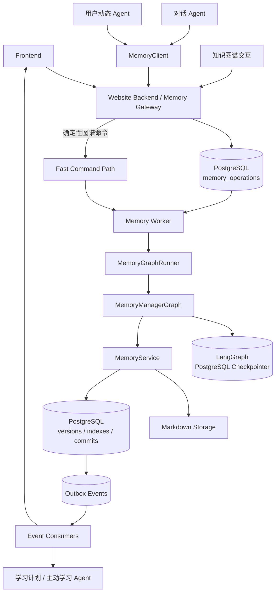
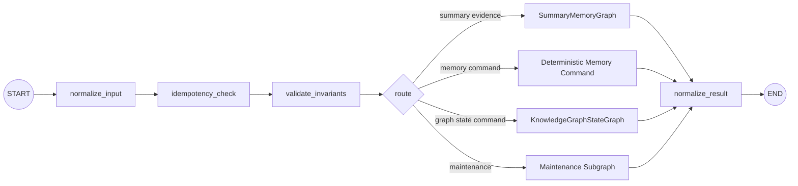
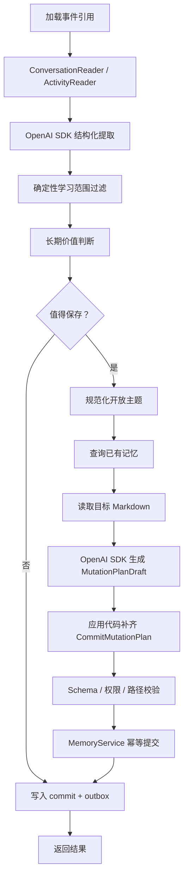
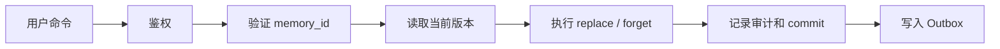
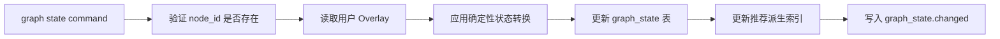
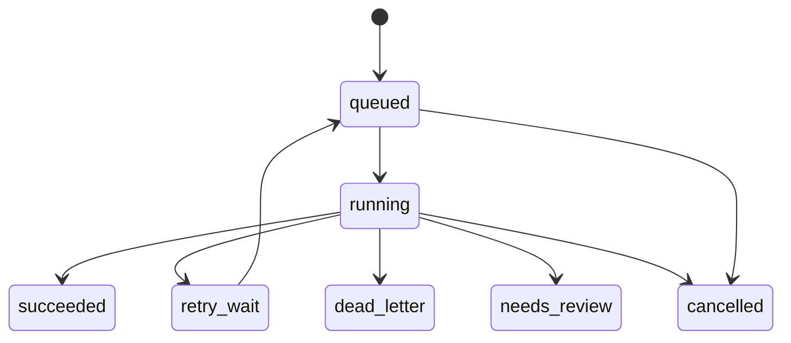

# MemoryManagerGraph 架构设计

> **文档状态：架构基稿；施工细节以执行规格为准**  
> **更新时间：2026-08-10**  
> **适用范围：数学学习 AI 网站的长期记忆管理**  
> **核心技术约束：LangGraph + OpenAI SDK**

本文定义 `MemoryManagerGraph` 的职责、输入输出、内部节点、存储边界、任务调度、失败恢复和未来迁移到 LangGraph Agent Server 的方式。可直接施工的契约、DDL、部署、测试和验收规则见 [`memory-manager-execution-spec.md`](./memory-manager-execution-spec.md)；两者冲突时，以执行规格为准。

当前阶段**暂不引入 Agent Server**。系统通过自建 `Memory Gateway + PostgreSQL 任务表 + Memory Worker` 运行 LangGraph；但是所有 Graph 调用都必须经过稳定的 `MemoryGraphRunner.run(operation)` 抽象，未来可以把 Runner 的实现替换为 Agent Server Adapter，而不改变上层业务代码。

---

## 1. 设计结论

### 1.1 一句话定位

`MemoryManagerGraph` 是一个**内部异步记忆处理工作流**，不是前端直接调用的业务 API，也不是 Markdown 文件管理器本身。

```text
业务 API 负责接收、鉴权和排队
MemoryManagerGraph 负责编排、提取、判断和生成修改计划
MemoryService 负责校验并真正提交数据修改
Markdown 负责保存总结记忆事实
PostgreSQL 负责任务、版本、幂等、索引和 Outbox
固定知识图谱负责学习路线参考
用户图谱 Overlay 负责固定节点上的个人状态
```

### 1.2 已确定的记忆边界

系统维护三类不同性质的记忆：

```text
短期记忆
  = 当前对话的工作状态，由对话 Agent 的 LangGraph Checkpointer 保存

总结记忆
  = 从用户问答和网站行为中提炼出的开放式学习事实，保存为 Markdown

知识图谱记忆
  = 固定知识图谱节点上的用户状态 Overlay，不改变图谱本体
```

总结记忆和知识图谱记忆必须**独立存储、独立更新、独立删除**。二者只在读取和推荐阶段进行弱融合，不能因为知识图谱没有某个节点，就禁止保存该主题的总结记忆。

例如：固定知识图谱没有“Banach 不动点定理”，用户仍然可以在对话中学习该主题，并将相关学习事实保存到总结记忆中。

### 1.3 当前运行方案



当前部署进程建议为：

```text
1. Website API
   接收前端和内部 Agent 请求，鉴权、校验、创建任务、查询状态

2. Memory Worker
   领取任务并执行 MemoryGraphRunner.run(operation)

3. Maintenance Scheduler
   回收超时任务、触发重建、清理孤立版本和死信检查

4. PostgreSQL
   任务、幂等、版本、索引、Outbox、LangGraph Checkpoint

5. Markdown Storage
   本地开发使用持久目录；生产使用共享持久卷或对象存储
```

---

## 2. 为什么暂时不使用 Agent Server

LangGraph Agent Server 适合作为 Graph 的通用运行时，提供通用的 assistants、threads、runs、队列和运行管理能力。但它解决的是“如何托管和运行 Graph”，不替代本项目中的业务规则和长期记忆存储。

当前项目的主要难点是：

- 哪些学习证据值得进入长期记忆
- 如何合并和更新 `learner.md` 与 `mastery/*.md`
- 用户明确纠正如何覆盖模型推断
- 如何维护 Markdown、版本和数据库索引的一致性
- 如何处理并发、重试、删除和恢复
- 如何保证知识图谱本体不被用户或模型修改

这些问题仍然需要 `MemoryService` 和数据库事务解决。若现在直接引入 Agent Server，还会增加一层运行时、部署、队列和鉴权配置；在业务规则尚未稳定时，收益不大。

当前采用：

```text
FastAPI / Website Backend
    → PostgreSQL memory_operations
    → Memory Worker
    → MemoryGraphRunner
    → 本地编译的 MemoryManagerGraph
```

未来迁移时只替换：

```text
LocalLangGraphRunner
    → AgentServerMemoryGraphRunner
```

上层的 Gateway、Worker、MemoryService 和 Graph 输入输出契约保持不变。

---

## 3. 领域模型

### 3.1 短期记忆

短期记忆属于对话 Agent 的线程状态：

```text
conversation_thread_id
    → LangGraph Checkpointer
    → 当前消息、工具结果、工作变量、任务进度
```

它用于跨请求恢复同一轮对话，不进入 Markdown，也不由 `MemoryManagerGraph` 直接维护。

当需要总结时，不建议把整个 Checkpoint 原样复制到 MemoryManagerGraph。对话 Agent 应提交事件引用：

```json
{
  "thread_id": "chat-thread-456",
  "message_refs": ["msg-18", "msg-19"],
  "trigger": "turn_boundary"
}
```

`ConversationReader` 再按权限读取所需消息，避免 Graph State 被大型原始聊天记录撑大。

### 3.2 总结记忆

总结记忆是开放世界的用户学习档案，记录用户实际问过、学过、理解、误解、偏好、目标和计划。它不受固定知识图谱节点全集限制。

建议的用户级存储布局：

```text
memory/
└── users/
    └── {user_id}/
        ├── index.md
        ├── learner.md
        └── mastery/
            ├── l-hopital-rule.md
            └── uniform-convergence.md
```

对外逻辑结构仍为：

```text
memory/index.md
  → 长期记忆目录和主题路由

memory/learner.md
  → 用户偏好、目标和计划

memory/mastery/*.md
  → 每个主题一份简明的用户掌握档案
```

主题文件可以是知识图谱中的主题，也可以是图谱之外的数学主题。`topic_key` 是总结记忆自己的规范化主题标识，不要求能映射到图谱 `node_id`。

### 3.3 知识图谱记忆

知识图谱本体由项目预先提供，节点和关系只读：

```text
knowledge_graph/
├── 教材目录.md
└── 数学知识科技树关系图.md
```

用户可以更新的是独立的用户 Overlay，例如：

```yaml
user_id: user_123
node_id: n102
status: learning  # null 表示无状态
status_source: user
last_user_action_at: 2026-08-10T10:30:00+08:00
evidence_count: 1
source_memory_id: null
```

对外只显示四种状态：

- `null`：无状态，表示用户尚未提及或系统还无法判断；
- `learning`：学习中，表示正在学习或掌握程度一般、需要继续学习；
- `proficient`：熟练；
- `expert`：精通。

用户只能通过确定性命令 `mark_unfamiliar`、`mark_familiar` 和 `clear` 更新 Overlay。系统可根据长期总结证据产生或调整 `expert`，也可以在充分的新冲突证据下调整已有状态；所有变化保留内部证据和审计，但前端只展示上述四种状态及必要的解释提示。

不允许更新：

- 新增或删除知识图谱节点
- 修改节点名称
- 修改固定图谱的边
- 通过用户输入创建新的图谱结构

总结记忆和图谱 Overlay 可以有可选的弱关联，例如模型候选携带 `graph_node_candidates: ["n102"]`。该映射不是保存总结记忆的前置条件；总结 commit 只在同一事务写入 `memory.changed` Outbox，Consumer 再创建独立的 projection operation，由 `KnowledgeGraphStateService` 按证据规则更新 Overlay，不能在总结提交事务中直接改图谱状态。

---

## 4. 组件职责

### 4.1 Memory Gateway

对外暴露稳定的业务 API，负责：

- HTTP 鉴权和用户身份解析
- 从登录态确定 `user_id`，不信任客户端自传的用户 ID
- 请求 Schema 校验
- actor 权限检查
- 幂等键检查
- 写入 `memory_operations`
- 对同步命令返回结果
- 对异步任务返回 `operation_id`
- 隐藏 LangGraph 的 `assistant_id`、`thread_id` 和 `run_id`
- 返回任务查询结果

Gateway 不负责：

- 直接调用 OpenAI 生成总结
- 直接修改 Markdown
- 直接决定语义合并结果
- 直接操作固定知识图谱文件

### 4.2 MemoryManagerGraph

负责把一次记忆操作编排成可恢复的工作流：

- 规范化输入
- 检查操作状态
- 进行内部路由和不变量校验
- 从事件内容提取候选事实
- 判断长期价值
- 搜索和读取已有记忆
- 生成新增、合并、替换或删除计划
- 调用 MemoryService 提交
- 返回结构化结果

Graph 不直接使用 `open()` 写文件，不持有文件删除权限，不把 OpenAI Client、数据库连接和文件句柄放进 Graph State。

### 4.3 MemoryService

MemoryService 是所有持久化写入的唯一入口，负责：

- 读取和解析 Markdown
- 计算逻辑路径和安全文件名
- 写入不可变 Markdown 版本
- 原子更新活动版本
- 校验 `expected_version`
- 记录 `memory_commits`
- 更新 PostgreSQL 查询索引
- 更新 `index.md` 或创建待重建任务
- 执行用户纠正和删除
- 实现 `mutation_id` 幂等
- 写入 Outbox 事件

Graph 只生成经过 Schema 校验的 `MutationPlanDraft`；应用代码再补齐 `CommitMutationPlan` 所需的稳定 ID、目标 `memory_id` 和 `expected_version`，MemoryService 只接收确定计划。

### 4.4 KnowledgeGraphStateService

负责固定图谱和用户 Overlay 的确定性逻辑：

- 加载只读图谱注册表
- 验证 `node_id`
- 读取用户状态
- 更新用户状态
- 计算推荐相关派生字段
- 记录状态变更审计
- 发布 `graph_state.changed`

该服务通常不需要 OpenAI SDK。

### 4.5 MemoryClient

其他 Agent 和后端业务代码不得直接调用 Graph 节点或文件系统，应依赖 `MemoryClient`：

```python
class MemoryClient:
    async def get_learner(self, user_id: str): ...

    async def get_memory_index(self, user_id: str): ...

    async def get_mastery(self, user_id: str, topic_key: str): ...

    async def search_summary(
        self,
        user_id: str,
        query: str,
        *,
        limit: int = 8,
    ): ...

    async def get_graph_state(
        self,
        user_id: str,
        node_ids: list[str],
    ): ...

    async def submit_evidence(self, operation): ...

    async def submit_command(self, operation): ...
```

`MemoryClient` 当前可以是同进程 Service Adapter 或内部 HTTP Client；以后也可以接入 MCP Adapter，但公共业务语义不变。

---

## 5. `MemoryGraphRunner` 抽象

### 5.1 目的

`MemoryGraphRunner` 隔离“业务任务如何调用 Graph”和“Graph 运行在哪里”。当前调用本地 LangGraph，未来可以调用内部 Agent Server。

```python
from typing import Protocol


class MemoryGraphRunner(Protocol):
    """记忆 Graph 的运行边界，屏蔽本地执行和 Agent Server 执行差异。"""

    async def run(self, operation: "MemoryOperation") -> "MemoryOperationResult":
        """执行一次记忆操作并返回结构化结果。"""
        ...
```

### 5.2 当前实现：LocalLangGraphRunner

```python
class LocalLangGraphRunner:
    def __init__(self, graph, checkpointer, runtime_services):
        self.graph = graph
        self.checkpointer = checkpointer
        self.runtime_services = runtime_services

    async def run(self, operation):
        config = {
            "configurable": {
                "thread_id": f"memory-op:{operation.operation_id}",
            },
            "metadata": {
                "operation_id": operation.operation_id,
                "user_id": operation.user_id,
                "trace_id": operation.trace_id,
            },
        }
        return await self.graph.ainvoke(
            operation.to_graph_input(),
            config=config,
            context=self.runtime_services,
        )
```

实际实现中，服务依赖应通过运行时 Context 或依赖注入传入，不放进可持久化的 Graph State。

### 5.3 未来实现：AgentServerMemoryGraphRunner

未来如果引入内部 Agent Server，Worker 仍然只依赖同一个接口：

```python
class AgentServerMemoryGraphRunner:
    async def run(self, operation):
        # 将 operation 映射为 Agent Server 的 run 请求。
        # 这里不改变上层业务契约，只更换 Graph 的运行位置。
        ...
```

建议的映射关系：

```text
operation.operation_id
    → Agent Server run metadata / client request id

memory-op:{operation_id}
    → Agent Server thread_id

MemoryManagerGraph
    → Agent Server 中注册的 assistant / graph
```

不要把 `user_id` 永久作为 MemoryManagerGraph 的 thread_id。一次操作使用一个独立线程，避免不同任务的 Graph State 互相污染。

### 5.4 Runner 的边界约束

Runner 只负责：

1. 根据 operation 生成 Graph 输入
2. 选择 Graph thread
3. 调用 Graph
4. 将 Graph 输出转换为 `MemoryOperationResult`
5. 传播可分类的错误

Runner 不负责：

- 业务鉴权
- 生成幂等键
- 直接写 Markdown
- 修改任务状态表
- 直接发外部事件

任务状态由 Worker 管理，持久化写入由 MemoryService 管理。

---

## 6. 输入契约

### 6.1 统一操作对象

```python
class MemoryOperation(BaseModel):
    operation_id: str
    idempotency_key: str
    user_id: str
    actor_type: Literal[
        "conversation_agent",
        "activity_agent",
        "knowledge_graph",
        "user",
        "system",
    ]
    input_kind: Literal["evidence", "command", "maintenance"]
    operation_type: str
    occurred_at: datetime
    payload: dict
    priority: int = 2
    trace_id: str | None = None
    graph_thread_id: str | None = None
```

关键规则：

- `operation_id` 是一次处理任务的稳定 ID。
- `idempotency_key` 由事件来源生成，用于防止 API 重试重复创建任务。
- `user_id` 由 Gateway 从认证上下文注入。
- `occurred_at` 是事件实际发生时间，不等于处理时间。
- `payload` 必须根据 `operation_type` 使用判别联合校验。
- `graph_thread_id` 默认由 Worker/Runner 生成，不接受前端任意指定。

### 6.2 对话学习证据

```python
class ConversationEvidence(BaseModel):
    thread_id: str
    message_refs: list[str]
    trigger: Literal[
        "explicit_remember",
        "turn_boundary",
        "topic_switch",
        "exercise_completed",
        "conversation_end",
    ]
    topic_hints: list[str] = []
```

每条消息不必触发一次长期记忆任务。推荐在主题切换、完整讲解结束、用户做题后反馈或会话结束时批量提交。

### 6.3 用户动态证据

```python
class ActivityEvidence(BaseModel):
    activity_type: Literal[
        "forum_post",
        "forum_reply",
        "wrong_question_upload",
        "page_view",
        "bookmark",
        "review",
        "check_in",
    ]
    content_ref: str | None = None
    topic_hints: list[str] = []
    aggregated_count: int = 1
    occurred_at: datetime
```

行为证据默认是“学习信号”，不是掌握结论：

```text
打开页面       → exposure
收藏           → interest
发帖/回复      → learning evidence
上传错题集     → possible misconception evidence
做题正确/错误  → stronger assessment evidence
用户图谱标记    → explicit command
```

不能因为用户打开某个页面，就直接把掌握状态设置为熟悉。

### 6.4 用户命令

用户命令优先级高于模型推断：

```python
class LearnerReplacement(BaseModel):
    """用户确认后的 learner.md 结构化替换内容。"""

    replacement_type: Literal["learner"] = "learner"
    preferences: list[str] = Field(default_factory=list)
    goals: list[str] = Field(default_factory=list)
    plans: list[str] = Field(default_factory=list)


class MasteryReplacement(BaseModel):
    """用户确认后的 mastery 文档结构化替换内容。"""

    replacement_type: Literal["mastery"] = "mastery"
    topic_title: str
    overview: str = ""
    understood: list[str] = Field(default_factory=list)
    difficulties: list[str] = Field(default_factory=list)
    review_advice: list[str] = Field(default_factory=list)
    evidence_refs: list[str] = Field(default_factory=list)


MemoryReplacement = Annotated[
    LearnerReplacement | MasteryReplacement,
    Field(discriminator="replacement_type"),
]


class CorrectMemoryCommand(BaseModel):
    memory_id: str
    expected_version: int
    replacement: MemoryReplacement
    reason: str | None = None


class ForgetMemoryCommand(BaseModel):
    memory_id: str
    expected_version: int
    reason: str | None = None


class GraphStateCommand(BaseModel):
    node_id: str
    action: Literal["mark_unfamiliar", "mark_familiar", "clear"]
    expected_version: int | None = None
```

明确的用户纠正、删除和知识图谱标记不应交给模型猜测；它们走确定性命令分支。

---

## 7. `MemoryManagerGraph` 总体结构

建议使用父图和两个职责明确的子图：

```text
MemoryManagerGraph
├── SummaryMemoryGraph
└── KnowledgeGraphStateGraph
```



父图状态应只包含可序列化、可恢复的业务数据：

```python
class MemoryManagerState(TypedDict):
    operation_id: str
    user_id: str
    operation: dict
    route: str | None
    source_content: list[dict]
    candidates: list[dict]
    existing_memories: list[dict]
    mutation_plan_drafts: list[dict]
    commit_mutation_plans: list[dict]
    commit_result: dict | None
    errors: list[dict]
```

`CommitMutationPlan` 必须在进入有副作用的提交节点前写入可 Checkpoint 的 Graph State。Worker 在提交后宕机时复用同一个 `mutation_id`；如果尚未提交却发生版本冲突，则丢弃旧确定计划，重新读取、重新规划并生成新的 `mutation_id`。

不要放入 Graph State：

```text
OpenAI Client
数据库连接
文件句柄
对象存储 Client
大型原始聊天全文
不可序列化的服务实例
密钥和用户认证 Token
```

这些对象通过运行时 Context 或依赖注入提供。

---

## 8. SummaryMemoryGraph 设计

### 8.1 流程



### 8.2 OpenAI SDK 的职责

OpenAI SDK 只负责需要语义理解的部分：

- 从对话中提取用户的学习事实
- 从错题中提取错误模式和可能的误解
- 总结用户偏好、目标和计划
- 判断候选记忆是否具有长期价值
- 判断两条记忆是否语义重复
- 生成候选 Markdown 总结正文

建议使用 OpenAI SDK 的结构化输出，把模型结果约束为 Pydantic Schema。模型只能生成候选数据，不能决定任意文件路径或直接写文件。

### 8.3 候选记忆示例

```json
{
  "memory_type": "mastery",
  "topic_title": "一致收敛",
  "category": "misconception",
  "summary": "用户理解一致收敛的定义，但在使用判别法时容易忽略统一性条件。",
  "long_term_value": "save",
  "confidence": 0.88,
  "evidence": [
    {
      "evidence_ref": "event_123",
      "evidence_type": "repeated_error",
      "summary": "多次练习中忽略统一性条件",
      "strength": 0.88
    }
  ],
  "graph_node_candidates": []
}
```

这是模型候选草稿示例。候选落库后才由应用代码生成 `candidate_id`；模型不能生成稳定 ID。

`graph_node_candidates` 可以为空。它只是可选的检索辅助信息，不是总结记忆的归属证明；最终是否映射到固定图谱节点由应用代码依据注册表、相似度和证据规则确定。

### 8.4 长期价值过滤

以下内容通常不应进入长期总结记忆：

- 一次性的闲聊
- 没有学习意义的页面访问
- 模型自己的解释，而不是用户的状态
- 没有证据支持的掌握结论
- 与数学学习无关的个人信息
- 仅凭单次点击推断出的稳定偏好

以下内容更适合保存：

- 用户明确要求“记住”
- 稳定的学习目标、偏好和计划
- 重复出现的错误模式
- 用户对某数学主题的稳定理解或误解
- 多次练习中一致出现的困难
- 用户明确纠正后的学习档案

### 8.5 MutationPlanDraft

模型生成的 `MutationPlanDraft` 必须先经过代码校验；它不包含稳定 ID、最终主题键或当前版本：

```json
{
  "target_memory_type": "mastery",
  "topic_title": "一致收敛",
  "action": "merge",
  "mastery_patch": {
    "difficulties_to_add": [
      "容易把逐点收敛和一致收敛混淆"
    ],
    "evidence_refs_to_add": ["event_123"]
  },
  "candidate_indexes": [0],
  "reasoning_summary": "与现有掌握档案属于同一主题，追加新的错误模式。"
}
```

允许的模型计划 `action`：

```text
create
merge
replace
append_evidence
no_change
```

`no_change` 只是 Graph/策略层结果，不生成稳定 `mutation_id`，也不创建引用不存在文档的 commit；只有非 `no_change` 草稿才由应用代码转换为 `CommitMutationPlan`，并补齐 `memory_id`、`mutation_id` 和当前 `expected_version`。

模型不能生成：

```text
任意绝对路径
任意 user_id
任意 node_id 关系
任意 SQL
任意文件删除命令
```

---

## 9. 确定性命令和 KnowledgeGraphStateGraph

### 9.1 用户记忆命令

纠正和删除不应经过开放式语义总结流程：



用户纠正应保留：

- 原始版本号
- 新版本号
- 操作来源为 `user`
- 用户提供的修改原因（如果有）
- 修改时间

### 9.2 知识图谱状态更新



知识图谱状态更新通常不需要 OpenAI SDK。它可以作为快速路径：

```text
请求成功 → 同步返回 200
临时数据库故障 → 写入任务并返回 202
```

用户点击命令立即生效，但不永久锁定 Overlay。总结记忆仍可通过独立 Outbox projection 更新图谱状态；只有满足可靠映射、充分证据和确定性状态转换规则时才允许调整，并发送解释事件，供前端在用户查看时提示调整依据。

---

## 10. Markdown 文档格式

### 10.1 `index.md`

`index.md` 是人类可读的目录和路由摘要，同时可以作为恢复和审查的辅助文件。它不是高并发查询的唯一真相，PostgreSQL 索引可以从 Markdown 重建。

示例：

```markdown
---
kind: memory-index
schema_version: 1
user_id: user_123
updated_at: 2026-08-10T10:30:00+08:00
---

# 长期记忆目录

## 学习者档案
- [学习者偏好与目标](./learner.md)

## 掌握档案
- [一致收敛](./mastery/uniform-convergence.md)
- [洛必达法则](./mastery/l-hopital-rule.md)

## 主题路由
- 一致收敛：掌握档案、错误模式
- 洛必达法则：掌握档案、复习建议
```

### 10.2 `learner.md`

保存稳定的学习者级信息：

```markdown
---
kind: learner-profile
schema_version: 1
user_id: user_123
version: 7
updated_at: 2026-08-10T10:30:00+08:00
---

# 学习者档案

## 学习偏好
- 更喜欢先看具体例题，再看形式化定义。

## 学习目标
- 掌握高等数学中的极限、连续和级数。

## 当前计划
- 本周复习一致收敛的判别方法。

## 可靠性说明
- 以上内容来自多次对话和用户明确表达；模型推断必须标注证据来源。
```

### 10.3 `mastery/{topic_key}.md`

每个总结主题一份简明档案：

```markdown
---
kind: mastery-profile
schema_version: 1
user_id: user_123
topic_key: uniform-convergence
version: 4
updated_at: 2026-08-10T10:30:00+08:00
---

# 一致收敛

## 当前掌握概况
用户理解定义，但在使用判别法时容易忽略统一性条件。

## 已掌握
- 能解释逐点收敛与一致收敛的定义差异。

## 仍有困难
- 容易把逐点收敛的证明方式直接用于一致收敛。

## 建议复习
- 先复习函数列上确界估计，再练习判别法。

## 证据
- event_123：完成例题后暴露出统一性条件遗漏。

## 置信与人工确认
- 模型总结置信度：0.88
- 最近用户明确确认：未确认
```

### 10.4 路径安全

`topic_key` 必须由代码规范化：

```text
允许：字母、数字、短横线
禁止：斜杠、反斜杠、..、绝对路径、控制字符
```

文件路径由 `MemoryService` 根据 `memory_type + topic_key` 生成，不能由模型直接提供。

---

## 11. 存储与提交协议

### 11.1 生产存储布局

单用户的逻辑目录为：

```text
memory/users/{user_id}/
├── index.md
├── learner.md
└── mastery/*.md
```

生产环境不应依赖容器临时文件系统：

```text
开发环境：Markdown + SQLite 或本地持久目录
生产环境：Markdown 对象存储/共享持久卷 + PostgreSQL
```

### 11.2 PostgreSQL 主要表

```text
memory_operations
    可靠任务、状态、重试、Lease、输入 Payload

memory_documents
    logical_path、active_version、checksum、更新时间

memory_commits
    mutation_id、operation_id、版本变化、审计信息

memory_index_entries
    topic、memory_type、关键词、检索字段

graph_user_states
    user_id、node_id、用户 Overlay 状态

memory_outbox
    memory.changed 和 graph_state.changed 事件

langgraph_checkpoints
    MemoryManagerGraph 的可恢复运行状态
```

### 11.3 Markdown 版本提交

跨文件系统和数据库不能假设一个全局事务，因此采用“不可变内容 + 数据库活动指针”的提交协议：

```text
1. 获取 user_id 级写锁或目标文档锁
2. 读取当前 active_version
3. 校验 expected_version
4. 生成完整的新 Markdown 内容
5. 写入不可变新版本并校验 checksum
6. 在 PostgreSQL 事务中：
   a. 更新 memory_documents.active_version
   b. 写入 memory_commits
   c. 更新查询索引
   d. 写入 memory_outbox
7. 提交事务
8. 异步更新/重建 index.md
```

如果第 5 步之后 PostgreSQL 事务失败，新文件只是孤立版本，不会成为活动版本，清理任务可以删除它。

如果数据库事务已提交但 Worker 随后宕机，新的活动版本和 `memory_commit` 已经存在，任务重试时通过 `mutation_id` 返回同一个结果，不会重复修改。

`index.md` 是可重建的派生目录；核心读写不应因为一次目录生成失败而丢失已经提交的记忆。

---

## 12. 任务调度

### 12.1 任务状态机



状态含义：

| 状态 | 含义 |
|---|---|
| `queued` | 等待 Worker 领取 |
| `running` | 已被 Worker 领取并执行 |
| `retry_wait` | 临时失败，等待 `next_run_at` |
| `succeeded` | 核心提交和 Outbox 已完成 |
| `dead_letter` | 超过最大重试次数或永久失败 |
| `needs_review` | 需要人工或用户处理冲突 |
| `cancelled` | 被取消，后续不得继续提交 |

### 12.2 任务优先级

```text
P0：用户删除、纠正等明确命令
P1：用户知识图谱标记
P2：对话结束后的总结
P3：论坛、上传错题、浏览等行为证据
P4：索引重建、版本清理、数据校验
```

浏览、打开和收藏等低价值事件应先聚合：

```text
同一用户 + 同一主题 + 时间窗口
    → 合并为一条 ActivityEvidence
    → 再创建一个总结任务
```

不要让每个页面打开事件都调用一次 OpenAI SDK。

### 12.3 Worker 领取任务

多个 Worker 使用 PostgreSQL 行锁并行领取任务：

```sql
SELECT operation_id
FROM memory_operations
WHERE status IN ('queued', 'retry_wait')
  AND next_run_at <= NOW()
ORDER BY priority DESC, created_at ASC
FOR UPDATE SKIP LOCKED
LIMIT 10;
```

领取后在同一个事务中更新：

```text
status          = running
locked_by       = worker-id
lease_expires_at = now() + lease_duration
attempt_count   = attempt_count + 1
started_at      = now()
```

Worker 执行时间较长时发送心跳延长 Lease。数据库轮询可以作为第一版调度器；未来任务量增大时，可以把任务表替换为 Redis、RabbitMQ 或其他队列，但不改变 `MemoryGraphRunner` 和 `MemoryOperation` 契约。

### 12.4 周期维护任务

`Maintenance Scheduler` 只负责创建维护操作，不直接修改记忆：

```text
每 30 秒—1 分钟：回收过期 Lease
持续轮询：调度 next_run_at 到期的重试任务
每 5 分钟：检查需要重建的 index.md
每小时：聚合低价值行为证据
每天：清理孤立 Markdown 版本
每天：清理过期 LangGraph Checkpoint
每天：校验 Markdown checksum 和数据库活动指针
每 5—15 分钟：检查 dead_letter 并报警
```

多实例 Scheduler 必须使用 PostgreSQL advisory lock 或独立的调度锁，避免同一维护任务重复创建。

---

## 13. 失败恢复与重试

整体采用：

```text
任务至少执行一次
+ Graph Checkpoint 支持节点级恢复
+ MemoryService 提交幂等
+ 用户级写入串行化或乐观锁
```

不追求跨所有外部系统的理论 exactly-once，而是保证重复执行不会重复产生业务修改。

### 13.1 任务级恢复

Worker 可能在任何时刻宕机。使用 Lease 判断任务是否失联：

```text
status = running
AND lease_expires_at < now()
```

Watchdog 发现后：

```text
attempt_count < max_attempts
    → status = retry_wait
    → 设置 next_run_at

attempt_count >= max_attempts
    → status = dead_letter
    → 记录告警和完整错误上下文
```

任务默认使用：

```text
thread_id = memory-op:{operation_id}
```

同一个操作重试时复用相同 thread_id，使 LangGraph 可以加载已保存的 checkpoint。

### 13.2 Graph 节点级恢复

`MemoryManagerGraph` 应在有副作用的节点前后设计清晰的边界：

```text
extract_candidate       纯语义提取
filter_candidate        确定性过滤
retrieve_existing       查询
plan_mutation           生成计划
commit_memory           唯一持久化副作用边界
record_outcome          结果归档
```

OpenAI 超时、限流、临时网络错误和数据库连接闪断可以进行有限的节点级重试。节点重试失败后，再由任务层安排下一次执行，不在 Worker 中无限循环。

### 13.3 重试分类

| 错误 | 处理 |
|---|---|
| OpenAI 超时、429、临时 5xx | 指数退避重试 |
| PostgreSQL 临时断开 | 任务级重试 |
| Markdown/对象存储暂时不可用 | 任务级重试 |
| `expected_version` 冲突 | 重新读取并重新规划，最多 1—2 次 |
| 输入 Schema 错误 | 永久失败，不重试 |
| 无权限 | 永久失败并记录审计 |
| 图谱 `node_id` 不存在 | 永久失败并返回业务错误 |
| 模型输出持续不符合 Schema | 限次后 `needs_review` |
| 删除已经不存在的记忆 | 按幂等成功处理 |

建议的任务级退避：

```text
第 1 次：30 秒
第 2 次：2 分钟
第 3 次：10 分钟
第 4 次：30 分钟
第 5 次：进入 dead_letter
```

实际等待通过 `next_run_at` 调度，Worker 不应长时间占用线程睡眠。

### 13.4 版本冲突恢复

两个任务同时读取同一版本时：

```text
任务 A 读取 version = 8
任务 B 读取 version = 8
A 提交 8 → 9
B 携带 expected_version = 8 提交
```

B 必须收到 `VERSION_CONFLICT`，不能最后写入覆盖 A。恢复流程为：

```text
reload_latest_memory
    → reconcile_mutation
    → 生成新的 MutationPlanDraft
    → 应用代码补齐新的 CommitMutationPlan
    → MemoryService 再次提交
```

同一用户建议串行写入；即使使用用户级锁，也保留 `expected_version`，作为第二道保护。

---

## 14. 幂等和 Outbox

### 14.1 API 幂等

客户端请求可能因网络重试重复提交，因此：

```text
unique(source_actor, idempotency_key)
```

如果相同幂等键已经存在：

- 不创建新 operation
- 返回原有 `operation_id`
- 返回当前任务状态

### 14.2 MemoryService 幂等

Worker 可能在“持久化成功、更新任务状态前”宕机。每次 Mutation 必须携带：

```text
operation_id
mutation_id
expected_version
```

数据库建立：

```text
UNIQUE(user_id, operation_id, mutation_id)
```

提交前检查：

```text
mutation_id 已提交
    → 直接返回原 CommitResult

mutation_id 未提交
    → 执行版本校验和提交
```

### 14.3 Outbox

不要在 Markdown 提交后直接依赖一次不可靠的网络发布：

```text
错误方式：提交 Markdown → 立即 HTTP 通知其他服务
```

正确方式：在同一个 PostgreSQL 事务中写入：

```text
memory_commits
memory_index_entries
memory_outbox
```

Outbox Consumer 再异步发布：

```text
memory.changed
memory.deleted
learner.updated
graph_state.changed
```

Consumer 也必须幂等。事件发布失败不回滚已经提交的长期记忆，只等待 Outbox 重试。

---

## 15. 对外 API

前端和其他业务模块只使用业务接口，不直接调用 LangGraph 的 `runs`、`threads` 或 `assistants`。

### 15.1 接收学习证据

```http
POST /api/v1/memory/events
```

```json
{
  "idempotency_key": "chat-thread-123-turn-18",
  "source": "conversation_agent",
  "event_type": "learning_observation",
  "occurred_at": "2026-08-10T18:00:00+08:00",
  "payload": {
    "thread_id": "chat-thread-456",
    "message_refs": ["msg-18", "msg-19"],
    "topic_hints": ["一致收敛"]
  }
}
```

返回异步任务：

```http
202 Accepted
```

```json
{
  "operation_id": "memory-op-789",
  "status": "queued"
}
```

### 15.2 接收用户命令

```http
POST /api/v1/memory/commands
```

支持：

```text
correct_memory
forget_memory
override_learner_profile
```

用户命令可以优先走快速确定性路径；如果需要等待锁或发生临时错误，则落入 `memory_operations`，返回 `operation_id`。

### 15.3 更新知识图谱用户状态

```http
PUT /api/v1/knowledge-graph/me/nodes/{node_id}/state
```

```json
{
  "action": "mark_unfamiliar",
  "expected_version": 2
}
```

`mark_unfamiliar` 映射为“学习中”，`mark_familiar` 映射为“熟练”，`clear` 映射为“无状态”。用户尝试提交“精通”时，前后端返回明确提示：精通由长期学习表现自动评估，不能手动设置。接口只验证并更新固定节点的用户 Overlay，不修改知识图谱本体。

### 15.4 查询任务

```http
GET /api/v1/memory/operations/{operation_id}
```

```json
{
  "operation_id": "memory-op-789",
  "status": "succeeded",
  "attempt_count": 1,
  "mutations": [
    {
      "memory_id": "mastery.uniform-convergence",
      "action": "merge",
      "version": 5
    }
  ]
}
```

### 15.5 查询记忆

```http
GET  /api/v1/memory/learner
GET  /api/v1/memory/index
GET  /api/v1/memory/mastery/{topic_key}
POST /api/v1/memory/search

GET  /api/v1/knowledge-graph/me/nodes
GET  /api/v1/knowledge-graph/me/nodes/{node_id}/state
GET  /api/v1/knowledge-graph/recommendations
```

检索接口返回受控的结构化上下文，不直接把任意文件系统路径暴露给前端。

---

## 16. 其他 Agent 如何利用记忆

### 16.1 对话 Agent

每次新请求可以按需组装：

```text
短期上下文：当前 conversation thread
长期上下文：learner.md
主题上下文：相关 mastery/*.md
路线参考：相关固定知识图谱节点和用户 Overlay
```

对话 Agent 读取长期记忆时只取与当前问题相关的有限内容，避免把整个用户档案塞入上下文。

对话结束后提交 `ConversationEvidence`，而不是直接修改 Markdown。

### 16.2 用户动态 Agent

用户动态 Agent：

- 读取已有总结记忆以解释论坛上下文
- 将发帖、回复、错题上传和复习行为转成 `ActivityEvidence`
- 不根据单一行为直接修改掌握结论
- 交由 SummaryMemoryGraph 聚合和判断

### 16.3 主动学习 Agent

主动学习 Agent 主要依赖：

```text
固定知识图谱
+ 用户 graph-state
+ learner.md
+ 相关 mastery/*.md
```

知识图谱提供候选学习路径，用户状态提供排序信号，总结记忆提供个性化困难和误解信息。它们是弱融合，不互相覆盖。

### 16.4 记忆读取服务

可进一步提供 `LearningContextService`：

```python
class LearningContextService:
    async def build_context(
        self,
        user_id: str,
        *,
        query: str,
        topic_keys: list[str] | None = None,
        graph_node_ids: list[str] | None = None,
        token_budget: int = 3000,
    ) -> dict:
        """返回供 Agent 使用的有限学习上下文。"""
        ...
```

它负责把总结记忆和图谱状态组合成 Agent 可用上下文，但不把二者合并成同一种存储实体。

---

## 17. RAG 和 MemoryManagerGraph 的关系

RAG 知识库与用户长期记忆是两个不同系统：

```text
RAG 知识库
    = 项目提供的教材、题目、讲义和参考资料

用户总结记忆
    = 用户的偏好、目标、误解、掌握档案和学习经历

固定知识图谱
    = 项目提供的学习路线结构
```

RAG 检索通常属于对话 Agent 的检索节点或独立 `RetrievalService`，不需要强行放进 MemoryManagerGraph。

SummaryMemoryGraph 可以调用检索服务查询已有总结记忆，但不应把教材内容误保存成用户记忆。模型需要区分：

```text
教材事实：外部知识，不是用户状态
用户事实：长期记忆候选
用户图谱状态：固定节点上的 Overlay
```

如果未来使用向量检索，向量索引是查询加速层，不替代 Markdown 事实源和 PostgreSQL 版本/幂等记录。

---

## 18. 安全、权限和治理

### 18.1 用户隔离

所有读取和写入都必须带服务端解析出的 `user_id`。目标路径由服务端生成：

```text
memory/users/{authenticated_user_id}/...
```

禁止模型或客户端提交任意路径。

### 18.2 用户命令优先级

建议采用以下优先级：

```text
用户明确纠正/删除
    > 用户图谱标记
    > 多次学习证据
    > 单次学习证据
    > 模型低置信度推断
```

用户的删除命令不能被后续相同旧事件自动恢复。事件处理需要检查删除墓碑或版本审计。

### 18.3 数学学习范围

总结记忆默认只关注数学学习相关内容：

- 学习目标和计划
- 数学主题掌握情况
- 解题方法和错误模式
- 学习偏好
- 复习行为

与学习无关的个人信息默认不进入长期 Markdown。

### 18.4 模型不拥有副作用权限

OpenAI SDK 的模型输出必须经过：

```text
结构化 Schema 校验
→ 业务规则校验
→ 用户权限校验
→ 版本校验
→ MemoryService 提交
```

模型不能直接获得：

```text
文件系统写权限
文件删除权限
SQL 执行权限
任意 HTTP 内网调用权限
固定图谱写权限
```

---

## 19. 可观测性

每个请求和任务至少携带：

```text
request_id
operation_id
idempotency_key
trace_id
user_id（日志中按隐私策略脱敏）
actor_type
operation_type
graph_thread_id
```

建议记录：

- 任务排队时长
- Graph 执行时长
- OpenAI 请求次数、延迟和错误类型
- 每个节点的成功/失败次数
- 候选记忆数量
- `no_change` 比例
- 版本冲突次数
- 重试次数
- dead-letter 数量
- Outbox 延迟
- 单用户锁等待时间

日志中不要写入完整的聊天原文和敏感用户信息；需要调试时使用受控的事件引用和摘要。

---

## 20. 测试策略

### 20.1 单元测试

测试以下纯逻辑：

- 输入信封解析
- `topic_key` 规范化和路径安全
- 事件类型路由
- 长期价值过滤规则
- `MutationPlanDraft` / `CommitMutationPlan` Schema 校验及草稿转换
- 图谱 `node_id` 验证
- 用户 Overlay 状态转换
- 重试分类
- Lease 过期判断

### 20.2 Graph 测试

使用假的 OpenAI SDK 响应和内存版 Service：

- 对话证据能产生候选记忆
- 无长期价值证据返回 `no_change`
- 相似主题生成 `merge`
- 图谱命令不调用 OpenAI
- 模型输出非法时不会写文件
- Graph 从中间 checkpoint 恢复

### 20.3 持久化集成测试

- 新建 `learner.md`
- 更新 `mastery/*.md`
- 用户纠正覆盖模型候选
- 删除操作产生墓碑/审计记录
- `expected_version` 冲突不会覆盖新版本
- `mutation_id` 重放只产生一次提交
- Outbox 事件和 commit 在同一事务中落库
- 孤立版本可以被清理

### 20.4 失败恢复测试

必须模拟：

```text
OpenAI 超时
OpenAI 429
Worker 在 commit 前宕机
Worker 在 commit 后、任务状态更新前宕机
数据库连接中断
Markdown 写入失败
Lease 过期
任务重复领取
两个任务同时更新同一主题
Outbox Consumer 重复消费
```

验收标准：

```text
不丢任务
不重复产生业务修改
不出现半个 Markdown 文件成为活动版本
不允许固定知识图谱本体被修改
任务最终进入 succeeded、needs_review 或 dead_letter
```

### 20.5 API 契约测试

验证前端和内部 Agent 只依赖业务 API，不依赖 LangGraph 内部运行字段。未来更换 Runner 实现后，API 契约测试应保持不变。

---

## 21. 建议模块边界

当前项目尚未实现后端目录，落地时可以按以下职责组织，而不是按“一个大 Agent 文件”组织：

```text
backend/
└── memory/
    ├── contracts.py          # Pydantic 输入输出契约
    ├── gateway.py            # HTTP 业务入口适配
    ├── client.py             # 其他 Agent 使用的 MemoryClient
    ├── runner.py             # MemoryGraphRunner 接口及本地实现
    ├── graph/
    │   ├── manager.py        # 父图构建
    │   ├── summary.py        # 总结记忆子图
    │   ├── graph_state.py    # 知识图谱 Overlay 子图
    │   └── policies.py       # 确定性过滤和路由规则
    ├── services/
    │   ├── memory_service.py
    │   ├── graph_state_service.py
    │   ├── conversation_reader.py
    │   └── context_service.py
    ├── persistence/
    │   ├── operations.py
    │   ├── commits.py
    │   ├── documents.py
    │   ├── outbox.py
    │   └── checkpoints.py
    └── worker/
        ├── worker.py         # 领取和执行任务
        ├── scheduler.py      # 周期任务
        └── retry.py          # 错误分类和退避
```

模块设计原则：

```text
contracts 不依赖 Graph
services 不依赖 HTTP
Graph 不依赖文件系统细节
Worker 不依赖具体 Graph 节点
Gateway 不依赖 OpenAI SDK
Runner 隔离 Graph 运行位置
```

---

## 22. 端到端示例

### 22.1 对话结束后总结

```text
1. 用户在 chat thread 中讨论一致收敛
2. 对话 Agent 使用 LangGraph Checkpointer 保存短期状态
3. 对话达到 turn_boundary
4. 对话 Agent 通过 MemoryClient 提交 ConversationEvidence
5. Gateway 校验认证和 idempotency_key
6. Gateway 写入 memory_operations，返回 operation_id
7. Worker 领取任务并创建 thread_id = memory-op:{operation_id}
8. LocalLangGraphRunner 调用 MemoryManagerGraph
9. SummaryMemoryGraph 读取引用消息
10. OpenAI SDK 输出结构化候选事实
11. Graph 查询已有 mastery/uniform-convergence.md
12. Graph 生成 merge `MutationPlanDraft`，应用代码补齐并提交 `CommitMutationPlan`
13. MemoryService 校验版本并写入新 Markdown 版本
14. PostgreSQL 同事务记录 memory_commit 和 memory.changed Outbox
15. Worker 将 operation 标记为 succeeded
16. 后续 Agent 或前端通过查询接口读取更新后的内容
```

### 22.2 用户点击“不熟悉”

```text
1. 用户在固定知识图谱页面点击节点 n102 的“不熟悉”
2. 前端调用 PUT /api/v1/knowledge-graph/me/nodes/n102/state
3. Gateway 从登录态获得 user_id
4. KnowledgeGraphStateService 验证 n102 存在且属于固定图谱
5. 更新 user graph-state Overlay
6. 写入 graph_state.changed Outbox
7. 同步返回新的状态
```

此过程不修改 `knowledge_graph/` 下的固定文件，也不要求创建或更新 `mastery/n102.md`。

### 22.3 Worker 在提交后宕机

```text
1. 应用代码根据 operation 和提交计划生成 mutation_id = mut_001
2. MemoryService 成功提交 version 4 → 5
3. Worker 尚未来得及把 operation 标为 succeeded 就宕机
4. Lease 过期，任务再次进入 retry_wait
5. 新 Worker 复用 operation_id 和 Graph thread
6. Worker 从 Checkpoint/operation 提交状态复用 mutation_id = mut_001，MemoryService 发现该 mutation 已提交
7. 返回原 CommitResult，不重复写入
8. Worker 将 operation 标为 succeeded
```

---

## 23. 迁移到 Agent Server 的方案

迁移前必须保持以下稳定契约：

```text
MemoryOperation
MemoryOperationResult
MemoryGraphRunner.run(operation)
MemoryService.commit(commit_mutation_plan)
MemoryClient
```

迁移步骤：

```text
1. 将 MemoryManagerGraph 注册到内部 Agent Server
2. 实现 AgentServerMemoryGraphRunner
3. 将 operation 映射到 Agent Server run
4. 仍然使用 operation_id 作为幂等和任务主键
5. 保留 MemoryService、memory_commits 和 Outbox
6. 先灰度运行少量任务
7. 对比 Local Runner 和 Agent Server 的结果
8. 稳定后再决定是否移除本地 Graph Worker
```

迁移后架构变为：

```text
Frontend / Agents
    → Memory Gateway
    → memory_operations
    → Worker
    → AgentServerMemoryGraphRunner
    → LangGraph Agent Server
    → MemoryManagerGraph
    → MemoryService
```

不变的原则：

```text
前端仍不直接调用 Agent Server
长期记忆仍由 MemoryService 管理
Markdown 仍是总结记忆内容的事实载体
固定知识图谱本体仍只读
```

---

## 24. 非目标

当前版本不做：

- 把 MemoryManagerGraph 直接暴露给浏览器
- 让模型直接写 Markdown
- 让模型修改固定知识图谱
- 用总结记忆替代对话 Checkpoint
- 用知识图谱节点限制总结记忆主题
- 把所有浏览行为都转为掌握结论
- 用向量库替代 Markdown 和版本系统
- 现在就引入 Agent Server
- 现在就把 MemoryManagerGraph 做成 MCP Server

如果未来需要 MCP，应该增加一个业务适配层，只暴露：

```text
memory_search
memory_get
memory_submit_evidence
knowledge_graph_get_state
```

不暴露：

```text
write_markdown_file
delete_any_file
commit_memory_directly
```

---

## 25. 最终决策清单

```text
[已确定] 项目架构固定为 LangGraph + OpenAI SDK
[已确定] 短期记忆由对话 Agent Checkpointer 保存
[已确定] 总结记忆保存为开放式 Markdown
[已确定] 知识图谱本体只读，用户只修改个人 Overlay
[已确定] 总结记忆和知识图谱记忆独立维护、弱连接
[已确定] MemoryManagerGraph 是内部处理引擎
[已确定] 前端和其他 Agent 通过 Gateway / MemoryClient 访问
[已确定] 现阶段不引入 Agent Server
[已确定] Graph 调用边界为 MemoryGraphRunner.run(operation)
[已确定] 任务采用 PostgreSQL 持久任务表和 Lease
[已确定] 任务采用至少一次执行，提交采用幂等
[已确定] LangGraph Checkpoint 用于 Graph 恢复，不代替长期记忆
[已确定] MemoryService 是唯一的持久化写入入口
[已确定] Markdown 使用版本化和原子提交
[已确定] 索引和通知通过 Outbox 异步补偿
[已确定] 用户明确纠正、删除和图谱标记命令走确定性路径；用户命令即时生效但不永久锁定状态
[已确定] 总结记忆可通过独立 Outbox projection 更新图谱 Overlay，保留证据和解释事件
[已确定] 图谱只显示无状态、学习中、熟练、精通；用户不能手动设置精通
[已确定] 稳定 ID 和 expected_version 由应用代码/数据库读取结果生成或注入，模型只输出受限草稿
[已确定] no_change 不创建稳定 mutation 或不存在目标文档的 commit
```

核心职责边界最终归纳为：

> **Gateway 负责接收和鉴权；Scheduler/Worker 负责调度和恢复；Runner 负责隔离 Graph 运行位置；MemoryManagerGraph 负责编排和语义判断；OpenAI SDK 负责结构化提取与总结；MemoryService 负责真正修改；Markdown 保存总结记忆事实；PostgreSQL 管理任务、版本、幂等和索引；固定知识图谱只提供参考结构；其他 Agent 只能通过 MemoryClient 读取或提交事件。**
